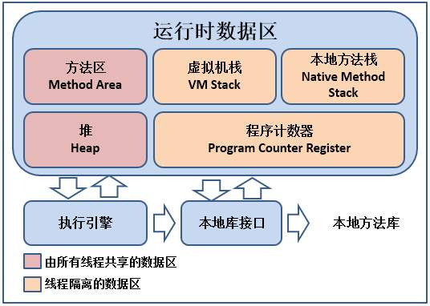
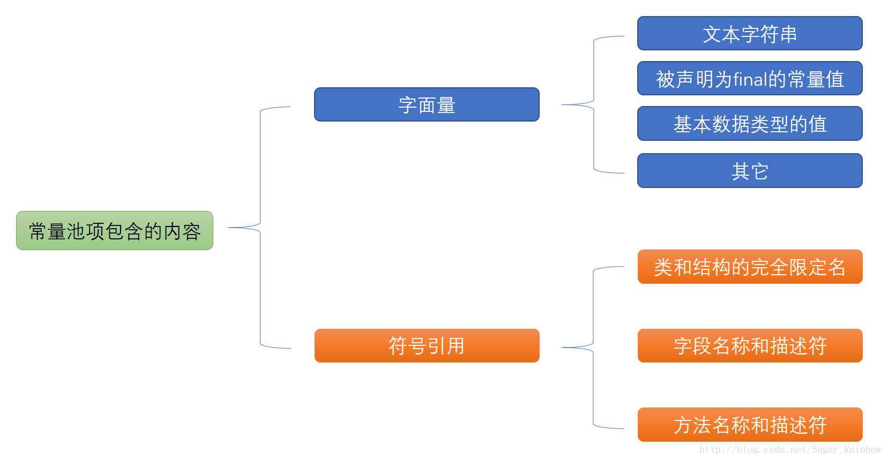

<!-- GFM-TOC -->

- [一、Java内存区域](#一Java内存区域)
- 

<!-- GFM-TOC -->


## 一、Java内存区域

以下内容如无特殊说明，都是针对HotSpot虚拟机。

### 1.运行时数据区域

<div align="center">  </div><br>
其中方法区和堆是线程共享的，程序计数器、虚拟机栈和本地方法栈是私有的。

**1.1程序计数器**

记录正在执行的虚拟机字节码指令的地址（如果正在执行的是本地方法则为空）。

作用：

- 字节码解释器通过改变程序计数器来依次读取指令，从而实现代码的流程控制，如：顺序执行、选择、循环、异常处理。
- 在多线程的情况下，程序计数器用于记录当前线程执行的位置，从而当线程被切换回来的时候能够知道该线程上次运行到哪儿了。

注：程序计数器随着线程的创建而创建，随着线程的结束而死亡。**不会出现OutOfMemoryError**。

**1.2Java虚拟机栈**

每个 Java 方法在执行的同时会创建一个栈帧用于存储局部变量表、操作数栈、常量池引用等信息。方法被调用时，栈帧压入虚拟机栈；方法返回后（return 或抛出异常），栈帧被弹出。

该区域可能抛出的异常：

-  若 Java 虚拟机栈的内存大小不允许动态扩展，当线程请求的栈深度超过最大值，会抛出 StackOverflowError 异常；
- 若 Java 虚拟机栈的内存大小允许动态扩展，栈进行动态扩展时如果无法申请到足够内存，会抛出 OutOfMemoryError 异常。

可通过 -Xss 参数来指定每个线程的虚拟机栈内存的大小，默认为1M

```
java -Xss2M HackTheJava
```


**1.3本地方法栈**

本地方法栈与 Java 虚拟机栈类似，它们之间的区别只不过是本地方法栈为本地方法服务。本地方法一般是用其它语言（C、C++ 或汇编语言等）编写的，并且被编译为基于本机硬件和操作系统的程序，对待这些方法需要特别处理。

本地方法栈也会抛出StackOverFlowError 和 OutOfMemoryError 两种异常。

**1.4堆**

Java 堆是所有线程共享的一块内存区域，在虚拟机启动时创建。目的是存放对象实例，几乎所有的对象实例都在这里分配内存。堆也是垃圾收集的主要区域（因此又称为GC堆）。

现代的垃圾收集器基本都采用分代垃圾收集算法，Java堆可以细分为新生代和老年代。大部分情况，对象都会首先在 Eden 区域分配，在一次新生代垃圾回收后，如果对象还存活，则会进入 s0 或者 s1，并且对象的年龄还会加 1(Eden 区->Survivor 区后对象的初始年龄变为 1)，当它的年龄增加到一定程度（默认为 15 岁），就会被晋升到老年代中。对象晋升到老年代的年龄阈值，可以通过参数 `-XX:MaxTenuringThreshold` 来设置。

堆不需要连续内存，并且可以动态增加内存，增加失败时会抛出OutOfMemoryError 异常。

可以通过 -Xms（初始值） 和 -Xmx（最大值） 参数来指定一个程序的堆内存大小

```
java -Xms1M -Xmx2M HackTheJava
```


**1.5方法区**

方法区用于存储已被虚拟机加载的类信息、常量、静态变量、即时编译器编译后的代码等数据。

和堆一样不需要连续的内存，并且可以动态扩展，动态扩展失败一样会抛出 OutOfMemoryError 异常。

HotSpot虚拟机中，方法区也被称为永久代。在JDK1.8及以后，方法区被彻底移除了，取而代之是元空间，元空间使用直接内存。

常用参数：

```
-XX:MetaspaceSize=N // Metaspace 的初始值（最小大小）
-XX:MaxMetaspaceSize=N // Metaspace 的最大大小
```

**使用元空间替换永久代的原因**：

- 永久代的大小有固定上限，元空间使用直接内存，且可以动态扩容，出现内存溢出的可能性更小。
- 元空间存放的是类的元数据，可以加载更多的类。
- JDK8合并HotSpot和JRockit（另一款JVM）时，JRockit没有永久代。

**1.6运行时常量池**

Class文件中除了有类的版本、字段、方法、接口等描述信息外，还有常量池信息（用于存放编译器生成的各种字面量和符号引用）

<div align="center">  </div><br>
以前版本中的常量池是方法区的一部分，也会抛出OutOfMemoryError 异常。

JDK1.7 及之后版本的 JVM 已经将运行时常量池从方法区中移了出来，在 Java 堆中开辟了一块区域存放运行时常量池。

**1.7直接内存**

直接内存不是运行时数据区的一部分。这部分内存被频繁使用，也可能抛出OutOfMemoryError异常。

在 JDK 1.4 中新引入了 NIO 类，它可以使用 Native 函数库直接分配堆外内存，然后通过 Java 堆里的 DirectByteBuffer 对象作为这块内存的引用进行操作。这样能在一些场景中显著提高性能，因为避免了在堆内存和堆外内存来回拷贝数据。

本机直接内存的分配不会受到Java堆的限制，但会受到总内存（RAM以及SWAP区或者分页文件）大小以及处理器寻址空间的限制。

### 2.HotSpot虚拟机对象探秘

**2.1对象创建过程**

过程一览：类加载检查- 分配内存- 初始化零值- 设置对象头- 执行init方法。

1. 类加载检查。虚拟机遇到一条 new 指令时，首先将去检查这个指令的参数是否能在常量池中定位到这个类的符号引用，并且检查这个符号引用代表的类是否已被加载过、解析和初始化过。如果没有，那必须先执行相应的类加载过程。
2. 分配内存。在类加载检查通过后，接下来虚拟机将为新生对象分配内存。对象所需的内存大小在类加载完成后便可确定，为对象分配空间的任务等同于把一块确定大小的内存从 Java 堆中划分出来。
   - 分配方式。选择哪种方式取决于堆内存是否规整。
     - 指针碰撞：规整。将用过的内存放到一边，没有用过的放到另一边；中间有一个分界值指针，只需向没有用过的内存方向移动对象所需大小的位置即可。GC：Serial、ParNew
     - 空闲列表：不规整。虚拟机维护一个列表，该列表内记录哪些内存块可用，分配时寻找一块足够大的内存块划分给对象实例，最后更新列表记录。GC：CMS
   - 并发问题。虚拟机采用两种方式来保证线程安全。
     - CAS+失败重试： CAS 是乐观锁的一种实现方式。所谓乐观锁就是，每次不加锁而是假设没有冲突而去完成某项操作，如果因为冲突失败就重试，直到成功为止。虚拟机采用 CAS 配上失败重试的方式保证更新操作的原子性。
     - TLAB： 为每一个线程预先在 Eden 区分配一块内存，JVM 在给线程中的对象分配内存时，首先在 TLAB 分配，当对象大于 TLAB 中的剩余内存或 TLAB 的内存已用尽时，再采用上述的 CAS 进行内存分配。
3. 初始化零值。内存分配完成后，虚拟机需要将分配到的内存空间都初始化为零值（不包括对象头），这一步操作保证了对象的实例字段在 Java 代码中可以不赋初始值就直接使用，程序能访问到这些字段的数据类型所对应的零值。
4. 设置对象头。初始化零值完成之后，**虚拟机要对对象进行必要的设置**，例如这个对象是那个类的实例、如何才能找到类的元数据信息、对象的哈希码、对象的 GC 分代年龄等信息。 **这些信息存放在对象头中。** 另外，根据虚拟机当前运行状态的不同，如是否启用偏向锁等，对象头会有不同的设置方式。
5. 执行init方法。在上面工作都完成之后，从虚拟机的视角来看，一个新的对象已经产生了，但从 Java 程序的视角来看，对象创建才刚开始，init方法还没有执行，所有的字段都还为零。所以一般来说，执行 new 指令之后会接着执行init方法，把对象按照程序员的意愿进行初始化，这样一个真正可用的对象才算完全产生出来。

**2.2对象的内存布局**

在 Hotspot 虚拟机中，对象在内存中的布局可以分为 3 块区域：

- 对象头：
  - 存储对象自身的运行时数据：哈希码、GC 分代年龄、锁状态标志等等
  - 类型指针，即对象指向它的类元数据的指针，虚拟机通过这个指针来确定这个对象是那个类的实例。
- 实例数据：程序中所定义的各种类型的字段内容。
- 对齐填充：不是必然存在的，也没有什么特别的含义，仅仅起占位作用。因为 Hotspot 虚拟机的自动内存管理系统要求对象起始地址必须是 8 字节的整数倍，换句话说就是对象的大小必须是 8 字节的整数倍。而对象头部分正好是 8 字节的倍数（1 倍或 2 倍），因此，当对象实例数据部分没有对齐时，就需要通过对齐填充来补全。

**2.3对象的访问定位**

建立对象就是为了使用对象，我们的 Java 程序通过栈上的 reference数据来操作堆上的具体对象。主流的访问方式有两种：

- 句柄：如果使用句柄的话，那么 Java 堆中将会划分出一块内存来作为句柄池，reference指向对象的句柄地址，句柄存储 对象实例数据的指针和对象类型数据的指针。
- 直接指针。 如果使用直接指针访问，那么 Java 堆对象的布局中就必须考虑如何放置访问类型数据的相关信息，而 reference 中存储的直接就是对象的地址，在对象中会存储对象的类型数据指针。

比较：

- 使用句柄来访问的最大好处是 reference 中存储的是稳定的句柄地址，在对象被移动时只会改变句柄中的实例数据指针，而 reference 本身不需要修改。
- 使用直接指针访问方式最大的好处就是速度快，它节省了一次指针定位的时间开销。

## 二、垃圾收集


