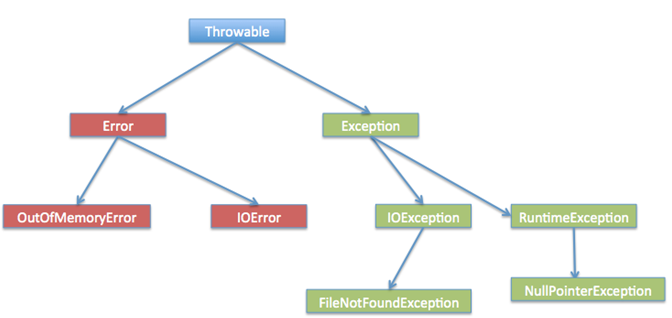

<!-- GFM-TOC -->

- [一、数据类型](#一数据类型)
- [二、条件、循环与运算](#二条件、循环与运算)
- [三、面向对象](#三面向对象)
- [四、Object](#四Object)
- [五、String](#五String)
- [六、异常](#六异常)
- [七、泛型](#七泛型)
- [八、反射](#八反射)
- [九、其他](#九其他)

<!-- GFM-TOC -->


## 一、数据类型

### 1.基本类型

java有八个基本数据类型，分别是(括号内是其对应的字节数，斜杠后是默认值，**注意类的成员变量才有默认值**)：

- byte(1)\ 0
- char(2)\ '\u0000'
- short(2)\ 0
- int(4)\ 0
- float(4)\ 0.0f
- long(8)\ 0L
- double(8)\ 0
- boolean\ false。布尔型可以使用1位进行存储。JVM会在编译时自动将boolean转为int，因此大小是4B。JVM 支持 boolean 数组，但是是通过读写 byte 数组来实现的。

隐式类型转换：(byte char short) -> int -> long -> float ->double   (byte char short)相互之间不互相转化，参与运算的时候首先转化为int。无小数点的数默认为int，有小数点默认为double。

强制转换：从高级向低级转换。如 f=(float)1.0。

特殊：使用 += 或者 ++ 运算符可以执行隐式类型转换。如： 

```java
short s1=1;
s1+=1;//相当于执行了s1=(short)(s1+1);
```

### 2.包装类型

为了编程使用的方便，java引入了基本数据类型，但为了将这些基本类型当做对象进行操作，java为每个基本数据类型提供了相应的包装类型。从java 5开始引入了自动装箱/拆箱机制，从而使两者可以相互转换。

```java
//example of boxing and unboxing
Integer a = 1;//自动装箱，调用Integer.valueOf()方法
int b = a;    //自动拆箱，调用a.intValue()方法
```

```java
Integer a=new Integer(3);
Integer b=3;
int c=3;
Integer d=Integer.valueOf(3);
System.out.println(a==b);//输出false因为两个引用的是不同的对象
System.out.println(a==c);//输出true因为a会自动拆箱成int再进行比较
System.out.println(a==d);//输出false因为d是使用缓存池中的对象，而a是新建一个对象
```

new Integer(3)和Integer.valueOf(3)的区别在于前者每次都会创建一个新的对象，而后者是使用缓存池中的对象，多次调用会取得同一个对象的引用。java8中缓存池的大小默认为-128~127

valueOf() 方法的实现：

```java
public static Integer valueOf(int i) {
    if (i >= IntegerCache.low && i <= IntegerCache.high)
        return IntegerCache.cache[i + (-IntegerCache.low)];//在就返回缓存池中的对象
    return new Integer(i);//不在就新建一个对象
}
```

补充：在 jdk 1.8 所有的数值类缓冲池中，Integer 的缓冲池 IntegerCache 很特殊，这个缓冲池的下界是 - 128，上界默认是 127，但是这个上界是可调的，在启动 jvm 的时候，通过 -XX:AutoBoxCacheMax=< size >来指定这个缓冲池的大小，该选项在 JVM 初始化的时候会设定一个名为 java.lang.IntegerCache.high 系统属性，然后 IntegerCache 初始化的时候就会读取该系统属性来决定上界。


## 二、条件、循环与运算

### 1.switch语句的使用

使用时，注意每个case内都要以break结尾。

java7开始，switch语句支持使用String对象，但不支持long。

### 2.参数传递

一般的参数传递方式有两种：值传递和引用传递。java中采用的是值传递。意思是将一个参数传入一个方法的时候，实质上是将该对象的地址(引用类型)或值(基本类型)以值的方式传递到形参中。如果在方法中改变这个指针的指向，不会影响原指针所指的对象；而如果在方法中改变对象的某个成员变量，则会改变原对象的成员变量值。

### 3.逻辑运算符

逻辑运算符具有短路运算的特点。如 b1&&b2 ，如果左边的表达式为false，则右边的表达式不会执行。

### 4.比较运算符“==”和equals方法

对于引用类型：

- ==比较的是两个对象的引用，如果两个对象的引用完全相同（即指向同一个对象）时，返回true，否则就算值相同也返回false。
- equals方法在Object类中与==相同，但在很多子类中都被重写（如String，Integer等）。一般是比较在内存中变量的值是否相同。Float和Double类中也对equals方法进行了重写，是判断他们的类型是否相同 & 数值是否相同。

对于基本数据类型，只有==运算符没有equals方法。


## 三、面向对象

### 1.构造方法

构造器是一个特殊的方法，用于创建实例时执行初始化。没有构造方法时，系统会自动生成一个默认的无参构造方法；如有，则系统不会自动生成。

在实例化一个对象的时候，会自动执行构造方法中的内容。

### 2.访问控制权限与package、import关键字

java中有四种访问权限

- public，所有类可以访问
- protected，同一包下的其他类和其他包的子类可以访问
- default，同一个包下的其他类可以访问
- private，仅本类可以访问

如果子类重写了父类的方法，则子类中该方法的访问级别不应低于父类的访问级别。

类中的字段不可以公有，使用公有的getter和setter方法来替换公有字段，从而实现对字段的读和写。体现了面向对象的封装特点。

package关键字用于定义包，一般会自动生成。

import关键字用于在使用不同包中的类时，导入所需的相关类。注意：如import java.util.*。只能访问util包中一级目录下的类，不能访问二级目录中的类。因为使用时如果出现一级目录和二级目录中有同名类，会出现所指不明的情况。

### 3.抽象类与接口

抽象类使用abstract关键字进行声明。如果一个类中包含抽象方法，必须声明为抽象类。抽象类不可被实例化，但继承了抽象类的子类可以实例化。

接口是抽象类的延伸。java8之后的接口支持拥有默认的方法实现。接口的字段和方法默认是public，不允许修饰为protected和private。接口的字段默认是static final的。

两者的比较：

- 抽象类是一种IS-A的关系，满足里氏替换原则；而接口是LIKE-A的关系，不要求接口的实现类与接口有IS-A的关系
- 一个类可以实现多个接口，但只能继承一个抽象类
- 接口的使用场景：需要多个类实现一个方法或一个类需要多重继承的时候；抽象类使用场景：需要几个类共享代码、需要能控制访问权限、需要继承非final和非static的字段时。一般接口更为常用。

注：抽象类中的抽象方法（其前有abstract修饰）不能用private、static、synchronized、native等修饰符修饰。

### 4. super与this关键字

super表示当前类的父类

- 访问父类的构造函数。使用super()方法来访问。子类会调用父类的默认构造函数完成初始化工作，也可以用super()方法调用父类的其他构造函数。
- 访问父类的成员。如果子类重写了父类的方法，可以使用super关键字引用父类的方法实现。

this表示当前类

- 访问本类的构造方法：使用this()方法访问本类的构造方法，一般用于访问本类的其他有参构造方法。
- 访问本类中的字段。

### 5. final与static关键字

final：

- 被final声明的数据为常量。
  - 对于基本类型，final声明使数值不能改变
  - 对于引用类型，final使引用不能改变，但引用的对象本身可以改变。
- 被final声明的方法不能被子类重写。
- 被final声明的类不能被继承。

static：

- 静态变量。类的所有实例共享，可以通过类名来访问。
- 静态方法。静态方法在类加载的时候就存在了；静态方法必须实现，不能是抽象方法；只能访问本类的静态变量和静态方法，不能有this和super关键字
- 静态代码块。在类初始化的时候会执行一次。
- 静态内部类。非静态内部类依赖于外部类的实例，而静态内部类不需要。静态内部类不能访问外部类的非静态的变量和方法。
- 静态导包。import static com.xxx.ClassName.* 使用静态变量和方法时不用再指明 ClassName，从而简化代码，但可读性大大降低。

### 6.初始化顺序

在存在继承的情况下，初始化顺序为：

- 父类的静态变量、静态代码块
- 子类的静态变量、静态代码块
- 父类的实例变量和普通代码块
- 父类的构造方法
- 子类的实例变量和普通代码块
- 子类的构造方法

### 7.重写与重载

重写与重载是面向对象多态性的体现。

重写（Override）是指子类实现了一个与父类在方法声明上完全相同的一个方法。

为满足里氏替换原则，重写有以下三个限制：

- 子类方法的访问权限大于父类
- 子类方法返回类型必须与父类一致或是其返回类型的子类
- 子类方法抛出的异常必须与父类一致或为其抛出异常类型的子类

使用@Override注解可以让编译器自动检查是否满足三个限制条件。

在调用一个方法的时候，查找顺序如下：

- 本类是否有对应方法。this.func(this)
- 没有则查找父类是否有对应方法。super.func(this)
- 如果都没有，对参数转型成父类，再在本类中查找。this.func(super)
- 没有则查找父类是否有对应方法。super.func(super)

### 8. instanceof关键字

用于向下转型时判断属于该对象属于哪个子类。

```java
Animal animal=new Dog();
if(animal instanceof Dog){
    ((Dog)animal).fs();
}
```


## 四、Object

所有类都直接或间接的继承java.lang.Object类。由于所有的类都继承在Object类，因此省略了extends Object关键字。

常用方法有以下几个：

### 1.equals()

equals方法在Object类中与==相同，但在很多子类中都被重写（如String，Integer等）。一般是比较在内存中变量的值是否相同。Float和Double类中也对equals方法进行了重写，是判断他们的类型是否相同 & 数值是否相同。

### 2.hashCode()

hashCode() 返回散列值。等价(equals方法返回true)的两个对象散列值一定相同，但是散列值相同的两个对象不一定等价。

在重写 equals() 方法时应当总是重写 hashCode() 方法，保证等价的两个对象散列值也相等。

### 3.toString()

默认返回abc@12344f 的形式，@后面的值为当前对象的散列码的无符号十六进制表示。一般需要返回对象中包含的属性时，要重写toString方法

### 4.clone()

返回当前对象的复制对象。有以下几种实现方式：

- 实现cloneable接口。clone方法是protected修饰的，因此必须显式地对其进行重写，才能调用clone方法。Cloneable 接口规定，如果一个类没有实现 Cloneable 接口又调用了 clone() 方法，就会抛出 CloneNotSupportedException。
- 浅拷贝。复制后的对象与原对象引用同一个对象。
- 深拷贝。复制后的对象与原对象引用不同对象。

## 五、String

String最大的特点在于不可变。String被final修饰，因此不可被继承。（Integer等包装类也不可被继承）

### 1.String类设计为不可变的好处

- 实现String Pool。只有字符串是不可变的，String Pool才能实现。
- 网络安全。譬如，数据库的用户名、密码都是以字符串的形式传入来获得数据库的连接，或者在socket编程中，主机名和端口都是以字符串的形式传入。因为字符串不可变，降低了被篡改的风险。
- 线程安全。同一个字符串实例可以被多个线程共享，不需使用同步即可实现线程安全。
- 用于缓存hash值。因为String不可变，其hash值只需进行一次计算，节省了开销。因而String常被用作HashMap的key。

### 2.String、StringBuffer、StringBuilder的比较

- 可变性。String不可变，StringBuffer、StringBuilder可变

- 线程安全。String和StringBuffer（内部使用synchronized 实现线程同步）线程安全，StringBuilder线程不安全（不能同步访问）

- 执行速度。String<StringBuffer<StringBuilder

  常量用String，需要多线程修改字符串使用StringBuffer，单线程操作大量字符串用StringBuilder

### 3.字符串常量池

字符串常量池（String Pool）保存着所有字符串字面量（literal strings），这些字面量在编译时期就确定。

可以使用 String 的 intern() 方法在运行过程中将字符串添加到 String Pool 中。当一个字符串调用 intern() 方法时，如果 String Pool 中已经存在一个字符串和该字符串值相等（使用 equals() 方法进行确定），那么就会返回 String Pool 中字符串的引用；否则，就会在 String Pool 中添加一个新的字符串，并返回这个新字符串的引用。

在 Java 7 之前，String Pool 被放在运行时常量池中，它属于永久代。而在 Java 7，String Pool 被移到堆中。这是因为永久代的空间有限，在大量使用字符串的场景下会导致 OutOfMemoryError 错误。

使用new String("abc")方法会创建两个字符串对象，在String Pool中如果没有该字符串，则会创建一个，同时还会再堆中创建一个字符串对象。而使用str="abc"的方式，如果String Pool中已有该字符串，不会再创建新的对象，只是将str的引用指向字符串常量池中的"abc"字符串。

## 六、异常

### 1.异常基础

异常是发生在程序执行过程中阻碍程序正常执行的错误事件。

Throwable 可以用来表示任何可以作为异常抛出的类，分为两种： Error 和 Exception。Error表示JVM无法处理的错误，Exception 分为两种：

- 受检异常（Checked Exception） 
  - 需要用 try...catch... 语句捕获并进行处理，并且可以从异常中恢复。我们必须捕获此类异常，并为用户提供有用信息和合适日志来进行调试。
  - Exception是所有受检异常的父类。
  - 常见的受检异常有：
    - ClassNotFoundException，无法找到指定类异常。
    - IOException，IO流异常，一般读写数据时会出现。
    - FileNotFoundException，无法找到指定文件异常。
    - DataFormatException，数据格式异常，如将字符串转为整型：int i=Integer.valueOf("str")。
    - SQLException，JDBC与数据源进行交互时出现错误。
- 非受检异常（运行时异常 Runtime Exception） 
  - 是程序运行时错误，此时程序崩溃并且无法恢复。
  - RuntimeException是所有运行时异常的父类。
  - 常见的运行时异常有：
    - NullPointerException，空指针异常。
    - ArrayIndexOutOfBoundsException、数组索引越界异常。
    - ClassCastExcpetion，强制类型转换异常，将对象强制转换为不是实例的子类时抛出的异常。
    - ArithmeticException，数学异常，如除以零。
    - ArrayStoreException，存储数组类型异常，试图将错误类型的对象存储到一个对象数组时抛出的异常。

### 2.异常关键字

- throw:有时我们需要显式地创建并抛出异常对象来终止程序的正常执行。throw关键字用来抛出并处理**运行时异常**。
- throws:当我们抛出任何**受检异常**并不处理时，需要在方法签名中使用关键字throws来告知调用程序此方法可能会抛出的异常。调用方法可能会处理这些异常，或者同样用throws来将异常传给上一级调用方法。throws关键字后可接多个潜在异常，甚至是在main()中也可以使用throws。
- try-catch:我们在代码中用try-catch块处理异常。一个try块之后可以有多个catch子句，try-catch块也能嵌套。每个catch块必须接受一个（且仅有一个）代表异常类型的参数。
- finally：finally块是可选的，并且只能配合try-catch一起使用。虽然异常终止了程序的执行，但是还有一些打开的资源没有被关闭，因此，我们能使用finally进行关闭。不管异常有没有出现，finally块总会被执行。

注：finally代码块先于return语句执行，当finally代码块中有return语句，会覆盖try/catch代码块中的return语句。

### 3. Throwable继承关系

<div align="center">  </div><br>
### 4.常用方法

Exception和它的所有子类没有提供任何特殊方法供使用，它们的所有方法都是来自其基类Throwable。

- String getMessage():方法返回Throwable的String型信息，当异常通过构造器创建后可用。
- String getLocalizedMessage()：此方法通过被重写来得到用本地语言表示的异常信息返回给调用程序。Throwable类通常只是用getMessage()方法来实现返回异常信息。
- synchronized Throwable getCause():此方法返回异常产生的原因，如果不知道原因的话返回null。
- String toString():方法返回String格式的Throwable信息，此信息包括Throwable的名字和本地化信息。
- void printStackTrace()：该方法打印栈轨迹信息到标准错误流。该方法能接受PrintStream 和PrintWriter作为参数实现重载，这样就能实现打印栈轨迹到文件或流中。


## 七、泛型

### 1.泛型概念

泛型即参数化类型。将类型由原来的具体的类型参数化，类似于方法中的变量参数，此时类型也定义成参数形式（可以称之为类型形参），然后在使用/调用时传入具体的类型（类型实参）。

常用于集合中，不使用泛型会导致集合在添加元素的时候，如果添加的元素类型不一致，运行时会报类型转换异常。而如果在初始化时，将泛型声明出来，在添加与指定类型不一致的元素时，编译器就会报错。如：

```java
List<String> arrayList = new ArrayList<String>();
arrayList.add(100);//编译不通过
```

### 2.泛型的使用方式

泛型有三种使用方式：泛型类、泛型接口和泛型方法。定义时，一般使用T、E、K、V等形式的参数常用于表示泛型。

- 泛型类

  - 将泛型用于类的定义中。最典型的就是各种容器类。在使用时，不一定要传入泛型类型实参，如果不传入，则可以为任何类型。

  ```java
  //泛型类定义示例
  public class Generic<T>{
      private T key;
      public Generic(T key) { 
          this.key = key;
      }
  }
  ```

  - 泛型的类型参数只能是引用类型，不能是基本类型

- 泛型接口。与泛型类的定义与使用基本相同。

- 泛型方法。是在调用方法的时候指明泛型的具体类型，在方法声明时以泛型作为返回值的类型。如：

  ```java
  public <T> T genericMethod(Class<T> tClass)throws InstantiationException ,IllegalAccessException{
          T instance = tClass.newInstance();
          return instance;
  }
  ```

### 3.通配符

例：如果将List<String> 传递给一个接受List<Object>的方法，编译不会通过，因为类型不匹配。为了解决以上问题，需要引入通配符。

非限定通配符：

- 在传入参数的类型不确定的时候，一般使用？代替具体的类型实参。例：

```java
public void showKeyValue1(Generic<?> obj){
    System.out.println(obj.getKey());
}
```

限定通配符：

- <? extends T>确保类型必须是T的子类来设定类型上界。例如List<? extends Number>可以接受List<Integer>或List<Float>
- <? super T>确保类型必须是T的父类来设定类型的下界。

注：Array不支持泛型。因此一般建议用List来替代Array，因为List可以提供编译期的类型安全保证。

## 八、反射

### 1.反射的概念

反射 (Reflection) 是 Java 的特征之一，它允许运行中的 Java 程序获取自身的信息，并且可以操作类或对象的内部属性。

通过反射，我们可以在**运行时**获得程序或程序集中每一个类型的成员和成员的信息。程序中一般的对象的类型都是在编译期就确定下来的，而 Java 反射机制可以动态地创建对象并调用其属性，这样的对象的类型在编译期是未知的。所以我们可以通过反射机制直接创建对象，即使这个对象的类型在编译期是未知的。

每个类都有一个 **Class** 对象，包含了与类有关的信息。当编译一个新类时，会产生一个同名的 .class 文件，该文件内容保存着 Class 对象。

类加载相当于 Class 对象的加载，类在第一次使用时才动态加载到 JVM 中。也可以使用 `Class.forName("com.mysql.jdbc.Driver")` 这种方式来控制类的加载，该方法会返回一个 Class 对象。反射的核心是 JVM 在运行时才动态加载类或调用方法/访问属性，它不需要事先（写代码的时候或编译期）知道运行对象是谁。

### 2.反射的作用

- 在运行时判断任意一个对象所属的类；
- 在运行时构造任意一个类的对象；
- 在运行时判断任意一个类所具有的成员变量和方法（通过反射甚至可以调用private方法）；
- 在运行时调用任意一个对象的方法

### 3.反射的优缺点

反射的优点：

- **可扩展性** ：应用程序可以利用全限定名创建可扩展对象的实例，来使用来自外部的用户自定义类。
- **类浏览器和可视化开发环境** ：一个类浏览器需要可以枚举类的成员。可视化开发环境（如 IDE）可以从利用反射中可用的类型信息中受益，以帮助程序员编写正确的代码。
- **调试器和测试工具** ： 调试器需要能够检查一个类里的私有成员。测试工具可以利用反射来自动地调用类里定义的可被发现的 API 定义，以确保一组测试中有较高的代码覆盖率。

反射的缺点：

- **性能开销** ：反射涉及了动态类型的解析，所以 JVM 无法对这些代码进行优化。因此，反射操作的效率要比那些非反射操作低得多。我们应该避免在经常被执行的代码或对性能要求很高的程序中使用反射。
- **安全限制** ：使用反射技术要求程序必须在一个没有安全限制的环境中运行。如果一个程序必须在有安全限制的环境中运行，如 Applet，那么这就是个问题了。
- **内部暴露** ：由于反射允许代码执行一些在正常情况下不被允许的操作（比如访问私有的属性和方法），所以使用反射可能会导致意料之外的副作用，这可能导致代码功能失调并破坏可移植性。反射代码破坏了抽象性，因此当平台发生改变的时候，代码的行为就有可能也随着变化。

[深入解析Java反射](https://www.sczyh30.com/posts/Java/java-reflection-1/)


## 九、其他

### 1.JRE与JDK

- JRE is the JVM program, Java application need to run on JRE.Java运行环境，面向Java程序的使用者。
- JDK is a superset of JRE, JRE + tools for developing java programs. e.g, it provides the compiler "javac"。面向开发者使用的SDK。

### 2.变量命名规则

由字母、数字、$和下划线组成，不能以数字开头，不能使用关键字。

### 3.序列化与transient关键字

序列化的含义：

- Java中对象的序列化指的是将对象转换成以字节序列的形式来表示，这些字节序列包含了对象的数据和信息，一个序列化后的对象可以被写到数据库或文件中，也可用于网络传输，一般当我们使用缓存cache（内存空间不够有可能会本地存储到硬盘）或远程调用rpc（网络传输）的时候，经常需要让我们的实体类实现Serializable接口，目的就是为了让其可序列化。
- 将序列化后的字节序列恢复成java对象的过程称为反序列化。

transient关键字的作用就是让被修饰的成员变量不被序列化，可以节省一定的存储空间。一般有两种情况可以用transient关键字修饰：

- 类中的字段值可以由其他字段推导出来，例如一个长方形类有长、宽、面积三个属性，那么面积这个属性可以用transient关键字修饰。
- 功能性的字段。例如modCount，主要用于判断容器类的结构是否发生变化，就不需要序列化。

注意：

- 一旦变量被transient修饰，变量将不再是对象持久化的一部分，该变量内容在序列化后无法获得访问。 
- transient关键字只能修饰变量，而不能修饰方法和类。注意，本地变量是不能被transient关键字修饰的。变量如果是用户自定义类变量，则该类需要实现Serializable接口。 
- 一个静态变量不管是否被transient修饰，均不能被序列化。 


## 参考资料

- Eckel B. Java 编程思想[M]. 机械工业出版社, 2002.
- Bloch J. Effective java[M]. Addison-Wesley Professional, 2017.
- Cay S,周立新等译. Java核心技术 卷一 [M].机械工业出版社,2017

