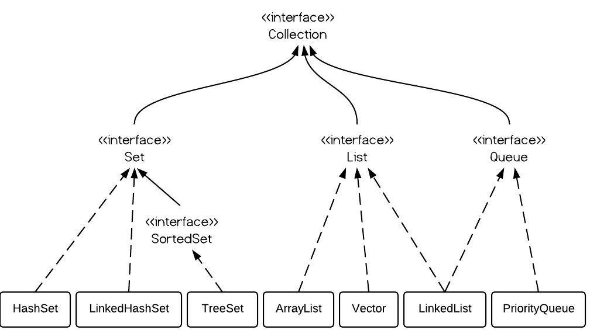

<!-- GFM-TOC -->

- [一、概述](#一概述)
  - [1.Collection](#1.Collection)
  - [2.Map](#2.Map)
- [二、源码](#二源码)

<!-- GFM-TOC -->


## 一、概述

Java中主要有Collection和Map两种容器，Collection是存储某种对象的集合，Map是存储两个对象形成的键值对（映射表）。

### 0.Iterable和Iterator

- Iterator是迭代器接口，此接口的实例可以对集合进行迭代遍历；Iterable是Collection接口的父接口。
- Iterable接口中有一个成员是Iterator，只要实现了Iterable接口的类，就可使用Iterator迭代器。
- Iterator中核心方法有next()（返回迭代器中的下一个值）,hasNext()（返回迭代器是否有下一个值）和remove()（从迭代器中移除迭代器返回的最后一个元素）

```java
List<Integer> list=new ArrayList<>();
for (Integer integer : list) {
    System.out.println(integer);
}
//上面的代码在编译时会自动变成
List<Integer> list = new ArrayList();
Iterator var3 = list.iterator();
while(var3.hasNext()) {
    Integer integer = (Integer)var3.next();
    System.out.println(integer);
}
```


### 1.Collection

<div align="center">  </div><br>
Collection继承自Iterable接口。

Collection下有Set、List和Queue三个接口。

**Set**

Set中存放的数据是唯一的。可以存放null，但只有一个。

- HashSet。无序，底层的数据结构是哈希表，支持快速查找O(1)，使用Iterator遍历得到的结果不确定。保证唯一性的两个方法（hashCode()和equals()方法）。
- LinkedHashSet。有序，底层数据结构是链表+哈希表，具有HashSet的查找效率。
- TreeSet。有序（排序），底层数据结构是红黑树，查找效率为O(logN)。实现了SortedSet接口，元素排序的方法有默认排序和比较器排序。

**List**

List中存放的数据是有序且可重复的。可存放多个null值。

- ArrayList。底层数据结构是数组，查询快，增删慢。线程不安全，效率高。
- Vector。底层数据结构是数组，查询快，增删慢。线程安全，效率低。Stack类继承自Vector类。
- LinkedList。底层数据结构是链表（双向链表），查询慢，增删块。线程不安全，效率高。

**Queue**

- LinkedList。可以用来实现双端队列。
- PriorityQueue。基于堆结构实现，可以用来实现优先队列。java中默认是小顶堆，使用大顶堆需要重写其compare方法。

Collection集合类的选用：

- 先判断是否需要元素唯一。唯一则用set，否则用list
- 使用set判断是否需要有序。有序用LinkedHashSet/TreeSet，否则HashSet
- 使用list判断是否需要线程安全。需要用vector；否则查询多用ArrayList，增删多用LinkedList。
- 需要用到堆或者优先队列时使用PriorityQueue。

### 2.Map

Map接口主要的实现类有HashMap,HashTable,TreeMap和LinkedHashMap。其中TreeMap实现了SortedMap接口。

- HashMap。底层数据结构是哈希表。
- HashTable。与HashMap类似，但它是线程安全的。属于遗留类，不建议使用。可以使用ConcurrentHashMap 来支持线程安全，并且ConcurrentHashMap 的效率更高一些，因为HashTable是整个加锁，而ConcurrentHashMap 引入了分段锁。
- TreeMap。有序（排序），底层数据结构是红黑树。
- LinkedHashMap。有序，链表+哈希表，顺序为插入顺序或者LRU（最近最少使用）顺序。


## 二、源码分析

注：无特殊说明的情况下，以下源码是基于jdk1.8的源码分析

### 1.ArrayList

#### 1.1继承关系

```java
public class ArrayList<E> extends AbstractList<E>  
	implements List<E>, RandomAccess, Cloneable, java.io.Serializable
```

继承自AbstractList类，实现了RandomAccess接口表示该类支持快速随机访问，因为底层数据结构是数组。

#### 1.2添加与扩容

数组的默认初始容量是10。

添加元素时，使用ensureCapacityInternal方法来确保容量足够，如果容量不足，要使用grow方法进行扩容，扩容大小为原有容量的1.5倍。

```java
private static final int DEFAULT_CAPACITY = 10;

public boolean add(E e) {
    ensureCapacityInternal(size + 1);  // Increments modCount!!
    elementData[size++] = e;
    return true;
}
private void ensureCapacityInternal(int minCapacity) {
    if (elementData == DEFAULTCAPACITY_EMPTY_ELEMENTDATA) {
        minCapacity = Math.max(DEFAULT_CAPACITY, minCapacity);
    }
    ensureExplicitCapacity(minCapacity);
}
private void ensureExplicitCapacity(int minCapacity) {
    modCount++;
    // overflow-conscious code
    if (minCapacity - elementData.length > 0)
        grow(minCapacity);
}
private void grow(int minCapacity) {
    // overflow-conscious code
    int oldCapacity = elementData.length;
    int newCapacity = oldCapacity + (oldCapacity >> 1);
    if (newCapacity - minCapacity < 0)
        newCapacity = minCapacity;
    if (newCapacity - MAX_ARRAY_SIZE > 0)
        newCapacity = hugeCapacity(minCapacity);
    // minCapacity is usually close to size, so this is a win:
    elementData = Arrays.copyOf(elementData, newCapacity);
}
```

由于每次扩容需要使用Arrays.copyOf()方法将原数组整个复制到新数组中，这一操作的代价很高，因此最好在创建ArrayList时就指定大概的容量大小，减少扩容的次数。

#### 1.3删除

ArrayList删除元素需要调用System.arraycopy()方法将从index+1开始后面的元素全部复制到其前一个位置，时间复杂度为O(N)，代价很高。

```java
    public E remove(int index) {
        rangeCheck(index);
        modCount++;
        E oldValue = elementData(index);
        int numMoved = size - index - 1;
        if (numMoved > 0)
            System.arraycopy(elementData, index+1, elementData, index,
                             numMoved);
        elementData[--size] = null; // clear to let GC do its work
        return oldValue;
    }
```

#### 1.4拷贝

ArrayList的clone实现，是通过数组元素拷贝来实现的深拷贝。

```java
public Object clone() {
    try {
        ArrayList<?> v = (ArrayList<?>) super.clone();
        v.elementData = Arrays.copyOf(elementData, size);
        v.modCount = 0;
        return v;
    } catch (CloneNotSupportedException e) {
        // this shouldn't happen, since we are Cloneable
        throw new InternalError(e);
    }
}
```

#### 1.5序列化

ArrayList实现了Serializable接口，说明是可以被序列化的，但是elementData数组又被transient关键字修饰（即不参与序列化过程），存在矛盾。

```java
private void readObject(java.io.ObjectInputStream s)
    throws java.io.IOException, ClassNotFoundException {
    elementData = EMPTY_ELEMENTDATA;

    // Read in size, and any hidden stuff
    s.defaultReadObject();

    // Read in capacity
    s.readInt(); // ignored

    if (size > 0) {
        // be like clone(), allocate array based upon size not capacity
        ensureCapacityInternal(size);

        Object[] a = elementData;
        // Read in all elements in the proper order.
        for (int i=0; i<size; i++) {
            a[i] = s.readObject();
        }
    }
}
```

实际上，ArrayList重写了readObject和writeObject来自定义的序列化和反序列化策略。自定义的方法通过遍历elementData数组中的数据来将元素写入ObjectInputStream 和ObjectOutputStream。这样只对数组中的有效元素进行了序列化，而null的部分没有。从而减少了开销。


#### 1.6线程安全.fail-fast与fail-safe

fail-fast（快速失败）与fail-safe（安全失败）

- 快速失败。在用迭代器遍历一个集合对象时，如果遍历过程中另一个线程对集合对象的内容进行了修改（增加、删除、修改），则会抛出Concurrent Modification Exception。
- 采用安全失败机制的集合容器，在遍历时不是直接在集合内容上访问的，而是先复制原有集合内容，在拷贝的集合上进行遍历。java.util.concurrent包下的容器都是安全失败。

modCount变量用于记录ArrayList的结构发生变化的次数，是指添加或删除了元素或是调整了数组的大小。在进行序列化或迭代等操作时，需要比较操作前后modCount的值是否发生改变，如果改变了会抛出Concurrent Modification Exception。

```java
private void writeObject(java.io.ObjectOutputStream s)
        throws java.io.IOException{
        // Write out element count, and any hidden stuff
        int expectedModCount = modCount;
        s.defaultWriteObject();

        // Write out size as capacity for behavioural compatibility with clone()
        s.writeInt(size);

        // Write out all elements in the proper order.
        for (int i=0; i<size; i++) {
            s.writeObject(elementData[i]);
        }

        if (modCount != expectedModCount) {
            throw new ConcurrentModificationException();
        }
    }
```

迭代时修改抛出异常示例：

```java
List<Integer> list = new ArrayList<>(Arrays.asList(1, 2, 3));
Iterator<Integer> iterator = list.listIterator();
while (iterator.hasNext()) {
    Integer i = iterator.next();
    if (i == 1) {
        list.remove(i);
    }
}
```

抛出异常：

```java
Exception in thread "main" java.util.ConcurrentModificationException
```

如果需要迭代过程中修改，使用Iterator中提供的remove方法即可。原理是因为remove方法移除元素后可以将modCount重新赋值给expectedModCount，这样就不会抛出异常。

```java
List<Integer> list = new ArrayList<>(Arrays.asList(1, 2, 3));
Iterator<Integer> iterator = list.listIterator();
while (iterator.hasNext()) {
    Integer i = iterator.next();
    if (i == 1) {
        iterator.remove();
    }
}
```

ArrayList是线程不安全的，可以使用Collections.synchronizedList()方法获得一个线程安全的ArrayList，也可以使用concurrent并发包下的CopyOnWriteArrayList 类。

```java
List<String> list=new ArrayList<>();
List<String> synList=Collections.synchronizedList(list);
List<String> cowList=new CopyOnWriteArrayList<>();
```

#### 1.7CopyOnWriteArrayList

读写分离的实现：

- 写操作在复制的数组上进行，读操作在原数组上进行；
- 写操作加锁，防止并发写入时导致写入数据丢失；
- 写操作结束后将原数组指向新数组。

```java
public boolean add(E e) {
    final ReentrantLock lock = this.lock;
    lock.lock();
    try {
        Object[] elements = getArray();
        int len = elements.length;
        Object[] newElements = Arrays.copyOf(elements, len + 1);
        newElements[len] = e;
        setArray(newElements);
        return true;
    } finally {
        lock.unlock();
    }
}
final void setArray(Object[] a) {
    array = a;
}
```

CopyOnWriteArrayList可在写操作的同时允许读操作，适合读多写少的情景。但是内存开销较大，且不能实时地读取数据，不适合内存约束和有实时性要求的情景。

#### 1.8其他

ArrayList与Array的相互转化：

```java
Integer [] a=new Integer []{1,2,3};
List<Integer> list= new ArrayList<>(Arrays.asList(a));
Integer [] b= (Integer[]) list.toArray();
```

ArrayList与Array的区别：

- ArrayList只能容纳对象，Array可以容纳基本类型和对象。
- ArrayList大小可变，Array大小固定。

使用Array更好的情形：基本类型、大小固定、多维数组。


### 2.LinkedList

#### 2.1继承关系

```java
public class LinkedList<E>
    extends AbstractSequentialList<E>
    implements List<E>, Deque<E>, Cloneable, java.io.Serializable
```

#### 2.2Node类

使用Node类存储链表节点的信息，有prev和next两个指针。

```java
private static class Node<E> {
    E item;
    Node<E> next;
    Node<E> prev;

    Node(Node<E> prev, E element, Node<E> next) {
        this.item = element;
        this.next = next;
        this.prev = prev;
    }
}
```

注：LinkedList类中还存储了first和last两个指针用来存储头指针和尾指针。

```java
transient Node<E> first;
transient Node<E> last;
```


#### 2.3ArrayList和LinkedList的区别

- 底层实现：动态数组/双向链表
- 随机访问：支持/不支持
- 增删元素：慢/快


### 3.HashMap

**HashMap的整体实现**

HashMap是由哈希表来实现的，即数组+链表的方式实现，通过key的hash值与数组长度取余来获得插入数组的下标（桶坐标），如果产生哈希冲突，在该下标位置转为链表。jdk1.8以后，当链表长度到达8并且数组长度大于等于64则转为红黑树。

#### 3.1 存储结构

HashMap主要包含以下几个字段

```java
transient Node<K,V>[] table;//Node数组
transient int size;
transient int modCount;
int threshold;//最大键值对个数
final float loadFactor;//负载因子，默认0.75
```

table字段是一个Node数组，初始默认大小是16。Node是HashMap的一个内部类，实现了Map.Entry类，存储了键值对信息。Node类中还包含next字段，可以看出每个Node都是一个链表。Node类与1.8之前的Entry类是等价的。

```java
static class Node<K,V> implements Map.Entry<K,V> {
        final int hash;    //用来定位数组索引位置
        final K key;
        V value;
        Node<K,V> next;   //链表的下一个node

        Node(int hash, K key, V value, Node<K,V> next) { ... }
        public final K getKey(){ ... }
        public final V getValue() { ... }
        public final String toString() { ... }
        public final int hashCode() { ... }
        public final V setValue(V newValue) { ... }
        public final boolean equals(Object o) { ... }
}
```

size字段是HashMap中实际存在的键值对数量

modCount字段记录内部结构发生变化的次数，用于迭代器中的快速失败。当put新的键值对时，结构发生变化，但覆盖某个key对应的value值不算。

threshold字段是指HashMap所能容纳的最大键值对个数。threshold=loadFactor*length。超过这个数目就需要resize（扩容）扩容后的HashMap的容量是之前的两倍。

loadFactor是负载因子。默认0.75，越大说明允许存储的键值对个数越多。默认0.75是对时间和空间效率的一个平衡选择。

#### 3.2 确定桶下标

HahsMap利用hash算法求得数组索引的位置。我们希望HashMap中的元素尽量分布的均匀一些，即使得每个位置上的元素数量只有一个。

```java
static final int hash(Object key) {
    int h;
    return (key == null) ? 0 : (h = key.hashCode()) ^ (h >>> 16);
}
```

这里Hash算法本质上就是三个步骤：

- 取HashCode值
- 高位运算
- 取模运算

Hash算法是先对key取hashCode值，然后将高16位与低16位进行异或运算得到hash值。这么做的原因主要是从速度，功效和质量来考虑的，**减少系统的开销**，也不会造成**因为高位没有参与**下标的计算，从而引起的**碰撞**。 

使用异或运算的原因：减少碰撞。保证了对象的32位中有一位发生改变，hash值就会相应的发生改变，从而减少了碰撞的情况。

最后使用除留余数法得到桶下标，用hashCode值 % size。

#### 3.3 put方法

执行过程： 

- 首先会计算 key 的 hash 值，然后根据 hash 值确认在 table 中存储的位置。
- 若该位置没有元素，则直接插入。
- 否则迭代该处元素链表并依次比较其 key 的 hash 值。如果两个 hash 值相等且 key 值相等(e.hash == hash && ((k = e.key) == key || key.equals(k)))，则用新的 Entry 的 value 覆盖原来节点的 value。
- 如果两个 hash 值相等但 key 值不等 ，则将该节点插入该链表的尾部。1.8之前是头插法，1.8改为尾插法。 

```java
public V put(K key, V value) {
    return putVal(hash(key), key, value, false, true);
}
final V putVal(int hash, K key, V value, boolean onlyIfAbsent,
               boolean evict) {
    Node<K,V>[] tab; Node<K,V> p; int n, i;
    //如果table为null或者为空，则执行扩容
    if ((tab = table) == null || (n = tab.length) == 0)
        n = (tab = resize()).length;
    //计算桶下标，如果对应索引的数组元素为null，则新建一个节点添加上去
    if ((p = tab[i = (n - 1) & hash]) == null)
        tab[i] = newNode(hash, key, value, null);
    //如果不为空，则用拉链法添加元素
    else {
        Node<K,V> e; K k;
        //依次比较key的hash值，如果相等且key相等，则覆盖该值。
        if (p.hash == hash &&
            ((k = p.key) == key || (key != null && key.equals(k))))
            e = p;
        //判断此时的数组是否是红黑树，如果是，则直接调用红黑树中插入键值对的方法putTreeVal
        else if (p instanceof TreeNode)
            e = ((TreeNode<K,V>)p).putTreeVal(this, tab, hash, key, value);
        //如果链表长度大于8，则将链表转为红黑树。jdk1.8后增加
        else {
            for (int binCount = 0; ; ++binCount) {
                //尾插法
                if ((e = p.next) == null) {
                    p.next = newNode(hash, key, value, null);
                    if (binCount >= TREEIFY_THRESHOLD - 1) // -1 for 1st
                        treeifyBin(tab, hash);
                    break;
                }
                if (e.hash == hash &&
                    ((k = e.key) == key || (key != null && key.equals(k))))
                    break;
                p = e;
            }
        }
        //如果当前key已经存在，覆盖其value值
        if (e != null) { // existing mapping for key
            V oldValue = e.value;
            if (!onlyIfAbsent || oldValue == null)
                e.value = value;
            afterNodeAccess(e);
            return oldValue;
        }
    }
    ++modCount;
    //容量超过就执行扩容
    if (++size > threshold)
        resize();
    afterNodeInsertion(evict);
    return null;
}
```

#### 3.4 get方法

通过 key 的 hash 值找到在 table 数组中的索引处的 Entry，然后返回该 key 对应的 value 即可。

在存储的过程中，系统根据 key 的 HashCode 来决定 Entry 在 table 数组中的存储位置，在取的过程中同样根据 key 的 HashCode 取出相对应的 Entry 对象（value 就包含在里面） 

#### 3.5 resize方法

有两种情况下会调用resize方法：

-  第一次调用 HashMap 的 put 方法时，会调用 resize 方法对 table 数组进行初始化，如果不传入指定值，默认大小为 16。 
- 当HashMap中无法装载更多的元素时，就需要进行扩容(resize)。

为了便于理解，以下以JDK1.7的源码进行分析。

当需要扩容时，令capacity变为原来的两倍。

```java
void addEntry(int hash, K key, V value, int bucketIndex) {
    Entry<K,V> e = table[bucketIndex];
    table[bucketIndex] = new Entry<>(hash, key, value, e);
    if (size++ >= threshold)
        resize(2 * table.length);
}
```

调用resize()方法实现，需要将原数组中的所有Entry放入新数组中，这一步是很费时的。

```java
void resize(int newCapacity) {  
    Entry[] oldTable = table;    
    int oldCapacity = oldTable.length;         
    if (oldCapacity == MAXIMUM_CAPACITY) {  
        threshold = Integer.MAX_VALUE; 
        return;
    }
    Entry[] newTable = new Entry[newCapacity];  
    transfer(newTable);                         
    table = newTable;                           
    threshold = (int)(newCapacity * loadFactor);
}
```

这里使用了一个容量更大的数组来代替原有数组，使用transfer方法将原有的Entry数组中的元素拷贝到新的Entry数组中。

```java
void transfer(Entry[] newTable) {
    Entry[] src = table;                   
    int newCapacity = newTable.length;
    for (int j = 0; j < src.length; j++) { 
        Entry<K,V> e = src[j];             
        if (e != null) {
            src[j] = null;
            do {
                Entry<K,V> next = e.next;
                int i = indexFor(e.hash, newCapacity); //重新计算每个元素在数组中的位置
                e.next = newTable[i]; 
                newTable[i] = e;      
                e = next;             
            } while (e != null);
        }
    }
}
```

新数组中确定位置的方式：

- 对于一个key，它的哈希值与length进行与运算，如果为0，则桶位置与原来一致；如果结果为1，桶位置为原来位置+length。

HashMap多线程死循环问题：

- 是由于多线程同时put时，如果同时触发了rehash操作，则会导致HashMap中出现循环链表。进而使得后面使用get方法时，会出现死循环。

HashMap的底层数组的长度设计为2的整数次方的原因：

- 当length为2的n次方时，进行取模运算时，使用 h & length-1就相当于对length取模，而且计算效率比直接取模要高，同时还不会造成空间的浪费。因此每次扩容时都进行翻倍，保证数组length为2的n次方。

#### 3.6 与HashTable的区别

- HashTable使用synchronized关键字来实现同步，是线程安全的。而HashMap的迭代器是fail-fast迭代器，但是也可以通过 Collections.synchronizedMap(hashMap) 使其实现同步。
- HashMap允许key和value的值为null，而HashTable不允许。HashMap通过putForNullKey方法处理key为null的情况；而HashTable会报空指针异常。

### 4.ConcurrentHashMap

以下分析以JDK1.7为主。

#### 4.1存储结构

 JDK1.7中ConcurrentHashMap 采用了数组 + Segment + 分段锁的方式实现。 

```java
static final class HashEntry<K,V> {
    final int hash;
    final K key;
    volatile V value;
    volatile HashEntry<K,V> next;
}
```

ConcurrentHashMap 和 HashMap 实现上类似，最主要的差别是 ConcurrentHashMap 采用了分段锁（Segment,继承自 ReentrantLock），每个分段锁维护着几个桶（HashEntry），多个线程可以同时访问不同分段锁上的桶，从而使其并发度更高（并发度就是 Segment 的个数）。这样分段处理减小了锁的粒度。

```java
static final class Segment<K,V> extends ReentrantLock implements Serializable {

    private static final long serialVersionUID = 2249069246763182397L;

    static final int MAX_SCAN_RETRIES =
        Runtime.getRuntime().availableProcessors() > 1 ? 64 : 1;

    transient volatile HashEntry<K,V>[] table;

    transient int count;

    transient int modCount;

    transient int threshold;

    final float loadFactor;
}

final Segment<K,V>[] segments;
static final int DEFAULT_CONCURRENCY_LEVEL = 16;//默认并发级别为16，即默认创建16个Segment
```

#### 4.2 实现原理

- ConcurrentHashMap 的主干是个 Segment 数组。 
- Segment 继承了 ReentrantLock，所以它就是一种可重入锁（ReentrantLock)。每个Segment 类似于一个HashMap，Segment 里维护了一个 HashEntry 数组。
- 并发环境下，对于不同 Segment 的数据进行操作是不用考虑锁竞争的。就按默认的 ConcurrentLevel 为 16 来讲，理论上就允许 16 个线程并发执行。 
- ConcurrentHashMap 定位一个元素的过程需要进行两次 Hash 操作。第一次 Hash 定位到 Segment，第二次 Hash 定位到元素所在的链表的头部。 

#### 4.3 JDK1.8的改动

JDK 1.8 使用了 CAS （比较并交换）操作来支持更高的并发度，在 CAS 操作失败时使用内置锁 synchronized。并且 JDK 1.8 的实现也在链表过长时会转换为红黑树。


### 5.LinkedHashMap

实现原理：

- LinkedHashMap 也是基于 HashMap 实现的，不同的是它定义了一个 Entry header，这个 header 不是放在 Table 里，它是额外独立出来的。LinkedHashMap 通过继承 hashMap 中的 Entry，并添加两个属性 Entry before，after 和 header 结合起来组成一个双向链表，来实现按插入顺序或访问顺序排序。
- LinkedHashMap 定义了排序模式 accessOrder，该属性为 boolean 型变量，默认为false。对于访问顺序，为 true；对于插入顺序，则为 false。一般情况下，不必指定排序模式，其迭代顺序即为默认为插入顺序。 


### 6.HashSet

实现原理：

- HashSet 的实现是依赖于 HashMap 的，HashSet 的值都是存储在 HashMap 中的。在 HashSet 的构造法中会初始化一个 HashMap 对象，HashSet 不允许值重复。
- HashSet的元素值作为map的key， value是一个PRESENT 变量，仅作为占位符存在；因为HashMap的key不可能重复，所以HashSet的元素也不能重复。


