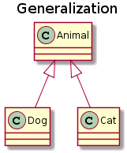
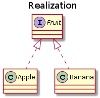
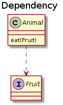
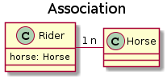
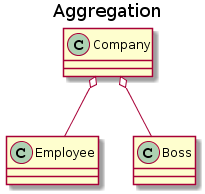
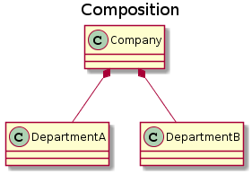

<!-- GFM-TOC -->

- [一、面向对象三大特性](#一面向对象三大特性)
- [二、设计原则](#二设计原则)
- [三、类的关系](#三类的关系)

<!-- GFM-TOC -->


## 一、面向对象三大特性

1. 封装。 将描述事物的数据和操作封装在一起，形成一个类；被封装的数据和操作只有通过提供的公共方法才能被外界访问（封装隐藏了对象的属性和实施细节），私有属性和方法是无法被访问的，表现了封装的隐藏性，增加数据的安全性。 
2. 继承。子类通过继承获得父类的属性和方法。继承应满足里氏替换原则。
3. 多态。不同的输入通过调用相同的方法，得到不同的输出。多态又分为编译时多态和运行时多态： 
   - 编译时多态主要指方法的重载。
   - 运行时多态是指程序中定义的对象引用所指的具体类型在运行期间才确定。需要满足继承、重写和向上转型三个条件。


## 二、设计原则

软件设计的总体原则是低耦合、高内聚。只有各个模块之间的耦合尽量的低，才能提高代码的复用率。

SOLID五大原则为基本原则，此外还有一些常见的设计原则。

### 1.单一职责原则

Single Responsibility Principle（SRP）

**一个类应该仅有一个引起他变化的原因**

即让一个类只承担一项职责，如果一个类承担了多项职责，当需要修改其中一个职责时，可能会导致其他职责的功能发生故障。

当这个类需要做过多的事情时，就需要对其进行分解。

### 2.开放封闭原则

Open Closed Principle(OCP)

**对于扩展是开放的，对于修改是封闭的**

即要求一个类在添加新的功能时，不需要修改已有的代码来实现变化，而是通过扩展软件实体的行为来实现变化。

例如装饰者模式很好地体现了这一原则，它可以动态地将功能附加到对象上，而不用修改类的代码。

### 3.里氏替换原则

Liskov Substitution Principle(LSP)

**任何父类可以出现的地方，子类一定可以出现**

这一原则描述了继承关系，即子类一定能当成父类来使用，同时比父类更为特殊。子类可以扩展父类的功能，但不能改变父类原有的功能。一般来说体现在以下几个方面：

- 子类可以实现父类的抽象方法，但不能重写。
- 子类可以增加自己特有的方法。
- 子类重写父类的方法时，权限修饰符范围要比父类大。
- 子类实现父类抽象方法时，返回值要比父类的范围更小。

### 4.接口隔离原则

Interface Segregation Principle(ISP)

**客户端不应该依赖它不需要的接口**

即我们要为各个类建立专用的接口，而不要试图去建立一个很庞大的接口供所有依赖它的类去调用。 

### 5.依赖倒置原则

Dependence Inversion Principle(DIP)

**高层模块不应该依赖低层模块，二者都应该依赖其抽象；
抽象不应该依赖细节；细节应该依赖抽象**

由于细节是多变的，而抽象的东西是稳定的，因此以抽象为基础搭建的架构更为稳定。这一原则的核心思想是面向接口编程。使用接口或者抽象类的目的是制定好规范和契约，而不去涉及任何具体的操作，把展现细节的任务交给他们的实现类去完成。 

在实际中主要体现在以下三个方面：

- 任何变量都不应有指向具体类的指针或引用。
- 任何类都不应从具体类中派生。
- 任何方法都不应重写它父类中已实现的方法。

目前流行的测试驱动开发方式（TDD）也是依赖倒置原则的成功应用。TDD指的是在编码前先写单元测试，明确需要实现的功能。

### 6.迪米特原则

Law Of Demeter(LOD)

**一个软件实体应尽可能少的与其他实体发生相互作用**

一个单位应只与其直接关联的单位进行通信。门面模式（外观模式）和调停模式（中介者模式）都是迪米特原则的应用。

### 7.合成复用原则

 Composite Reuse Principle(CRP)

尽量使用对象的组合来实现复用，而不是继承。


## 三、类的关系

类的关系主要有泛化、实现、依赖、关联、聚合、组合，这六种关系的紧密程度依次加强。UML类图绘制参考 http://plantuml.com/ 

### 1.泛化

用来描述继承关系，java中使用extends关键字表示。是一种is-a关系。

类图中用空心三角形箭头实线，将子类指向父类。

```
@startuml
title Generalization

class Animal
class Dog
class Cat

Animal <|-- Dog
Animal <|-- Cat
@enduml
```

<div align="center">  </div><br>

### 2.实现

实现一个接口，java中用implements关键字表示。

类图中用空心三角形箭头虚线，将实现类指向接口。

```
@startuml
title Realization

interface Fruit
class Apple
class Banana

Fruit <|.. Apple
Fruit <|.. Banana
@enduml
```

<div align="center">  </div><br>

### 3.依赖

是一种使用的关系，即一个类的实现需要另一个类的协助，所以要尽量不使用双向的互相依赖，在程序中一般表现为类A中的方法需要类B的实例作为其参数或者变量，而类A本身并不需要引用类B的实例作为其成员变量。 

类图中用虚线箭头，类A指向类B。

```
@startuml
title Dependency

class Animal{
    eat(Fruit)
}

interface Fruit{
}

Animal ..> Fruit
@enduml
```

<div align="center">  </div><br> 

### 4.关联

表示类与类之间的联接,它使一个类知道另一个类的属性和方法，这种关系比依赖更强、不存在依赖关系的偶然性、关系也不是临时性的，一般是长期性的，在程序中被关联类B以类属性的形式出现在关联类A中，也可能是关联类A引用了一个类型为被关联类B的全局变量。

类图中用实线箭头，类A指向类B。

```
@startuml
title Association

class Rider {
    horse: Horse
}
class Horse

Rider "1" - "n" Horse
@enduml
```

<div align="center">  </div><br> 

### 5.聚合

表示整体与部分之间的关系，是has-a关系。如果整体没有了，部分还会继续存在。例如公司没有了，员工和老板都还在。

类图中为尾部为空心菱形的实线箭头（也可以没箭头）。

```
@startuml

title Aggregation

class Company
class Employee
class Boss

Company o-- Employee
Company o-- Boss

@enduml
```

<div align="center">  </div><br> 

### 6.组合

表示整体与部分之间的关系，但比聚合关系更强，是contains-a关系。如果整体没有了，部分也会没有。如公司没有了，部门也没有了。

类图中为尾部为实心菱形的实线箭头（也可以没箭头）。

```
@startuml
title Composition

class Company
class DepartmentA
class DepartmentB

Company *-- DepartmentA
Company *-- DepartmentB
@enduml
```

<div align="center">  </div><br> 