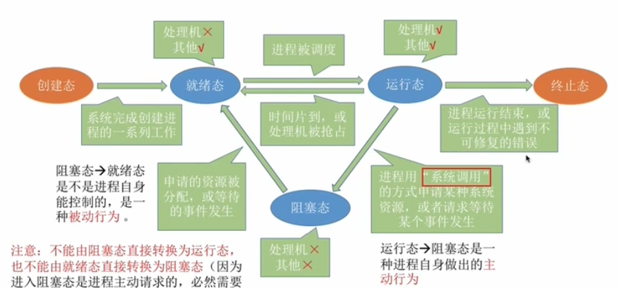

<!-- GFM-TOC -->

- [一、操作系统概述](#一操作系统概述)
- [二、进程管理](#二进程管理)
- [三、内存管理](#三内存管理)
- [四、I/O设备管理](#四IO设备管理)

<!-- GFM-TOC -->


## 一、操作系统概述

操作系统（OS）是指控制和管理整个计算机系统的硬件和软件资源，并合理地组织调度计算机的工作和资源的分配，以提供给用户和其他软件方便的接口和环境，是计算机系统中最基本的系统软件。

### 1.OS的功能和目标

- 作为系统资源的管理者：
  - 功能：处理机管理、存储器管理、文件管理、设备管理
  - 目标：安全、高效
- 作为用户和计算机硬件之间的接口：
  - 功能：
    - 命令接口（用户直接使用），包括联机命令接口（交互式）和脱机命令接口（批处理），如.bat文件就是批处理文件。
    - 程序接口（用户通过程序间接使用）。由一组**系统调用**组成。如windows中的.dll文件必须通过程序使用。
    - GUI（图形用户接口）。
  - 目标：方便用户使用
- 作为最接近硬件的层次：实现对硬件机器的拓展。通常把覆盖了软件的机器称为扩充机器或虚拟机。

### 2.OS的特征

- 并发：指两个或多个事件在同一时间间隔内发生（微观上是交替发生的）。区别于”并行“：指多个事件在同一时刻发生。并发性体现在OS负责协调多个程序交替执行。例：4核CPU意味着同一时刻可以有四个程序并行执行，但并发性依然必不可少。

- 共享：即资源共享。有互斥（一个时间段只允许一个进程访问该资源）和同时（宏观上同时，微观上交替）两种共享方式。

- 虚拟：是指将物理上的实体变为若干逻辑上的对应物。空分复用技术&时分复用技术。

- 异步：多道程序环境下，允许多个程序并发执行，但进程的执行不是一贯到底的，而是以不可预知的速度向前推进。

  四大特征间的关系：并发和共享是最基本的特征，是虚拟和异步的基础，且互为存在条件。

### 3.系统调用

系统调用是操作系统提供给应用程序使用的接口，可供应用程序调用的特殊函数。

- 按功能分类包括设备管理、文件管理、进程控制、进程通信和内存管理。

- 系统调用和库函数的区别：汇编语言可以直接进行系统调用，而高级编程语言向应用程序提供库函数，隐藏了系统调用的细节，从而使上层系统调用更简单。

- 系统调用会使处理器从用户态进入核心态。**系统调用发生在用户态，对系统调用的处理发生在核心态**。

  背后原理是执行陷入指令并引发了一个**内中断**。

### 4.OS的运行机制

- 两种指令。包括特权指令。如内存清零指令；以及非特权指令。如四则运算。
- 两种处理器状态.。核心态（管态）可以使用特权指令。用户态（目态）只能执行非特权指令。
- 两种程序。内核程序（系统管理者，可执行特权指令，运行在核心态）和应用程序（普通用户，运行在用户态）。

#### OS的内核

操作系统包括非内核功能和内核，内核更接近硬件。

1. 与硬件关联紧密的模块：时钟管理、中断处理、原语（一种特殊程序具有原子性，运行不可中断）
2. 对系统资源进行管理的功能：进程管理、存储器管理和设备管理。

#### OS的体系结构

包括大内核和微内核两种。

- 大内核包括1，2两部分功能，运行在核心态。优点是性能高；缺点是结构混乱。
- 微内核只把1保留在内核。优点是结构清晰便于维护；缺点是性能低。

### 5.中断

中断发生时，CPU会进入核心态。中断是将用户态切换到核心态的唯一途径，而将核心态切换为用户态只需通过执行一个特权指令即可。

- 内中断，信号来源是CPU内部。包括自愿中断（指令中断，如陷入指令）和强迫中断（包括硬件故障和软件中断）。也可以分为陷入（应用程序中使用系统调用）、故障（可被故障处理修复）和终止（不可恢复的错误，如算术溢出）三种。
- 外中断，即狭义的中断，信号来源CPU外部，与当前执行的指令无关。包括外设请求（如I/O操作完成发出的中断信号）和人工干预（用户强行终止一个进程）。

## 二、进程管理

### 1.进程与线程

**进程**：

进程是进程实体的运行过程，是系统进行资源分配和调度的一个独立单位。或定义为：进程是OS资源分配的基本单位（**引入线程后，进程只是资源分配的基本单位，而线程是调度的基本单位**）。

进程由程序段、数据段和PCB三部分组成。

进程控制块（PCB，process control block）描述了进程的基本信息和运行状态，包含操作系统对其进行管理所需的各种信息。

进程的组织方式有链接方式和索引方式两种。

**线程**：

线程是一个基本的CPU执行单元，也是程序执行流的最小单位。因为进程内的各线程之间也可以并发，从而进一步提升了系统并发度，使得一个进程内也可以并发处理各种任务。

**进程与线程的关系**：一个进程可以有多个线程，他们共享进程资源。如QQ是一个进程，里面有多个线程，如传文件、聊天、视频等等。

**进程和线程的区别**：

- 资源：进程是资源分配的基本单位，但是线程不拥有资源，线程可以访问其所属进程的资源。
- 调度：线程是独立调度的基本单位，在同一进程中，线程的切换不会引起进程切换，从一个进程中的线程切换到另一个进程中的线程时，会引起进程切换。
- 开销：进程的创建、撤销和切换都涉及到CPU的资源分配，开销大；而线程开销就很小。
- 通信：线程可以直接读写进同一进程的数据进行通信，而进程的通信需要借助IPC。

线程的实现方式：用户级线程和内核级线程。

多线程模型：

- 多对一模型。多个用户级线程映射到一个内核级线程，每个用户进程只对应一个内核级线程。优点是开销小，效率高；缺点是并发度不高。
- 一对一模型。一个用户级线程映射到一个内核级线程。优点并发能力强；缺点是开销大。
- 多对多模型。多个用户级线程映射到多个内核级线程。集前两者之所长。

### 2.进程的状态及其转换

进程包括三种基本状态：

- 就绪态（Ready）。已经具备运行条件，但由于没有空闲CPU，暂时不能运行。CPU x，其他资源 √
- 运行态（Running）。占有CPU，并在CPU上运行。CPU √ ，其他资源 √
- 阻塞态（Waiting/Blocked）。因等待某一时间而暂时不能运行。CPU x，其他资源 x

另两种状态：

- 创建态（New）：进程被创建，OS为进程分配资源，初始化PCB。
- 终止态（Terminated）：进程正在从系统中被撤销，OS回收资源，撤销PCB。

**进程状态的转换**。只有就绪态和运行态可以相互转换，其他都只能单向转换。

<div align="center">  </div><br>
**进程控制**即使用原语实现进程状态的转换。

原语的特点是执行期间不可中断。原语需要运行在核心态，属于OS内核的一部分。

### 3.进程调度

进程的挂起态与七状态模型：暂时调到外存等待的进程状态为挂起状态，挂起态又可以进一步细分为就绪挂起和阻塞挂起两种状态，补充到无状态模型中成为七状态模型。

注意：挂起态是将进程映像调到外存，而阻塞态下进程映像还在内存中。

处理机调度的三个层次：

- 高级调度。外存到内存，面向作业，发生频率最低。进程状态由无到创建态到就绪态。
- 中级调度。外存到内存，面向进程，发生频率中等。进程状态由挂起态到就绪态。
- 低级调度。内存到CPU，发生频率最高。进程状态由就绪态到运行态。

进程调度（低级调度），就是按照某种算法从就绪队列中选择一个进程为其分配处理机。

进程调度的时机：

- 主动放弃：进程正常终止、运行过程中发生异常而终止、主动阻塞（如等待IO）
- 被动放弃：分配给进程的时间片用完、有更紧急的事情要处理（如IO中断）、有更高优先级的进程进入就绪队列。
- 不能进行线程调度的时候：在处理中断的过程中、进程在操作系统内核程序临界区内、原子操作过程中（原语）。

进程调度的方式：

- 非剥夺调度方式：只允许进程主动放弃处理机。实现简单，系统开销小，但无法及时处理紧急任务。
- 剥夺调度方式：可以暂停正在执行的进程，将处理机分配给更紧急或更重要的进程。
- 进程调度、进程的切换是有代价的，频繁调度会降低操作系统效率。

调度算法的评价指标：

- CPU利用率。CPU忙碌时间除以总时间。
- 系统吞吐量。总共完成作业/总时间。
- 周转时间。作业提交给系统到作业完成的时间。带权周转时间是作业周转时间和实际运行时间的比。
- 等待时间。作业处于等待处理机状态时间之和。
- 响应时间。用户提交请求到产生响应的时间。

进程调度算法：

1. 批处理系统。批处理系统用户没有太多操作，调度算法的目标是保证吞吐量和周转时间。
   - FCFS，先来先服务。非抢占式，按请求顺序进行调度。对短作业不利。
   - SJF，短作业优先。默认为非抢占式，按估计运行时间最短的顺序进行调度。对长作业不利，可能会导致长作业饥饿。
   - HRRN，高响应比优先。非抢占式。是两种算法的权衡，综合考虑等待时间和运行时间。

2. 交互式系统。有大量用户交互操作，调度算法的目标是快速响应。
   - 时间片轮转。抢占式。为每个进程分配时间片，一个进程时间片用完将其送往就绪队列的末尾。优点是公平、缺点是频繁切换有开销，且无优先级。如果时间片过小，会导致切换过于频繁；时间片过长，实时性就得不到保证。
   - 优先级调度。抢占式和非抢占式都有。为每个进程分配优先级，按优先级进行调度。可能会导致饥饿，可以随着时间的推移提高等待进程的优先级。
   - 多级反馈队列。抢占式。设置多级队列，每个队列设置时间片（如1,2,4,8）和优先级（最上面的队列优先级最高，上一队列没有进程排队，才能调度当前队列），是前两种的结合。
3. 实时系统。要求响应时间短。分为硬实时和软实时两种。

### 4.进程通信

**进程通信**（IPC）是指进程之间的信息交换。各进程拥有的内存地址空间相互独立，为了保证安全，一个进程不能直接访问另一个进程的地址空间，操作系统提供了一些方法来实现进程之间的信息交换。

实现进程通信的方式：

- 共享存储
  - 基于数据结构的共享。比如存放长度为10的数组。但这种方式速度慢、限制多。
  - 基于存储区的共享。在内存中划出一块共享存储区，数据的形式、存放位置都由进程控制，而非操作系统。这种方式速度更快。
- 管道通信。管道是指用于连接读写进程的共享文件，其实就是在内存中开辟一个大小固定的缓冲区。
  - 管道只能采用半双工通信
  - 各进程要互斥的访问管道
  - 写满时不能再写，读空时不能再读
  - 没写满不能读，没读空不能写
- FIFO命名管道。遵循先进先出原则的管道，对管道及FIFO的读总是从开始处返回数据，对它们的写则把数据添加到末尾。
- 消息传递。
  - 传递结构化的信息。包括消息头和消息体
  - 系统提供发送/接收原语
  - 有直接通信（消息直接挂到接收进程的消息缓冲队列上）和间接通信（消息先发送到信箱中，类似于电子邮件）两种方式。

### 5.进程同步

进程的异步性：各并发执行的进程以各自独立的，不可预知的速度向前推进。

资源共享的两种方式：

- 互斥共享方式：一个时间段内只允许一个进程访问某一资源。这种资源称为临界资源。
- 同时共享方式：一个时间段内多个进程"同时"（宏观上）对资源进行访问。

进程的同步与互斥：

- 进程同步：进程之间需要相互配合的完成工作，各进程的工作推进需要遵循一定的先后顺序。
- 进程互斥：对临界资源的访问，需要互斥的进行。即同一时间段内只能有一个进程能进入临界区。
  - 对临界资源的互斥访问包含四个部分
    - 进入区，entry section。检查是否可进入临界区，如可以，则进行上锁操作，防止其他进程同时进入。
    - 临界区，critical section。对临界资源进行访问的代码。
    - 退出区，exit section。解锁。
    - 剩余区，reminder section。做其他处理。
  - 遵循原则：空闲让进、忙则等待、有限等待（保证不会饥饿）、让权等待（进不了临界区的进程，释放处理机资源，避免忙等）。

进程互斥的软件实现方法：

- 单标志法：每个进程访问完临界区后将使用权限转交给另一个进程。即每个进程设置进入标志，在退出区修改标志的值，从而切换进程。局限：违背了空闲让进原则。
- 双标志先检查：设置一个标志数组，标记各进程想进入临界区的意愿。局限：违反忙则等待原则，因为在检查后和上锁前可能会发生进程切换。
- 双标志后检查：先上锁后检查。局限：违背空闲让进和有限等待原则，会产生饥饿现象。
- Peterson算法：两个进程争夺资源时，主动检查对方是否想进，满足前三个原则，是效果最好的算法，但还是违背让权等待原则，会发生忙等。

信号量机制。使用一对原语来对信号量操作，从而方便地实现了进程互斥和进程同步。一对原语即wait(s)和signal(s)原语，简称为P和V操作（来自荷兰语proberen和verhogen）。

- 整型信号量。用一个整数型的变量作为信号量，用来表示系统中某种资源的数量。对信号量的操作只有三种即：初始化、P操作（相当于进入区）和V操作（相当于退出区）。局限在于不满足让权等待原则。

  ```c
  int S=1; //初始化，表示当前系统中可用资源数
  void wait(int S){
      while(S<=0); //如果资源不够，就一直等待
      S=S-1;//如果资源够，就占用一个资源
  }
  void signal(int S){
      S=S+1;//使用完资源后，在退出区释放资源
  }
  ```

- 记录型信号量。使用记录型数据结构表示的信号量。可以实现系统资源的申请和释放。满足让权等待。

  ```c
  typedef struct{
      int value;//剩余资源数
      struct process *L;//等待队列
  }semaphore
  void wait(semaphore S){
  	S.value--;
  	if(S.value<0){
  		block(S.L);//如果剩余资源不够，使用block原语使运行态进入阻塞态
  	}
  }
  void signal (semaphore S){
  	S.value++;
  	if(S.value<=0){
  		wakeup(S.L);//释放完资源后，使用wakeup唤醒等待队列中的一个进程，由阻塞态变为就绪态
  	}
  }
  ```

使用信号量机制实现进程互斥与同步：

- 实现进程互斥：设置互斥信号量mutex初始值为1，在临界区之前执行P操作（加锁），临界区之后执行V操作（解锁）。
- 实现进程同步：即实现一前一后的同步关系，设置同步信号量S初始值为0，在前操作后执行V操作，在后操作之前执行P操作。
- 实现进程的前驱关系：即多组进程同步关系。

### 6.进程同步与互斥经典问题

**生产者消费者问题**：

描述：生产者进程每次生产一个产品放入缓冲区，消费者每次从缓冲区取出一个产品并使用（缓冲区大小为n）。

- 缓冲区未满时，生产者才能将产品放到缓冲区，否则需等待。 （同步问题）。
- 缓冲区不空时，消费者才能取出产品，否则必须等待。 （同步问题）。
- 缓冲区为临界资源，各进程必须互斥的访问。（互斥问题）。

```c
#define N 100
typedef int semaphore;
semaphore mutex = 1;//互斥信号量，实现对缓冲区的互斥访问
semaphore empty = N;//同步信号量，表示缓冲区的空闲空间
semaphore full = 0;//同步信号量，表示缓冲区已占用的空间
void producer(){
    while(1){
        produce();//生产一个产品
        wait(empty);//empty-1,与signal(empty)共同实现进程同步
        wait(mutex);
        add();//放入一个产品到缓冲区
        signal(mutex);//在临界区前后增加一对PV操作实现互斥
        signal(full);//full+1,与wait(full)共同实现进程同步
    }
}
void cosumer(){
    while(1){
        wait(full);//full-1,与signal(full)共同实现进程同步
        wait(mutex);
        remove();//从缓冲区取出一个产品
        signal(mutex);//在临界区前后增加一对PV操作实现互斥
        signal(empty);//empty+1,与wait(empty)共同实现进程同步
        consume();//消费一个产品
    }
}
```

注意：实现同步的P操作必须放在实现互斥的P操作之前，否则两个进程都被阻塞，出现死锁。而V操作可以交换顺序。

类似的还有多生产者多消费者问题、吸烟者问题（单生产者多消费者）

**读者写者问题**：

读写两组进程访问共享文件。要求：

- 允许多个读者可以同时对文件执行读操作
- 只允许一个写者往文件中写信息
- 任一写者在完成写操作之前不允许其他读者或写者工作
- 写者执行写操作前，应让已有的读者和写者全部退出

互斥关系：写进程-写进程、写进程-读进程

```c
typedef int semaphore;
semaphore count_mutex = 1;//对count变量的互斥访问
semaphore data_mutex = 1;//对读写数据加锁
int count = 0;//记录有几个读进程在访问文件
void writer(){
    while(1){
        wait(data_mutex);//对读写数据加锁
        write();
        signal(data_mutex);//对读写数据解锁
    }
}
void reader(){
    while(1){
        wait(count_mutex);//各个读进程互斥访问count
        if(count==0) wait(data_mutex);//第一个读进程负责加锁，防止写进程访问
        count++;
        signal(count_mutex);
        read();
        wait(count_mutex);//各个读进程互斥访问count
        count--;
        if(count==0) signal(data_mutex);//最后一个读进程负责解锁
        signal(count_mutex);
    }
}
```

如果一直有读进程访问文件，那么写进程可能会出现饥饿的现象。可以新增一个信号量增加PV操作到合适的位置，用于实现写优先。

**哲学家进餐问题**：

五个哲学家围着圆桌吃饭，每个哲学家面前放着食物，哲学家有两种操作：吃饭和思考。当一个哲学家要吃饭时，需要先拿起左右两边的筷子，并且一次只能拿起一根筷子。

一个错误的解决方案如下。如果所有哲学家并发的拿起了左手边的筷子，那么每位哲学家循环等待右边的人放下筷子（都进入阻塞态），从而发生死锁。

```C
#define N 5
semaphore chopstick[N]={1,1,1,1,1};
void philosopher(int i) {
    while(1) {
        take(chopstick[i]);       // 拿起左边的筷子,P操作
        take((chopstick[i+1])%N); // 拿起右边的筷子
        eat();
        put(chopstick[i]); 	   // 放下左边的筷子,V操作
        put((chopstick[i+1])%N);
        think();
    }
}
```

可以设置一个条件防止死锁的发生，即各哲学家拿筷子的事件必须互斥的执行。

```c
#define N 5
semaphore chopstick[N]={1,1,1,1,1};
semaphore mutex=1;	//互斥信号量
void philosopher(int i) {
    while(1) {
        wait(mutex);	//实现的对筷子的互斥访问
        take(chopstick[i]);       // 拿左
        take((chopstick[i+1])%N); // 拿右
        signal(mutex);	
        eat();
        put(chopstick[i]); 	   // 放左
        put((chopstick[i+1])%N);	//放右
        think();
    }
}
```

每个进程都需要同时持有两个临界资源时，就有出现死锁问题的隐患，这种情况下应参考哲学家问题的思想，分析给出的进程之间是否会发生循环等待，是否会发生死锁。

### 7.管程

引入管程的原因：信号量机制存在编写程序困难，容易出错。使用管程可以将控制的代码独立出来，不易出错。

管程是一种特殊的软件模块，类似于面向对象中的类。使用管程可以**方便的实现互斥和同步**。包括以下组成部分：

- 共享数据结构说明
- 对该数据结构进行操作的一组过程
- 对共享数据设置初始值的语句
- 管程的名字

管程的基本特征：

- 局部于管程的数据只能被局部于管程的过程所访问
- 一个进程只能通过调用管程内的过程才能进入管程访问共享数据（类似接口）
- 每次仅允许一个进程在管程内执行某个内部过程

```pascal
// 管程
monitor ProducerConsumer
    condition full, empty;
    integer count := 0;
    condition c;

    procedure insert(item: integer);
    begin
        if count = N then wait(full);
        insert_item(item);
        count := count + 1;
        if count = 1 then signal(empty);
    end;

    function remove: integer;
    begin
        if count = 0 then wait(empty);
        remove = remove_item;
        count := count - 1;
        if count = N -1 then signal(full);
    end;
end monitor;

// 生产者进程
procedure producer
begin
    while true do
    begin
        item = produce_item;
        ProducerConsumer.insert(item);
    end
end;

// 消费者进程
procedure consumer
begin
    while true do
    begin
        item = ProducerConsumer.remove;
        consume_item(item);
    end
end;
```

补充：java中使用synchronized关键字来描述函数，那么这个函数同一时间段内只能被一个线程调用。

### 8.死锁

死锁是指各进程互相等待对方手里的资源，导致各进程都阻塞，无法向前推进的现象。

死锁发生的必要条件

- 互斥。只要对互斥使用的资源的争抢才会导致死锁
- 不剥夺。进程所占用的资源在未使用完之前，不能由其他进程强行夺走，只能主动释放。
- 请求和保持。进程已经保持了至少一个资源，但又提出了新的资源请求。
- 循环等待。存在两个或两个以上的进程组成一条循环等待链，该链的每个资源都在等待被下一个进程占有的资源。

死锁的处理策略

- 鸵鸟算法。最简单的方式，即将头埋在沙子里，假装问题没有发生。

  ​		因为解决死锁问题的代价很高，因此鸵鸟算法可以获得更高的性能。大多数OS，如Unix、Linux和Windows，解决死锁问题的办法仅仅是忽略它。

- 死锁预防。破坏造成死锁的四大条件。

  - 破坏互斥条件。将互斥使用的资源改为允许共享使用。如使用SPOOLing技术将打印机在逻辑上改为共享设备。缺点可行性不高，有的资源无法改为共享资源。
  - 破坏不剥夺条件。将进程请求新资源得不到满足时，就要求它释放保持的所有资源；或者当某进程需要的资源被其他进程占用时，可由OS协助强行剥夺想要的资源。缺点是实现起来复杂，系统开销大，可能导致饥饿。
  - 破坏请求和保持条件。规定所有进程在开始执行前请求所需要的全部资源。缺点是资源利用率低，可能导致饥饿。
  - 破坏循环等待条件。采用统一编号，进程需要按照编号顺序来请求资源。缺点是不方便增加新设备，会导致资源浪费。

- 死锁避免。在程序运行时避免发生死锁

  - 安全序列，指如果系统按照这种序列分配资源，则每个进程都可以顺利完成。只要能找出一个安全序列，系统就是安全状态。安全状态下系统就不会发生死锁。与安全状态相对的即不安全状态。
  - 银行家算法：在资源分配之前预先判断这次分配会不会导致系统进入不安全状态，从而决定是否认可这次分配请求。
  - 银行家算法步骤：
    1. 定义数据：二维数组Max（各进程对资源最大需求），Allocation（已分配），Need（最多还需要多少）；一位数组Available（可用资源），Request（此次申请的各种资源数）。
    2. 检查此次申请是否超过之前声明的最大需求数。
    3. 检查此时系统剩余的可用资源是否还满足这次请求。
    4. 试探着进行分配，更改各数组的值。
    5. 用安全性算法检查此次分配是否会导致系统进入不安全状态。安全性算法即检查当前的剩余可用资源是否能满足某个进程的最大需求，如果可以就将该进程加入安全序列，并将该进程持有的资源都回收；重复看是否能将所有进程放入安全序列。

- 死锁检测与解除。

  - 死锁检测。在资源分配图中，找出既不阻塞又不是孤点的进程并将该进程的所有边消去，而进程Pi所释放的资源可以唤醒某些等待这些资源而阻塞的进程，从而进行一系列简化后，如果资源分配图的所有边都被消去（即可完全简化），那么系统就没有发生死锁。如果不可完全简化，则系统死锁。
  - 死锁解除。
    - 资源剥夺法。挂起（暂时放到外存）某些死锁进程，抢占其资源。
    - 撤销进程法。强制撤销部分死锁进程，剥夺其资源。
    - 进程回退法。要求系统记录进程的历史信息，设置还原点。

## 三、内存管理

### 1.内存和内存管理

程序执行前需要先放到内存中才能被CPU处理。

内存地址有逻辑地址（相对）和物理地址（绝对）。

程序执行过程：

- 编译：将高级语言翻译为机器语言，生成目标模块。
- 链接：由目标模块生成装入模块，链接后形成完整的逻辑地址。
- 装入：将装入模块装入内存，装入后形成物理地址。包括绝对装入、可重定位装入和动态运行时装入。现代OS采用动态运行时装入，即运行时将逻辑地址转换为物理地址，需设置重定位寄存器。

内存管理的主要内容：

- 内存空间分配与回收
- 内存空间的扩充
- 地址转换。OS负责逻辑地址到物理地址的转换。即装入的三种方式
- 存储保护。保证各进程在自己的内存空间中运行，不会越界访问。有两种方式：设置上下限寄存器（存放进程的上下限地址），利用重定位寄存器（存放进程的起始物理地址）和界地址寄存器（存放进程的最大逻辑地址）进行判断。

### 2.内存空间分配与回收

连续分配管理方式：为用户进程分配的是连续的内存空间。

- 单一连续分配：只支持单道程序，内存分为系统区和用户区，用户程序放在用户区。无外部（进程之间有空闲）碎片，有内部（进程内有空闲）碎片。
- 固定分区分配：支持多道程序，内存用户空间分为若干固定大小的分区。无外部碎片，有内部碎片。
- 动态分区分配：支持多道程序，在进程装入内存时，根据进程大小动态建立分区。
  - 使用空闲分区表和空闲分区链两种数据结构记录内存使用情况。
  - 使用动态分区分配算法将新作业装入内存。
  - 回收进程占用的内存时相邻的空闲分区要合并。
  - 有外部碎片，无内部碎片。外部碎片可用紧凑技术来解决。

**非连续分配管理方式**：为用户进程分配的可以是一些分散的内存空间。

- 基本分页存储管理：将内存空间分为大小相等的分区，每个分区就是一个**页框**。将用户进程的地址空间也分为与页框大小相等的区域，称为**页或页面**。每个页面不必连续存放。
  - 地址转换的计算：页号=逻辑地址/页面长度，页内偏移量=逻辑地址%页面长度，该页面在内存中的起始位置（存放在重定向寄存器中）。物理地址=页面起始地址+页内偏移量。地址变换机构的目的就是将用户地址空间中的逻辑地址转换为内存空间中的物理地址，可引入快表机构。
  - **页表**：为了知道进程的每个页面的存放位置，OS要为每个进程建立一张页表，用来存放进程页面和实际存放的内存块之间的对应关系。
- 基本分段存储管理：按照程序自身的逻辑关系划分为若干个段，每个段都有一个段名，从0开始编址。内存以段为单位进行分配。逻辑结构由段号和段内地址组成。
  - **段表**：记录逻辑段和物理内存之间的映射关系。
- 分段与分页的比较
  - 对用户透明性：分页对用户不可见，分段可见。
  - 地址空间的维度：分页的地址空间是一维的，分段的地址空间是二维的。
  - 信息共享与维护：分段更易实现信息共享和维护。
  - 大小是否可变：页的大小不可变，段的大小可以动态改变。
  - 分段的优点在于易于信息共享与维护，缺点在于会产生外部碎片；分页优点在于不会产生外部碎片，只会产生少量的页内碎片。
- 基本段页式存储管理：将程序的地址空间划分成多个拥有独立地址空间的段，每个段上的地址空间划分成大小相同的页。这样既拥有分段系统的共享和保护，又提高了内存利用率。访问一个逻辑地址需要进行三次访问：查段表、查页表、访问目标单元。

### 3.内存空间扩充

- 覆盖技术：将程序分为多个段，常用的段常驻内存（放入一个固定区内），不常用的段在需要时调入内存（放入多个覆盖区内）。因对用户不透明增加了用户编程负担，现已不使用。

- **交换技术**：内存空间紧张时，将内存中某些进程暂时换出外存，将外存中具备运行条件的进程换入内存。暂时换出外存的进程状态为挂起态。

  外存（磁盘）空间分为文件区和对换区两部分。对换区用于存放换出的进程。

- **虚拟内存**：虚拟内存的目的是为了扩大逻辑内存，让程序获得更多可用内存。思路是程序不需要全部装入即可运行，运行时根据需要动态地调入数据，若内存不够，还需要换出一些数据。实现虚拟内存需要让OS负责提供请求调页功能和页面置换功能。对应三种非连续分配管理方式，虚拟内存有请求分页、请求分段和请求段页式三种实现方式。

  - 当要访问的页面不在内存中时，便产生一个**缺页中断**，由操作系统的缺页中断处理程序来处理中断。如果内存中有空闲块，则为进程分配一个空闲块，如果没有，则由**页面置换算法**选择一个页面淘汰。

### 4.页面置换算法

页面换入换出需要磁盘IO，会有较大的开销，因此好的页面置换算法应该追求更少的缺页率。

1. 最佳置换算法（OPT，Optimal replacement algorithm）。每次选择淘汰的页面将是以后永不使用，或者最长时间内不再被访问的页面，这样可以保证最低的缺页率。是一种理论上的算法，因为无法准确知道一个页面多长时间不再被访问，实际应用中无法实现。
2. 先进先出置换算法（FIFO）。每次淘汰的是最早进入内存的页面。性能较差。
3. 最近最久未使用置换算法（LRU，Least Recently Used）。每次淘汰的页面是最近最久未使用的页面。每次访问都需要维护一个所有页面的链表，因此效率较低。
4. 时钟置换算法（CLOCK/NRU  Not Recently Used）。使用循环链表将页面连接起来，再使用一个指针指向最老的页面。每次淘汰最近未使用（访问位为0）的页面。
5. 改进型的时钟置换算法。在最近未使用的页面中优先淘汰未被修改过的页面，最多会进行四次扫描。

## 四、I/O设备管理

### 1.I/O设备

IO设备就是可以将数据输入计算机或可以接收计算机输出数据的外部设备，属于计算机的硬件部件。

IO设备的分类：

- 按特性分：
  - 人机交互。如键盘、鼠标。传输速度慢。
  - 存储设备。如移动硬盘、光盘。传输速度块。
  - 网络通信设备。如路由器。传输速度一般
- 按传输速度分：
  - 低速。速率1b-999b/s.如键盘、鼠标。
  - 中速。速率1k-99k/s.如打印机。
  - 高速。速率100k-9999Mb/s.如磁带机、磁盘机、光盘机。
- 按信息交换单位分类：
  - 块设备。传输快，可寻址。如磁盘。
  - 字符设备。传输慢，不可寻址。如鼠标、键盘、打印机。

### 2.I/O控制器与控制方式

IO设备包括机械部件和电子部件。电子部件是机械部件和CPU之间的中介，用于实现CPU对设备的控制。这个电子部件就是IO控制器。

IO控制器的功能包括：接收和识别CPU指令、向CPU报告设备状态、数据交换和地址识别。

IO控制方式：

- 程序直接控制方式。完成一次读写的过程是CPU发出IO命令后需要不断轮询；CPU干预频率极高；每次的数据传输单位为字。
- 中断驱动方式。IO完成后设备控制器发出中断信号；CPU干预频率高；每次的数据传输单位为字。
- DMA方式。Direct Memory Access，直接存储器存取。IO完成后DMA控制器发出中断信号；CPU干预频率中等；每次的数据传输单位为块。
- 通道控制方式。通道可以识别并执行一系列通道指令。通道会执行通道程序以完成IO，完成后通道向CPU发出中断信号；CPU干预频率低；每次的数据传输单位为一组块。

