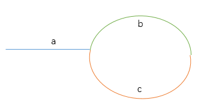

<!-- GFM-TOC -->
* [一、举例让抽象问题具体化](#一举例让抽象问题具体化)
* [二、分解让复杂问题简单化](#二分解让复杂问题简单化)
* [三、代码的完整性](#三代码的完整性)
* [四、代码的鲁棒性](#四代码的鲁棒性)
* [五、位运算](#五位运算)
* [六、回溯法](#六回溯法)
* [七、抽象建模能力](#七抽象建模能力)
* [八、时间效率](#八时间效率)
* [九、时间空间效率的平衡](#九时间空间效率的平衡)
* [十、知识迁移](#十知识迁移)
* [十一、递归和循环](#十一递归和循环)
* [十二、数组](#十二数组)
* [十三、栈和队列](#十三栈和队列)
* [十四、链表](#十四链表)
* [十五、树](#十五树)
* [十六、字符串](#十六字符串)

<!-- GFM-TOC -->

## 一、举例让抽象问题具体化

### 1.包含min函数的栈--栈

描述：定义栈的数据结构，请在该类型中实现一个能够得到栈中所含最小元素的min函数（时间复杂度应为O（1））。

思路：借助一个辅助栈B，栈B顶元素始终为栈A中的最小元素。考虑以下情形：

 - push。若要压入的元素比栈B顶元素大，则栈B不压入，栈A压入，否则栈A栈B都压入。

 - pop。若栈A栈B顶元素不相等，则A出，B不出。

   ```java
   import java.util.Stack;
   public class Solution {
       private Stack<Integer> A=new Stack<Integer>();
       private Stack<Integer> B=new Stack<Integer>();
   
       //入栈时，栈A压入，若元素比栈B的顶元素大，则B不压入。
       public void push(int node) {
           A.push(node);
           if(B.isEmpty()||node<B.peek()){
               B.push(node);
           }
       }
   
       //出栈时，若栈A栈B顶元素不等，则A出，B不出
       public void pop() {
           if(A.peek()==B.peek()){
               B.pop();
           }
           A.pop();
       }
   
       public int top() {
           return A.peek();
       }
   
       public int min() {
           return B.peek();
       }
   }
   
   ```

### 2.二叉树中和为某一值的路径--二叉树

描述：输入一颗二叉树的根节点和一个整数，打印出二叉树中结点值的和为输入整数的所有路径。路径定义为从树的根结点开始往下一直到叶结点所经过的结点形成一条路径。(注意: 在返回值的list中，数组长度大的数组靠前)

思路：借助栈实现深度优先遍历，将路径的数值存在一个数组中。每压入一个值就用目标值减去它，递归遍历，如果到叶子结点发现目标值刚好为0，则保存该路径到返回值中；否则删除末尾的值，返回上一层找寻其他路径进行遍历。

```java
import java.util.ArrayList;

public class Solution {
    public ArrayList<ArrayList<Integer>> FindPath(TreeNode root,int target) {
        ArrayList<ArrayList<Integer>> res=new ArrayList();
        ArrayList<Integer> path=new ArrayList();
       	//判空
        if(root!=null){
            dfs(root,target,res,path);
        }
        return res;
    }
    
    public void dfs(TreeNode root,int target,ArrayList<ArrayList<Integer>> res,ArrayList<Integer> path){
    	path.add(root.val);
        //递归出口，当前路径中数的和等于target
        if(root.left==null&&root.right==null&&target-root.val==0){
            res.add(new ArrayList<Integer> (path));
        }
        //判断左子树非空,非空则遍历左子树
        if(root.left!=null){
            dfs(root.left,target-root.val,res,path);
        }
        //判断右子树非空，非空则遍历右子树
        if(root.right!=null){
            dfs(root.right,target-root.val,res,path);
        }
        //前面条件都不满足说明是一个叶子结点，且路径和不等于target,则需回退一层，即从数组中删除该节点
        path.remove(path.size()-1);
    }
}
```

*备注*：本题有个bug。 题干中说到“在返回值的list中，数组长度大的数组靠前”。上述代码在该二叉树是一个二叉搜索树的时候，才满足长度大的数组靠前的条件，否则需要用排序算法调整结果数组中路径的顺序。

### 3.从上往下打印二叉树--二叉树

描述：从上往下打印出二叉树的每个节点，同层节点从左至右打印。

思路：二叉树的层次遍历，借助队列实现。每次将队首元素出队并将其子节点入队，直到队列为空。

```java
import java.util.ArrayList;

public class Solution {
    public ArrayList<Integer> PrintFromTopToBottom(TreeNode root) {
        ArrayList<Integer> res=new ArrayList();
       	ArrayList<TreeNode> queue=new ArrayList();
        //判空
        if(root!=null){
            //先将根节点入队
            queue.add(root);
            while(!queue.isEmpty()){
                //获取队首节点并出队
                TreeNode front=queue.get(0);
                res.add(front.val);
                queue.remove(0);
                //将其子节点入队
                if(front.left!=null){
                    queue.add(front.left);
                }
                if(front.right!=null){
                    queue.add(front.right);
                }
            }
        }
        return res;
    }
}
```

### 4.二叉搜索树的后序遍历序列--二叉树

描述：输入一个整数数组，判断该数组是不是某二叉搜索树的后序遍历的结果。如果是则输出Yes,否则输出No。假设输入的数组的任意两个数字都互不相同。

思路：后序遍历序列的最后一个元素是根元素，判断数组前半是否都小于根元素，后半是否都大于根元素。再递归判断左右子树即可。

```java
public class Solution {
    public boolean VerifySquenceOfBST(int [] sequence) {
        //特例：序列为空返回no，序列为1返回yes
        if(sequence.length==0){
            return false;
        }
        if(sequence.length==1){
            return true;
        }
        return judge(sequence, 0,sequence.length-1);
    }
    
    public boolean judge(int []a,int l,int r){
        //l指针表示左右子树在数组中所占区间的起点
        //r指针对应根节点在数组中的位置
        if(l>=r){
            return true;
        }
        //i用来找到左右子树的分界点
        int i;
        for(i=l;i<r;i++){
            if(a[i]>a[r]){
                break;
            }
        }
        for(int j=i;j<r;j++){
            if(a[j]<a[r])
                return false;
        }
        //递归遍历左右子树
        return judge(a,l,i-1)&&judge(a,i,r-1);
    }
}
```

### 5.栈的压入、弹出序列--栈

描述：输入两个整数序列，第一个序列表示栈的压入顺序，请判断第二个序列是否可能为该栈的弹出顺序。假设压入栈的所有数字均不相等。例如序列1,2,3,4,5是某栈的压入顺序，序列4,5,3,2,1是该压栈序列对应的一个弹出序列，但4,3,5,1,2就不可能是该压栈序列的弹出序列。（注意：这两个序列的长度是相等的）

思路： 借助一个辅助栈，将压栈序列的数依次压入，将出栈序列看成一个队列，每次判断栈顶元素和出栈序列的队首元素是否相等，若相等，则栈中元素出栈，队首元素出队。直到压栈序列遍历完成，如果辅助栈为空，则返回true。

按示例演示算法过程：

- 1入辅助栈，1≠4，继续2入辅助栈
- 2≠4，继续3入辅助栈
- 3≠4，继续4入辅助栈
- 4=4，辅助栈中4出栈，出栈序列向后一位。
- 3≠5，继续5入辅助栈
- 5=5，辅助栈中5出栈，出栈序列向后一位...直至辅助栈为空

```java
import java.util.ArrayList;

public class Solution {
    public boolean IsPopOrder(int [] pushA,int [] popA) {
        //判空
        if(pushA.length==0||popA.length==0){
            return false;
        }
        ArrayList<Integer> stack=new ArrayList();//辅助栈
       	int index=0;//出栈序列的指针
        //借助辅助栈遍历压栈序列
        for(int i=0;i<pushA.length;i++){
            stack.add(pushA[i]);
            while(!stack.isEmpty()&&popA[index]==stack.get(stack.size()-1)){
                stack.remove(stack.size()-1);
                index++;
            }
        }
        return stack.isEmpty();
    }
}
```


## 二、分解让复杂问题简单化

### 1.二叉搜索树与双向链表--二叉树，链表

描述：输入一棵二叉搜索树，将该二叉搜索树转换成一个排序的双向链表。要求不能创建任何新的结点，只能调整树中结点指针的指向。

思路：采用二叉树的中序遍历（有递归和借助栈两种方式），将左子树调整为双向链表并找到尾结点，与根节点相连，再将右子树调整为双向链表并找到头结点，与根节点相连。最后返回的是左子树的头结点。

```java
public class Solution {
    public TreeNode Convert(TreeNode pRootOfTree) {
        //判空
        if(pRootOfTree==null) return pRootOfTree;
        if(pRootOfTree.left==null&&pRootOfTree.right==null) return pRootOfTree;
        //将左子树调整为双向链表并返回头结点
        TreeNode left=Convert(pRootOfTree.left);
        //遍历找到左子树的尾结点
        TreeNode pLeft=left;//临时变量
        while(pLeft!=null&&pLeft.right!=null){
            pLeft=pLeft.right;
        }
        //将尾结点与根节点相连（注意需要判断左子树是否为空）
        if(left!=null){
            pLeft.right=pRootOfTree;
            pRootOfTree.left=pLeft;
        }
        //将右子树调整为双向链表并返回头结点
        TreeNode right=Convert(pRootOfTree.right);
        //将右子树的头结点与根节点相连（注意判断右子树是否为空）
        if(right!=null){
            right.left=pRootOfTree;
            pRootOfTree.right=right;
        }
        //左子树为空，则返回根节点，非空则返回left
        if(left==null){
            return pRootOfTree;
        }else return left;
    }
}
```

### 2.复杂链表的复制--链表

描述：输入一个复杂链表（每个节点中有节点值，以及两个指针，一个指向下一个节点，另一个特殊指针指向任意一个节点），返回结果为复制后复杂链表的head。（注意，输出结果中请不要返回参数中的节点引用，否则判题程序会直接返回空）

<div align="center">  </div><br>
思路：复制所有节点、特殊指针、拆分链表

```java
public class Solution {
    public RandomListNode Clone(RandomListNode pHead){
        //判空
        if(pHead==null){
            return null;
        }
        //将所有节点复制并插入到原链表每个节点的后面
        RandomListNode curNode=pHead;
        while(curNode!=null){
            RandomListNode newNode=new RandomListNode(curNode.label);
            newNode.next=curNode.next;
            curNode.next=newNode;
            curNode=newNode.next;
        }
        //复制原链表的特殊指针
        curNode=pHead;
        while(curNode!=null){
            RandomListNode newNode=curNode.next;
            if(curNode.random!=null){
                newNode.random=curNode.random.next;
            }
            curNode=newNode.next;
        }
        //拆分为原链表和复制后的链表，只需将间隔为2的节点连起来即可
        RandomListNode pCloneHead=pHead.next;
        RandomListNode tmp=new RandomListNode(pHead.label);//临时变量用来保存curNode的下一个节点
        curNode=pHead;
        while(curNode.next!=null){
            tmp=curNode.next;
            curNode.next=tmp.next;
            curNode=tmp;
        }
        return pCloneHead;
    }
}
```


###  3.字符串的排列--字符串

描述：输入一个字符串,按字典序打印出该字符串中字符的所有排列。例如输入字符串abc,则打印出由字符a,b,c所能排列出来的所有字符串abc,acb,bac,bca,cab和cba。输入字符串的描述：输入一个字符串,长度不超过9(可能有字符重复),字符只包括大小写字母。

思路：递归法。固定第一个字符，取得首位后续字符串的所有排列。使用一个hashSet来保存字符，遇到之前未出现的字符，则将该字符与首位字符进行交换。

用到的方法：

- 字符串转字符数组：str.toCharArray()
- 字符数组转字符串：String.valueOf(chars)
- 集合的排序：Collections.sort(list)

```java
import java.util.ArrayList;
import java.util.Collections;
import java.util.Set;
import java.util.HashSet;

public class Solution {
    public ArrayList<String> Permutation(String str) {
        ArrayList<String> list=new ArrayList<String>();
        if(str.length()>0){
            PermutationHelper(str.toCharArray(),0,list);
            //此时得到的list未按字典序排序，使用集合排序方法进行排序
            Collections.sort(list);
        }
        return list;
    }
    public void PermutationHelper(char[] chars,int i,ArrayList<String> list){
        //递归终点：当i为字符串最后一个字符时，将此字符串添加到列表中并结束本次递归。
        if(i==chars.length-1){
            list.add(String.valueOf(chars));
        }
        else{
            Set<Character> charSet=new HashSet<Character>();
            //固定第一个字符，找出其后续字符串的排列组合
            charSet.add(chars[i]);
            PermutationHelper(chars,i+1,list);
            //将后续字符串中未出现的字符与首字符进行交换
            for(int j=i+1;j<chars.length;j++){
                if(!charSet.contains(chars[j])){
                    charSet.add(chars[j]);
                    swap(chars,i,j);
                    PermutationHelper(chars,i+1,list);
                    swap(chars,i,j);
                }
            }
        }
    }
    public void swap(char[] chars,int i,int j){
        char tmp=chars[i];
        chars[i]=chars[j];
        chars[j]=tmp;
    }
}
```


## 三、代码的完整性

### 1.数值的整数次方--数

描述：给定一个double类型的浮点数base和int类型的整数exponent。求base的exponent次方。

思路：考虑exponent的正负号；考虑base为0的情况（当指数为负数时，base不能为0）。

```java
public class Solution {
    public double Power(double base, int exponent) {
        double res=1;
        int n;
        if(exponent==0){
            return 1;
        }else if(exponent>0){
            n=exponent;
        }else{
            if(base==0){
                throw new RuntimeException("无意义");
            }
            n=-exponent;
        }
        //使用位运算&1和>>1,进行幂运算
        while(n!=0){
            if((n&1)==1){
                res*=base;
            }
            base*=base;
            n=n>>1;
        }
        return exponent>0? res:(1/res);
    }
}
```

### 2.调整数组顺序使奇数位于偶数前面--数组，排序

描述：输入一个整数数组，实现一个函数来调整该数组中数字的顺序，使得所有的奇数位于数组的前半部分，所有的偶数位于数组的后半部分，并保证奇数和奇数，偶数和偶数之间的相对位置不变。

思路：方法1类似冒泡排序，前偶后奇就交换。注意：这里的swap方法需要传入数组，仅仅两个数做交换并不会改变数组中数的位置。

```java
public class Solution {
    public void reOrderArray(int [] array) {
        if(array.length>0) {
        	for(int i=0;i<array.length-1;i++){
                for(int j=array.length-1;j>i;j--){
                	//前偶后奇就交换
                    if( ((array[j]&1)==1) && ((array[j-1]&1)==0)){
                    	swap(array,j-1,j);
                    }
                }
            }
        }
    }
    public void swap(int [] arr,int i,int j){
        arr[i]=arr[i]^arr[j];
        arr[j]=arr[i]^arr[j];
        arr[i]=arr[i]^arr[j];
    }
}
```

方法2新建一个数组，用一个指针保存数在新数组中的位置。

```java
public class Solution {
    public void reOrderArray(int [] array) {
        int n=array.length;
        int[] newArr=new int[n];
        int count=0;
        for(int i=0;i<n;i++){
            if((array[i]&1)==1){
                newArr[count]=array[i];
                count++;
            }
        }
        for(int i=0;i<n;i++){
            if((array[i]&1)==0){
                newArr[count]=array[i];
                count++;
            }
        }
        for(int i=0;i<n;i++){
            array[i]=newArr[i];
        }
    }
}
```


## 四、代码的鲁棒性

### 1.链表中倒数第k个节点--链表

描述：输入一个链表，输出该链表中倒数第k个结点。

:方法1，遍历链表确定链表的长度，再找到倒数第k个节点。

```java
public class Solution {
    public ListNode FindKthToTail(ListNode head,int k) {
        //判空
        if(head==null||k<=0){
            return null;
        }
        //遍历链表找长度
        ListNode node=head;
        int n=1;
        while(node.next!=null){
            node=node.next;
            n++;
        }
        if(n<k) return null;
        //找到倒数第k个
        while(n>k){
            head=head.next;
            n--;
        }
        return head;
    }
}
```

方法2，设置两个指针，先让p1走k-1步，然后一起走，直到p1到最后一个时，p2即为所求。

```java
public class Solution {
    public ListNode FindKthToTail(ListNode head,int k) {
        //判空
        if(head==null||k<=0){
            return null;
        }
        //设置两个指针
        ListNode p1=head;
        ListNode p2=head;
        while(k>1){
            if(p1.next!=null){
                p1=p1.next;
                k--;
            }else return null;
        }
        //两个指针一起走
        while(p1.next!=null){
            p1=p1.next;
            p2=p2.next;
        }
        return p2;
    }
}
```

### 2.合并两个排序链表--链表

描述：输入两个单调递增的链表，输出两个链表合成后的链表，当然我们需要合成后的链表满足单调不减规则。

方法1，递归。比较两个链表头结点的大小，小的进入合并链表，头指针后移一位，递归。

```java
public class Solution {
    public ListNode Merge(ListNode list1,ListNode list2) {
        //判空
        if(list1==null) return list2;
        if(list2==null) return list1;
        //比较头结点大小，并入合并链表
        if(list1.val<=list2.val){
            list1.next=Merge(list1.next,list2);
            return list1;
        }else{
            list2.next=Merge(list2.next,list1);
            return list2;
        }
    }
}
```

方法2，非递归。思路一致，用循环取代递归，即当两个链表都非空时，进行比较和合并运算；直到有一个为空时，将非空的链表并入合并后的链表中。

```java
public class Solution {
    public ListNode Merge(ListNode list1,ListNode list2) {
        //判空
        if(list1==null) return list2;
        if(list2==null) return list1;
        //设置合并链表的头结点和当前节点
        ListNode mergeHead = null;
        ListNode curNode = null;
        //当两个链表都非空时执行比较合并
        while(list1!=null && list2!=null){
            if(list1.val<list2.val){
                if(mergeHead==null){
                    mergeHead=list1;
                    curNode=list1;
                }else{
                    curNode.next=list1;
                    curNode=curNode.next;
                }
                list1=list1.next;
            }else{
                if(mergeHead==null){
                    mergeHead=list2;
                    curNode=list2;
                }else{
                    curNode.next=list2;
                    curNode=curNode.next;
                }
                list2=list2.next;
            }
        }
        //当其中一个链表为空时，直接合并
        if(list1==null) curNode.next=list2;
        if(list2==null) curNode.next=list1;
        return mergeHead;
    }
}
```

### 3.反转链表--链表

描述：输入一个链表，反转链表后，输出新链表的表头。

思路：设置两个指针，分别保存当前节点的前一个节点和后一个节点。

```java
public class Solution {
    public ListNode ReverseList(ListNode head) {
        //判空
        if(head==null) return null;
        //设置两个指针
        ListNode before=null;
        ListNode after=null;
        while(head!=null){
            after=head.next;//保存下一个节点的信息避免更改指向时丢失
            head.next=before;
            before=head;
            head=after;
        }
    }
}
```

### 4.树的子结构--二叉树

描述：输入两棵二叉树A，B，判断B是不是A的子结构。（ps：我们约定空树不是任意一个树的子结构）

思路：先找到A树中与B树根节点相同的节点，然后递归遍历AB两树，看子树B中的节点是否与A树中的节点一致。

```java
public class Solution {
    public boolean HasSubtree(TreeNode root1,TreeNode root2){
        //判空
        if(root1==null||root2==null) return false;
        //找到两树根节点相同的节点
        boolean res=false;
        if(root1.val==root2.val){
            res=contains(root1,root2);
        } 
        if(!res){
            res=HasSubtree(root1.left,root2);
        }
        if(!res){
            res=HasSubtree(root1.right,root2);
        }
        return res;
    }
    
    public boolean contains(TreeNode root1,TreeNode root2){
        //递归出口：B树空，true；B树非空，A树为空，false；AB值不等，false
        if(root2==null) return true;
        if(root1==null) return false;
        if(root1.val!=root2.val) return false;
        return contains(root1.left,root2.left) && contains(root1.right,root2.right);
    }
}
```


## 五、位运算

### 1.求1+2+3+...+n

描述：求1+2+3+...+n，要求不能使用乘除法、for、while、if、else、switch、case等关键字及条件判断语句（A?B:C）。

思路：使用递归计算，但递归终止条件不能使用判断语句。使用逻辑与的短路特性实现递归终止条件。

```java
public class Solution {
    public int Sum_Solution(int n) {
        int sum = n;
        //利用逻辑与的短路特性实现递归终止条件(n>0不成立时，终止递归)
        boolean ans = (n>0)&&((sum+=Sum_Solution(n-1))>0);
        return sum;
    }
}
```

### 2.不用加减乘除做加法

描述：写一个函数，求两个整数之和，要求在函数体内不得使用+、-、*、/四则运算符号。

思路：回归加法计算过程。先只计算每一位相加，再计算进位，再将进位与之前的结果每位相加，直到不需要进位则计算完成。每位相加可以用按位异或来实现，进位的计算通过按位与+左移一位来实现。

```java
public class Solution {
    public int Add(int num1,int num2) {
		while(num2!=0){
            int temp=num1;
            num1=num1^num2;
            num2=(temp&num2)<<1;
        }
        return num1;
    }
}
```

### 3.二进制数中1的个数

描述：输入一个整数，输出该数二进制表示中1的个数。其中负数用补码表示。

思路：将该数逐位与1相与即可。

注：负数以补码参与位运算。

```java
public class Solution {
    public int NumberOf1(int n) {
        int count=0;
        int flag=1;
        while(flag!=0){
            if((flag&n)!=0){
                count++;
            }
            flag=flag<<1;
        }
        return count;
    }
}
```

### 4.巧用位运算

判断奇偶、交换两个数、找出没重复的数、幂运算、找出不大于n的最大的2的幂指数

```java
public class Bitwise{
    //判断奇偶数
    public String judge(int n){
        String res=new String();
        if((n&1)==1){
            res="奇数";
        }else{
            res="偶数";
        }
        return res;
    }
  	//交换两个数,不使用额外的变量
    public void swap(int x,int y){
        x=x^y;
        y=x^y;
        x=x^y;
    }
    //找出没重复的数。一组数中除了一个数外其他数都出现了两次，找出这个没有重复的数。
    //一般思路使用哈希表来存储数组中的数和出现次数，再遍历哈希表找出现1个的数。时间复杂度O(n),空间复杂度O(n)。
    //使用异或的特点可以简化该问题，两个相同的数异或得到0，一个数与0异或得到它自身。时间复杂度O(n),空间复杂度O(1)。
    public int findNoRepeat(int[] arr){
        int tmp=arr[0];
        for(int i=1;i<arr.length;i++){
            tmp=tmp^arr[i];
        }
        return tmp;
    }
    //求m的n次方。一般思路连乘，时间复杂度O(n)。
    //使用&1和>>1逐位读取n的值，并依次乘m，m的平方，m的四次方...时间复杂度O(logn)
    public int pow(int m,int n){
        int res=1;
        int tmp=m;
        while(n!=0){
            if((n&1)==1){
                res*=tmp;
            }
            tmp*=tmp;
            n=n>>1;
        }
        return res;
    }
    //找出不大于n的最大的2的幂指数。传统做法用1不断乘2直到找到，时间复杂度O(logn)。
    //以21为例，用二进制数表示最后八位为00010101，只需找到最左边的1的位置即可。
   	//1.将n右移并与n做或运算，多次之后得到00011111。（整型的数一般32位，依次右移1,2,4,8,16即可）。
    //2.对该数+1再右移一位即可得到00010000，即16。
    //时间复杂度O(1)
    public int findN(int n){
        n|=n>>1;
        n|=n>>2;
        n|=n>>4;
        n|=n>>8;
        n|=n>>16;
        return (n+1)>>1;
    }
}

```


## 六、回溯法

回溯法与深度优先遍历的异同：

- 相同点：回溯法在实现上遵循深度优先。都属于深度优先搜索。
- 不同：深度优先遍历是无序的，访问过的节点不再访问，目的是为了遍历所有节点；回溯法可能会重复访问节点，但有的节点可能不会访问到，目的是为了得到一个解。

### 1.矩阵中的路径

描述：请设计一个函数，用来判断在一个矩阵中是否存在一条包含某字符串所有字符的路径。路径可以从矩阵中的任意一个格子开始，每一步可以在矩阵中向左，向右，向上，向下移动一个格子。如果一条路径经过了矩阵中的某一个格子，则该路径不能再进入该格子。 例如 a b c e s f c s a d e e 矩阵中包含一条字符串"bccced"的路径，但是矩阵中不包含"abcb"路径，因为字符串的第一个字符b占据了矩阵中的第一行第二个格子之后，路径不能再次进入该格子。

思路：

- 设置一个数组用来标记矩阵中走过的格子
- 遍历数组，进入判断函数。
- 先确定递归终止条件。包括两种情况：
  - 越界、当前矩阵中的值不等于字符串中的值、已经走过该点。返回false
  - 字符串已遍历完成，则返回true。
- 如果不满足终止条件，将标志位置为1。
- 递归过程：判断当前格子的上下左右四个格子是否符合条件，只要有一个符合，则继续寻找其周围的四个格子。
- 如果递归之后找到了一条路径，返回true；如果没找到，将标记数组还原，返回false（退到hasPath函数继续找下一个格子）

```java
public class Solution {
    public boolean hasPath(char[] matrix, int rows, int cols, char[] str){
        int []flag=new int [matrix.length];
        for(int i=0;i<rows;i++){
            for(int j=0;j<cols;j++){
                if(judge(matrix,rows,cols,i,j,str,0,flag)){
                    return true;
                }
            }
        }
        return false;
    }
    private boolean judge(char[] matrix,int rows, int cols,int i,int j, char[] str,int k,int[]flag){
        int index=cols*i+j;
        if(i<0||i>=rows||j<0||j>=cols||
           matrix[index]!=str[k]||flag[index]==1){
            return false;
        }
        if(k==str.length-1) return true;
        flag[index]=1;//标记当前格子
        if(judge(matrix,rows,cols,i+1,j,str,k+1,flag)||
          judge(matrix,rows,cols,i-1,j,str,k+1,flag)||
          judge(matrix,rows,cols,i,j+1,str,k+1,flag)||
          judge(matrix,rows,cols,i,j-1,str,k+1,flag)){
            return true;
        }
        //如果不符合，则还原
        flag[index]=0;
        return false;
    }
}
```

### 2.机器人的运动范围

描述：地上有一个m行和n列的方格。一个机器人从坐标0,0的格子开始移动，每一次只能向左，右，上，下四个方向移动一格，但是不能进入行坐标和列坐标的数位之和大于k的格子。 例如，当k为18时，机器人能够进入方格（35,37），因为3+5+3+7 = 18。但是，它不能进入方格（35,38），因为3+5+3+8 = 19。请问该机器人能够达到多少个格子？

思路：  

- 用一个矩阵来标记走过的格子。进入计数函数
- 递归终止条件：越界、数位和超过threshold、已访问过，返回0
- 将标志位置为1.
- 递归搜索上下左右的格子并相加再加上自身（+1）。

```java
public class Solution {
    public int movingCount(int threshold, int rows, int cols){
        int [][] flag=new int [rows][cols];
        return countCore(threshold,rows,cols,0,0,flag);
    }
    private int countCore(int threshold, int rows, int cols,int i,int j,int[][] flag){
        if(i<0||i>=rows||j<0||j>=cols||
           numSum(i)+numSum(j)>threshold||flag[i][j]==1){
            return 0;
        }
        flag[i][j]=1;
        return countCore(threshold,rows,cols,i+1,j,flag)
            +countCore(threshold,rows,cols,i-1,j,flag)
            +countCore(threshold,rows,cols,i,j+1,flag)
            +countCore(threshold,rows,cols,i,j-1,flag)
            +1;
    }
    //计算数位和
    private int numSum(int i){
        int sum=0;
        while(i>0){
            sum+=i%10;
            i=i/10;
        }
        return sum;
    }
}
```


## 七、抽象建模能力

### 1.扑克牌顺子

描述：LL今天心情特别好,因为他去买了一副扑克牌,发现里面居然有2个大王,2个小王(一副牌原本是54张^_^)...他随机从中抽出了5张牌,想测测自己的手气,看看能不能抽到顺子,如果抽到的话,他决定去买体育彩票,嘿嘿！！“红心A,黑桃3,小王,大王,方片5”,“Oh My God!”不是顺子.....LL不高兴了,他想了想,决定大\小 王可以看成任何数字,并且A看作1,J为11,Q为12,K为13。上面的5张牌就可以变成“1,2,3,4,5”(大小王分别看作2和4),“So Lucky!”。LL决定去买体育彩票啦。 现在,要求你使用这幅牌模拟上面的过程,然后告诉我们LL的运气如何， 如果牌能组成顺子就输出true，否则就输出false。为了方便起见,你可以认为大小王是0。

思路：顺子需满足三条：1.数组长度为5。2.数组中除0外的值无重复数字。3.数组中最大最小值相差<5。

```java
import java.util.HashSet;

public class Solution {
    public boolean isContinuous(int [] numbers) {
        if(numbers.length!=5) return false;
        int max=-1;
        int min=14;
        HashSet<Integer> numSet=new HashSet<Integer>();
        for(int i=0;i<numbers.length;i++){
            if(numbers[i]==0){
                continue;
            }else{
                if(numSet.contains(numbers[i])) return false;
                numSet.add(numbers[i]);
                if(numbers[i]>max) max=numbers[i];
                if(numbers[i]<min) min=numbers[i];
            }
        }
        if(max-min>=5) return false;
        return true;
    }
}
```

### 2.孩子们的游戏(圆圈中最后剩下的数)--约瑟夫环

描述：n个人（编号0~(n-1))，从0开始报数，报到(m-1)的退出，剩下的人 继续从0开始报数。求胜利者的编号。

思路：第一个人（编号为m%n-1）出列后，剩下的n-1个人的编号依次为m%n,m%n+1,...n-2,n-1,0,1,...,m%n-2，从编号为m%n的人开始报0。对这些人的编号进行一次变换，即将m%n变换为0，则这个问题变成了（n-1）个人报数的子问题，因此设f（i）为i个人报数最后胜利者的编号，则递推公式为：f(i)=(f(i-1)+m)%n ，且f(1)=1。使用递归即可。

```java
public class Solution {
    public int LastRemaining_Solution(int n, int m) {
        if(n<=0) return -1;
        if(n==1) return 0;
        return (LastRemaining_Solution(n-1,m)+m)%n;
    }
}
```


## 八、时间效率

### 1.连续子数组的最大和--动态规划

描述：例如:{6,-3,-2,7,-15,1,2,2},连续子向量的最大和为8(从第0个开始,到第3个为止)。给一个数组，返回它的最大连续子序列的和。

思路：动态规划。设以第i个数为结尾的最大子序列的和为F（i）。则有：

- F（i）=max（F（i-1）+array[i]，array[i]）
- 最大连续子序列res = max（F（i），F（i-1）...F（0））

```java
public class Solution {
    public int FindGreatestSumOfSubArray(int[] array) {
        int res,max;
        res=max=array[0];
        for(int i=1;i<array.length;i++){
            max=Math.max(max+array[i],array[i]);
            res=Math.max(res,max);
        }
        return res;
    }
}
```

### 2.最小的K个数--排序，堆

描述：输入n个整数，找出其中最小的K个数。例如输入4,5,1,6,2,7,3,8这8个数字，则最小的4个数字是1,2,3,4。

方法1：冒泡排序思路，外层只需要排k个。时间复杂度O(n*k)

```java
import java.util.ArrayList;
public class Solution {
    public ArrayList<Integer> GetLeastNumbers_Solution(int [] input, int k) {
        ArrayList<Integer> res=new ArrayList<Integer>();
        if(k>input.length) return res;//注意判断k的大小
        for(int i=0;i<k;i++){
            for(int j=i;j<input.length-1;j++){
                if(input[j]<input[j+1]){
                    int tmp=input[j];
                    input[j]=input[j+1];
                    input[j+1]=tmp;
                }
            }
            res.add(input[input.length-1-i]);
        }
        return res;
    }
}
```

方法2：使用堆排序。先用大顶堆保存k个数。对于后面的数，每次和堆顶进行比较，如果数比堆顶小，则删除堆顶，将该数入堆。时间复杂度O（nlogk）

```java
import java.util.ArrayList;
import java.util.PriorityQueue;
import java.util.Comparator;
public class Solution {
    public ArrayList<Integer> GetLeastNumbers_Solution(int [] input, int k) {
        ArrayList<Integer> res=new ArrayList<Integer>();
        if(k>input.length||k==0) return res;//注意判断k的大小，且k不可为0
        PriorityQueue<Integer> maxHeap = new PriorityQueue<Integer>(k, new Comparator<Integer>() {
            @Override
            public int compare(Integer o1, Integer o2) {
                return o2.compareTo(o1);
            }
        });
        for(int i=0;i<input.length;i++){
            if(maxHeap.size()!=k){
                maxHeap.offer(input[i]);
            }else if(maxHeap.peek()>input[i]){
                maxHeap.poll();
                maxHeap.offer(input[i]);
            }
        }
        for(Integer i:maxHeap){
            res.add(i);
        }
        return res;
    }
}
```

### 3.数组中出现次数超过一半的数字--数组，哈希

描述：数组中有一个数字出现的次数超过数组长度的一半，请找出这个数字。例如输入一个长度为9的数组{1,2,3,2,2,2,5,4,2}。由于数字2在数组中出现了5次，超过数组长度的一半，因此输出2。如果不存在则输出0。

方法1：HashMap保存数字和出现次数。时间复杂度O（n）。

注：map的遍历方法：

- 通过map.keySet()获取到键的集合，然后根据键获取值

  ```java
  for(String s:map.keySet()){
  	System.out.println("key : "+s+" value : "+map.get(s));
  }
  ```

- 通过Map.Entry( E , E ) 获取到键值对的集合，然后使用entry.getKey()获取到键，通过entry.getValue()获取到值

  ```java
  Set<Map.Entry<String, String>> entrys=map.entrySet();
  for(Map.Entry<String, String> entry : entrys){
      System.out.println("key ："+entry.getKey()+"value ："+entry.getValue());
  }
  ```

- 其他：获取值的集合

  ```java
  Collection<String> values=map.values();
  ```

```java
import java.util.HashMap;
import java.util.Map;
import java.util.Map.Entry;
public class Solution {
    public int MoreThanHalfNum_Solution(int [] array) {
        HashMap<Integer,Integer> map =new HashMap<Integer,Integer>();
        for(int i=0;i<array.length;i++){
            if(!map.containsKey(array[i])){
                map.put(array[i],1);
            }else{
                int count=map.get(array[i]);
                map.put(array[i],++count);
            }
        }
        for(Map.Entry<Integer,Integer> entry:map.entrySet()){
            if(entry.getValue()>array.length/2){
                return entry.getKey();
            }
        }
        return 0;
    }
}
```

方法2：如果有符合条件的数，那么他出现的次数比其他数字出现的次数之和还要多。在遍历的时候，保存两个数，一个记录数字，一个记录次数。遍历到相同数字，次数+1；遍历到不同的数字，则次数-1；次数为0时，更换到当前数字。如果遍历完成，次数大于0，则此时的数字是剩余下来的数。再判断它是否符合条件即可。

```java
public class Solution {
    public int MoreThanHalfNum_Solution(int [] array) {
        int num=array[0];
        int count=1;
        for(int i=1;i<array.length;i++){
            if(count==0){
                num=array[i];
                count=1;
            }else if(array[i]==num){
                count++;
            }else {
                count--;
            }
        }
        count=0;
        for(int i=0;i<array.length;i++){
            if(array[i] == num)
                count++;
        }
        if(count>array.length/2){
            return num;
        }else return 0;
    }
}
```

方法3：用Arrays.sort方法排序，如果存在符合条件的数，则一定是正中间的数。因为底层是快排，所以时间复杂度O(log n)

```java
import java.util.Arrays;
public class Solution {
    public int MoreThanHalfNum_Solution(int [] array) {
        Arrays.sort(array);
        int count=0;
        for(int i=0;i<array.length;i++){
            if(array[i]==array[array.length/2]){
                count++;
            } 
        }
        if(count>array.length/2) {
            return array[array.length/2];
        }else return 0;
    }
}
```

### 4.整数中1出现的次数（从1到n整数中1出现的次数）--数

描述：求从1到n整数中各位数字中1出现的次数。

方法1：暴力拼接为字符串，遍历字符串统计结果。（不推荐）

注：顺便回顾int和String之间的转换，节省空间的转换法：

- int-->String : String str=String.valueOf(i);
- String-->int : int i=Integer.parseInt(str);

```java
public class Solution {
    public int NumberOf1Between1AndN_Solution(int n) {
        StringBuilder sb=new StringBuilder();
        int count=0;
        for(int i=0;i<n+1;i++){
            sb.append(i);
        }
        for(int i=0;i<sb.length();i++){
            if(sb.charAt(i)=='1'){
                count++;
            }
        }
        return count;
    }
}
```

方法2：将每一位上出现1的个数都计算出来，分情况讨论：

- 将整数n进行分割，分为高位a=n/i和低位b=n%i两部分。依次取i=1,10,100...
- 以i=1000为例。当千位数>=2，如n=535233，则千位上为1的次数为高位从0~53共(a/10+1)*1000个。
- 当千位数=1，如n=531233，则千位上为1的次数为高位从0~52即(a/10)*1000个加上531开头的后面只有0~233，即b+1个。
- 当千位数=0，如n=530233，则千位上为1的次数为高位从0~52即(a/10)*1000个。
- 综合三种情况，可以合并为(a+8)/10*i ，a%10为1的时候要再加上（b+1）。

```java
public class Solution {
    public int NumberOf1Between1AndN_Solution(int n) {
        int count=0;
        int i=1;
        for(;i<=n;i*=10){
            int a=n/i;
            int b=n%i;
            if(a%10==1){
                count=count+a/10*i+b+1;
            }else{
                count=count+(a+8)/10*i;
            }
        }
        return count;
    }
}
```

### 5.把数组排成最小的数--数组

描述：输入一个正整数数组，把数组里所有数字拼接起来排成一个数，打印能拼接出的所有数字中最小的一个。例如输入数组{3，32，321}，则打印出这三个数字能排成的最小数字为321323。

思路：按照冒泡排序的思路对数组进行排序。排序规则为：两数ab拼接，如果ab>ba，则a排在b后面。

```java
public class Solution {
    public String PrintMinNumber(int [] numbers) {
        for(int i=0;i<numbers.length;i++){
            for(int j=i+1;j<numbers.length;j++){
                int a=Integer.parseInt(numbers[i]+""+numbers[j]);
                int b=Integer.parseInt(numbers[j]+""+numbers[i]);
                if(a>b){
                    int temp=numbers[i];
                    numbers[i]=numbers[j];
                    numbers[j]=temp;
                }
            }
        }
        StringBuffer sb=new StringBuffer();
        for(int i=0;i<numbers.length;i++){
            sb.append(numbers[i]);
        }
        return sb.toString();
    }
}
```


## 九、时间空间效率的平衡

### 1.丑数--数

描述：把只包含质因子2、3和5的数称作丑数（Ugly Number）。例如6、8都是丑数，但14不是，因为它包含质因子7。 习惯上我们把1当做是第一个丑数。求按从小到大的顺序的第N个丑数。

思路：用一个数组res保存丑数的序列，并设置三个计数器c2，c3，c5用来分别记录当前数乘2，乘3和乘5的次数。每次比较res.get(c2)* 2，res.get(c3)* 3和res.get(c5)* 5，取最小的那个，哪个被取中，对应的计数器就+1。

```java
public class Solution {
    public int GetUglyNumber_Solution(int index) {
        if(index==0) return 0;
        int [] res=new int[index];
        res[0]=1;
        int c2,c3,c5;
        c2=c3=c5=0;
        for(int i=1;i<index;i++){
            res[i]=Math.min(res[c2]*2,Math.min(res[c3]*3,res[c5]*5));
            if(res[i]==res[c2]*2) c2++;
            if(res[i]==res[c3]*3) c3++;
            if(res[i]==res[c5]*5) c5++;
        }
        return res[index-1];
    }
}
```

### 2.两个链表的第一个公共结点--链表

描述：输入两个链表，找出它们的第一个公共结点。

方法1：用一个Set保存第一个链表遍历过的结点，遍历第二个的时候如果碰到相同的就输出。牺牲空间换时间。

```java
import java.util.HashSet;
public class Solution {
    public ListNode FindFirstCommonNode(ListNode pHead1, ListNode pHead2) {
        HashSet<Integer> set=new HashSet<Integer> ();
        while(pHead1!=null){
            set.add(pHead1.val);
            pHead1=pHead1.next;
        }
        while(pHead2!=null){
            if(set.contains(pHead2.val)){
                return pHead2;
            }else pHead2=pHead2.next;
        }
        return null;
    }
}
```

方法2：将两个链表拼起来，p1的尾结点-->p2，p2尾结点-->p1。然后设置两个指针一起走，当指针值相等时，则为公共节点。

```java
public class Solution {
    public ListNode FindFirstCommonNode(ListNode pHead1, ListNode pHead2) {
        ListNode p1=pHead1;
        ListNode p2=pHead2;
        while(p1!=p2){
            p1=(p1==null? pHead2:p1.next);
            p2=(p2==null? pHead1:p2.next);
        }
        return p1;
    }
}
```

### 3.第一个只出现一次的字符位置--字符串，哈希

描述：在一个字符串(0<=字符串长度<=10000，全部由字母组成)中找到第一个只出现一次的字符,并返回它的位置, 如果没有则返回 -1（需要区分大小写）。

思路：用HashMap保存每个字符和出现的次数。再遍历字符串找到第一个只出现一次的字符。

```java
import java.util.HashMap; 
public class Solution {
    public int FirstNotRepeatingChar(String str) {
        HashMap <Character,Integer> map=new HashMap<Character,Integer>();
        for(int i=0;i<str.length();i++){
            if(!map.containsKey(str.charAt(i))){
                map.put(str.charAt(i),1);
            }else{
                int count=map.get(str.charAt(i));
                map.put(str.charAt(i),++count);
            }
        }
        for(int i=0;i<str.length();i++){
            if(map.get(str.charAt(i))==1){
                return i;
            }
        }
        return -1;
    }
}
```

###  4.数组中的逆序对--数组

描述：在数组中的两个数字，如果前面一个数字大于后面的数字，则这两个数字组成一个逆序对。输入一个数组,求出这个数组中的逆序对的总数P。并将P对1000000007取模的结果输出。 即输出P%1000000007

方法1：直接比较，类似于冒泡排序。对每个数，将其与后面所有数比较，时间复杂度O（n^2），空间复杂度O（1）。（这种方法时间复杂度太高，牛客网只能通过50%）

```java
public class Solution {
    public int InversePairs(int [] array) {
        int res=0;
        for(int i=0;i<array.length-1;i++){
            for(int j=i+1;j<array.length;j++){
                if(array[i]>array[j]){
                    res=(res+1)%1000000007;
                }
            }
        }
        return res;
    }
}
```

方法2：参考归并排序，需要借助一个辅助数组。时间复杂度O（nlogn），空间复杂度O（n）。在合并时，出现前面的数组值array[i]大于后面数组值array[j]时，则前面数组array[i]~array[mid]都是大于array[j]的，count += mid+1 - i

```java
public class Solution {
    public int InversePairs(int [] array) {
        if(array.length==0) return 0;
        int [] help=new int[array.length];
        for(int i=0;i<array.length;i++){
            help[i]=array[i];
        }
        return mergeCount(array,help,0,array.length-1);
    }
    private int mergeCount(int [] array,int [] help,int start,int end){
        if(start==end) return 0;
        int mid=(start+end)>>1;
        int leftCount=mergeCount(array,help,start,mid)%1000000007;
        int rightCount=mergeCount(array,help,mid+1,end)%1000000007;
        int count=0;
        int i=start,j=mid+1;//左右子数组的指针
        int k=start;//辅助数组的指针
        while(i<=mid && j<=end){
            if(array[i]>array[j]){
                count+=mid+1-i;
                help[k++]=array[j++];
                if(count>=1000000007){
                    count%=1000000007;
                }
            }else{
                help[k++]=array[i++];
            }
        }
        while(i<=mid){
            help[k++]=array[i++];
        }
        while(j<=end){
            help[k++]=array[j++];
        }
        for(int s=start;s<=end;s++){
            array[s]=help[s];
        }
        return (count+leftCount+rightCount)%1000000007;
    }
}
```


## 十、知识迁移

### 1.平衡二叉树--二叉树

描述：输入一棵二叉树，判断该二叉树是否是平衡二叉树。

思路：递归判断左右子树是否是平衡二叉树。 时间复杂度O（n^2）

```java
public class Solution {
    public boolean IsBalanced_Solution(TreeNode root) {
        if(root==null) return true;
        return Math.abs(getHeight(root.left)-getHeight(root.right))<=1 && IsBalanced_Solution(root.left) &&  IsBalanced_Solution(root.right) && 
    }
    public int getHeight(TreeNode root){
        //求二叉树的高度有三种方法，以下使用递归
        if(root==null) return 0;
        return Math.max(getHeight(root.left),getHeight(root.right))+1;
    }
}
```

但是从上向下遍历会导致有的节点被重复访问，增加了不必要的开销。可以优化成从子节点开始判断。时间复杂度O（n）。

```java
public class Solution {
    public boolean IsBalanced_Solution(TreeNode root) {
        return getHeight(root)!=-1;
    }
    public int getHeight(TreeNode root){
        if(root==null) return 0;
        //自下往上判断
        int leftHeight=getHeight(root.left);
        if(leftHeight==-1) return -1;
        int rightHeight=getHeight(root.right);
        if(rightHeight==-1) return -1;
        return Math.abs(leftHeight-rightHeight)>1 ? -1:Math.max(leftHeight,rightHeight)+1;
    }
}
```

### 2.和为S的连续正数序列--滑动窗口

描述：给出一个数S，求出其所有和为S的连续整数序列。

思路：滑动窗口。从[1,2]开始，和=sum则存入结果，左指针&右指针右移继续寻找；和比sum大就左指针右移；和比sum小就右指针右移。

```java
import java.util.ArrayList;
public class Solution {
    public ArrayList<ArrayList<Integer> > FindContinuousSequence(int sum) {
        ArrayList<ArrayList<Integer> > res=new ArrayList<ArrayList<Integer> > ();
        int left=1,right=2;
        while(left<right){
            int count=(left+right)*(right-left+1)/2;
            if(count==sum){
                ArrayList<Integer> list=new ArrayList<Integer> ();
                for(int i=left;i<=right;i++){
                    list.add(i);
                }
                res.add(list);
                left++;
                right++;
            }else if (count>sum) left++;
            else right++;
        }
        return res;
    }
}
```

### 3.左旋转字符串--字符串

描述：汇编语言中有一种移位指令叫做循环左移（ROL），现在有个简单的任务，就是用字符串模拟这个指令的运算结果。对于一个给定的字符序列S，请你把其循环左移K位后的序列输出。例如，字符序列S=”abcXYZdef”,要求输出循环左移3位后的结果，即“XYZdefabc”。

思路：用subString方法截成两个子串，再拼起来。但这样做似乎这个题没什么意义...

```java
public class Solution {
    public String LeftRotateString(String str,int n) {
        if(str.length()==0) return "";
        n=n%str.length();
        String s1 = str.substring(0, n);
        String s2 = str.substring(n,str.length());
        return s2 + s1;
    }
}
```

如果认为这道题考察的是字符串翻转的话，可以用YX=(XTYT)T三次翻转得到。

```java
public class Solution {
    public String LeftRotateString(String str,int n) {
        if(str.length()==0) return "";
        n=n%str.length();
        char[] chars=str.toCharArray();
        for(int i=0,j=n-1;i<j;i++,j--) swap(chars,i,j);
        for(int i=n,j=chars.length-1;i<j;i++,j--) swap(chars,i,j);
        for(int i=0,j=chars.length-1;i<j;i++,j--) swap(chars,i,j);
        return String.valueOf(chars);
    }
    public void swap(char[] chars,int i,int j){
        char c=chars[i];
        chars[i]=chars[j];
        chars[j]=c;
    }
}
```

### 4.数字在排序数组中出现的次数--二分查找

描述：统计一个数字在排序数组中出现的次数。

方法1：顺序查找，碰到k开始计数，碰到不等于k的终止循环。时间复杂度最坏O（n）

```java
public class Solution {
    public int GetNumberOfK(int [] array , int k) {
       int count=0;
        for(int i=0;i<array.length;i++){
           if(array[i]==k){
               count++;
           }
           if(count!=0 && array[i]!=k) break;
       }
       return count;
    }
}
```

方法2：二分查找。分别找到k第一次和最后一次出现的位置，相减+1即可。（本题的测试用例是升序的）。可以分别使用循环和递归两种写法获取。需注意的点：

- 在获取第一个K的时候，需判断mid-1是否等于K，判断条件[mid-1是否越界]需写在前面，否则会报越界异常。获取最后一个K同理。

```java
public class Solution {
    public int GetNumberOfK(int [] array , int k) {
        int firstK=getFirstK(array,k,0,array.length-1);
        int lastK=getLastK(array,k,0,array.length-1);
        if(firstK!=-1 &&lastK!=-1){
            return lastK-firstK+1;
        }
        return 0;
    }
    //循环获取第一个K的位置
    public int getFirstK(int [] array,int k,int start,int end){
        int mid=(start+end)/2;
        while(start<=end){
            if(array[mid]>k){
                end=mid-1;
            }else if(array[mid]<k){
                start=mid+1;
            }else if(mid-1>=0 && array[mid-1]==k ){
                end=mid-1;
            }else return mid;
            mid=(start+end)/2;
        }
        return -1;
    }
    //递归获取最后一个K的位置
    public int getLastK(int [] array,int k,int start,int end){
        if(start>end) return -1;
        int mid=(start+end)/2;
        if(array[mid]>k){
            return getLastK(array,k,start,mid-1);
        }else if(array[mid]<k){
            return getLastK(array,k,mid+1,end);
        }else if(mid+1<array.length && array[mid+1]==k){
            return getLastK(array,k,mid+1,end);
        }else return mid;
    }
}
```

### 5.数组中只出现一次的数字--数组，位运算/哈希

描述：一个整型数组里除了两个数字之外，其他的数字都出现了两次。请写程序找出这两个只出现一次的数字。

思路：一般思路使用HashMap来存储，空间复杂度O(n)

```java
//num1,num2分别为长度为1的数组。传出参数
//将num1[0],num2[0]设置为返回结果
import java.util.HashMap;
public class Solution {
    public void FindNumsAppearOnce(int [] array,int num1[] , int num2[]) {
        HashMap<Integer,Integer> map=new HashMap<Integer,Integer>();
        for(int i=0;i<array.length;i++){
            if(!map.containsKey(array[i])){
                map.put(array[i],1);
            }else{
                int count=map.get(array[i]);
                map.put(array[i],++count);
            }
        }
        int count=0;
        for(int i:map.keySet()){
            if(map.get(i)==1 && count==0){
                count++;
            	num1[0]=i;
            }else if(map.get(i)==1 && count==1){
            	num2[0]=i;
            }
        }
    }
}
```

优化：利用位运算中的异或，当只有一个数出现一次，其他数都出现了两次的时候，所有数异或的结果就是该数。因为相同的数异或为0，一个数与0异或的结果是它本身。空间复杂度O(1)。

- 先将数组中的数全部异或运算得到的结果即为x^y
- 找到结果中第一个为1的位置，记为第n位，以第n位是否为1将数组分为两部分，两部分分别异或即可分别得到x和y的值

```java
public class Solution {
    public void FindNumsAppearOnce(int [] array,int num1[] , int num2[]) {
        int res=0;
        for(int i=0;i<array.length;i++){
            res^=array[i];
        }
        int n=findN(res);
        num1[0]=num2[0]=0;
        for(int i=0;i<array.length;i++){
            if((array[i]>>n & 1)==1){
                num1[0]^=array[i];
            }else{
                num2[0]^=array[i];
            }
        }
    }
    public int findN(int num){
        int n=0;
        while((num &1)==0){
            num=num>>1;
            n++;
        }
        return n;
    }
}
```

### 6.翻转单词顺序列

例如，“student. a am I”。翻转该单词顺序列，正确的句子应该是“I am a student.”。

思路：split()方法保存到字符串数组中，逆序添加到一个StringBuffer中。用trim()方法去除头尾的空格。

```java
public class Solution {
    public String ReverseSentence(String str) {
        if(str.trim().length()==0) return str;
        String[] s=str.split(" ");
        StringBuffer res=new StringBuffer();
        for(int i=s.length-1;i>=0;i--){
            res.append(s[i]);
            res.append(" ");
        }
        return res.toString().trim();
    }
}
```

### 7.二叉树的深度

描述：输入一棵二叉树，求该树的深度。从根结点到叶结点依次经过的结点（含根、叶结点）形成树的一条路径，最长路径的长度为树的深度。

方法1：递归写法。

```java
public class Solution {
    public int TreeDepth(TreeNode root) {
        return root==null? 0:Math.max(TreeDepth(root.left),TreeDepth(root.right))+1;
    }
}
```

方法2：借助队列，层次遍历。

```java
import java.util.Queue;
import java.util.LinkedList;
public class Solution {
    public int TreeDepth(TreeNode root) {
        if(root==null) return 0; 
        Queue<TreeNode> queue=new LinkedList<TreeNode>();
        int depth=0;
        queue.add(root);
        int start=0,end=1;
        while(!queue.isEmpty()){
            TreeNode head=queue.poll();
            start++;
            if(head.left!=null) queue.add(head.left);
            if(head.right!=null) queue.add(head.right);
            if(start==end){
                depth++;
                start=0;
                end=queue.size();
            }
        }
        return depth;
    }
}
```

### 8.和为S的两个数字

描述：输入一个递增排序的数组和一个数字S，在数组中查找两个数，使得他们的和正好是S，如果有多对数字的和等于S，输出两个数的乘积最小的。

思路：利用数组递增的特点。设置一头一尾两个指针。和==S，返回两个指针的数；和比S大，则end--；和比S小，则start++。

```java
import java.util.ArrayList;
public class Solution {
    public ArrayList<Integer> FindNumbersWithSum(int [] array,int sum) {
        ArrayList<Integer> res=new ArrayList<Integer>();
        int start=0,end=array.length-1;
        while(start<end){
            if(array[start]+array[end]==sum) {
                res.add(array[start]);
                res.add(array[end]);
                break;
            }else if(array[start]+array[end]>sum){
                end--;
            }else start++;
        }
        return res;
    }
}
```


## 十一、递归和循环

### 1.斐波那契数列

描述：大家都知道斐波那契数列，现在要求输入一个整数n，请你输出斐波那契数列的第n项（从0开始，第0项为0）。

循环写法：时间效率更高

```java
public class Solution {
    public int Fibonacci(int n) {
        int i=0;
        int j=1;
        while(n>0){
            j=i+j;
            i=j-i;
            n--;
        }
        return i;
    }
}
```

递归写法：

```java
public class Solution {
    public int Fibonacci(int n) {
        if(n==0) return 0;
        if(n==1) return 1;
        return Fibonacci(n-1)+Fibonacci(n-2);
    }
}
```

### 2.跳台阶

描述：一只青蛙一次可以跳上1级台阶，也可以跳上2级。求该青蛙跳上一个n级的台阶总共有多少种跳法（先后次序不同算不同的结果）。

思路：设跳上n级台阶的跳法为f(n)，则有f(n)=f(n-1)+f(n-2)，f(1)=1,f(2)=2，其他与斐波那契完全一致。

### 3.变态跳台阶

描述：一只青蛙一次可以跳上1级台阶，也可以跳上2级……它也可以跳上n级。求该青蛙跳上一个n级的台阶总共有多少种跳法。

思路：递推公式f(n)=f(n-1)+f(n-2)+...+f(1)+1。即f(n)=2*f(n-1)。

```java
public class Solution {
    public int JumpFloorII(int target) {
        return (int)Math.pow(2,target-1);
    }
}
```

### 4.矩形覆盖

描述：我们可以用2* 1的小矩形横着或者竖着去覆盖更大的矩形。请问用n个2* 1的小矩形无重叠地覆盖一个2* n的大矩形，总共有多少种方法？

思路：f(n)=f(n-1)+f(n-2)，f(1)=1，f(2)=2。同跳台阶。


## 十二、数组

### 1.数组中重复的数字

描述：  在一个长度为n的数组里的所有数字都在0到n-1的范围内。数组中某些数字是重复的，但不知道有几个数字是重复的。也不知道每个数字重复几次。请找出数组中任意一个重复的数字。 例如，如果输入长度为7的数组{2,3,1,0,2,5,3}，那么对应的输出是第一个重复的数字2。  

方法1，借助HashSet

```java
import java.util.HashSet;
 
public class Solution {
    public boolean duplicate(int numbers[],int length,int [] duplication) {
        HashSet<Integer> set=new HashSet<Integer>();
        for(int i=0;i<length;i++){
            if(set.contains(numbers[i])){
                duplication[0]=numbers[i];
                return true;
            }
            set.add(numbers[i]);
        }
        return false;
    }
}
```

方法2，由于数字都在0-n-1的范围，当一个数访问过一次后，将对应位置上的数+n，如再遇到相同的数，会发现对应位上的数已经大于n，返回该数。

```java
public class Solution {
    public boolean duplicate(int numbers[],int length,int [] duplication) {
        int index;
        for(int i=0;i<length;i++){
            index=numbers[i];
            if(index>=length){
                index-=length;
            }
            if(numbers[index]>length){
                duplication[0]=index;
                return true;
            }
            numbers[index]+=length;
        }
        return false;
    }
}
```

### 2.构建乘积数组

描述：给定一个数组A[0,1,...,n-1],请构建一个数组B[0,1,...,n-1],其中B中的元素B[i]=A[0]* A[1]* ...* A[i-1]* A[i+1]* ...* A[n-1]。不能使用除法。

思路：将B数组的每一项以乘积形式展开，写成二维数组，先计算下三角区域的乘积，再计算上三角区域的乘积

```java
import java.util.ArrayList;
public class Solution {
    public int[] multiply(int[] A) {
        int len=A.length;
        int [] B=new int[len];
        if(len==0)return B;
        //乘积形式展开，写成二维数组，先计算下三角区域的乘积
        B[0]=1;
        for(int i=1;i<len;i++){
            B[i]=A[i-1]*B[i-1];
        }
        //计算上三角形区域的乘积
        int tmp=1;
        for(int j=len-2;j>=0;j--){
            tmp*=A[j+1];
            B[j]*=tmp;
        }
        return B;
    }
}
```

### 3.二维数组中的查找

描述：在一个二维数组中（每个一维数组的长度相同），每一行都按照从左到右递增的顺序排序，每一列都按照从上到下递增的顺序排序。请完成一个函数，输入这样的一个二维数组和一个整数，判断数组中是否含有该整数。

思路：从数组的左下角开始查找（或者右上角也可以），目标值比数组值大就右移，小就上移。

```java
public class Solution {
    public boolean Find(int target, int [][] array) {
        int rowCount=array.length;
        int colCount=array[0].length;
        int row=rowCount-1;
        int col=0;
        while(col<colCount && row>=0){
            if(target==array[row][col]) return true;
            if(target>array[row][col]){
                col++;
            }else row--;
        }
        return false;
    }
}
```

### 4.旋转数组的最小数字

描述：把一个数组最开始的若干个元素搬到数组的末尾，我们称之为数组的旋转。输入一个非递减排序的数组的一个旋转，输出旋转数组的最小元素。例如数组{3,4,5,1,2}为{1,2,3,4,5}的一个旋转，该数组的最小值为1。NOTE：给出的所有元素都大于0，若数组大小为0，请返回0。

思路：利用原数组的非递减特性，旋转后的数组如果出现后一位比前一位小，则该位一定是最小值。如果都相等，那么返回第一个。

```java
public class Solution {
    public int minNumberInRotateArray(int [] array) {
        if (array.length==0){
            return 0;
        }
        for(int i=0;i<array.length-1;i++){
            if(array[i]>array[i+1]){
                return array[i+1];
            }
        }return array[0];
    }
}
```

优化：使用二分查找

```java
public class Solution {
    public int minNumberInRotateArray(int [] array) {
        if (array.length==0){
            return 0;
        }
        int high=array.length-1;
        int low=0;
        int mid=-1;
        while(array[low]>=array[high]){
            if(high-low==1){
                mid=high;
                break;
            }
            mid=(low+high)/2;
            if(array[mid]>=array[low]){
                low=mid;
            }
            if(array[mid]<=array[high]){
                high=mid;
            }
        }
    }
}
```

### 5.顺时针打印矩阵

描述：输入一个矩阵，按照从外向里以顺时针的顺序依次打印出每一个数字，例如，如果输入如下4 X 4矩阵： 1 2 3 4 5 6 7 8 9 10 11 12 13 14 15 16 则依次打印出数字1,2,3,4,8,12,16,15,14,13,9,5,6,7,11,10.

思路：关键在于正确写出每层四个角的位置，并且注意判断是否有一层只有一行或一列的情况。

```java
import java.util.ArrayList;
public class Solution {
    public ArrayList<Integer> printMatrix(int [][] matrix) {
        int top,left,bottom,right;
        int rows=matrix.length;
        int cols=matrix[0].length;
        top=left=0;
        bottom=rows-1;
        right=cols-1;
        ArrayList<Integer> res=new ArrayList<Integer>();
        while(left<=right&&top<=bottom){
            for(int i=left;i<=right;i++)  res.add(matrix[top][i]);
            for(int i=top+1;i<=bottom;i++)  res.add(matrix[i][right]);
            if(top!=bottom){
                for(int i=right-1;i>=left;i--) res.add(matrix[bottom][i]);
            }
            if(right!=left){
                for(int i=bottom-1;i>top;i--) res.add(matrix[i][left]);
            }
            left++;top++;right--;bottom--;
        }return res;
    }
}
```


## 十三、栈和队列

### 1.滑动窗口的最大值

描述：给定一个数组和滑动窗口的大小，找出所有滑动窗口里数值的最大值。例如，如果输入数组{2,3,4,2,6,2,5,1}及滑动窗口的大小3，那么一共存在6个滑动窗口，他们的最大值分别为{4,4,6,6,6,5}； 针对数组{2,3,4,2,6,2,5,1}的滑动窗口有以下6个： {[2,3,4],2,6,2,5,1}， {2,[3,4,2],6,2,5,1}， {2,3,[4,2,6],2,5,1}， {2,3,4,[2,6,2],5,1}， {2,3,4,2,[6,2,5],1}， {2,3,4,2,6,[2,5,1]}。

思路：借助双端队列，保持最大值的索引始终在队首。窗口每向后滑动一次，判断队首元素是否还在窗口内；同时将新元素从队尾开始比较，将比其小的元素都丢弃。

```java
import java.util.ArrayDeque;
import java.util.ArrayList;
public class Solution {
    public ArrayList<Integer> maxInWindows(int [] num, int size){
        ArrayList<Integer> res=new ArrayList<Integer>();
        //判断输入合法性
        if(num==null||size<=0||num.length<size) return res;
        ArrayDeque<Integer> deque=new  ArrayDeque<Integer>();
        int begin;//用来保存当前窗口的起始位置
        for(int i=0;i<num.length;i++){
        	begin=i-size+1;
        	if(deque.isEmpty()) deque.add(i);
        	if(begin>deque.peekFirst()) {
        		deque.pollFirst();
        	}
        	while(!deque.isEmpty() && num[deque.peekLast()]<=num[i]){
        		deque.pollLast();
        	}
        	deque.add(i);
        	if(begin>=0) res.add(num[deque.peekFirst()]);
        }
        return res;
    }
}
```

### 2.两个栈实现队列

描述：用两个栈来实现一个队列，完成队列的Push和Pop操作。 队列中的元素为int类型。

思路：两个栈顺序相反，入栈时，将栈2元素全部倒装到栈1；出栈时，将栈1元素全部倒装到栈2。

```java
import java.util.Stack;
public class Solution {
    Stack<Integer> stack1 = new Stack<Integer>();
    Stack<Integer> stack2 = new Stack<Integer>();
    public void push(int node) {
        while(!stack2.isEmpty()){
            stack1.push(stack2.pop());
        }
        stack1.push(node);
    }
    public int pop() {
        while(!stack1.isEmpty()){
            stack2.push(stack1.pop());
        }
        return stack2.pop();
    }
}
```


## 十四、链表

### 1.链表中环的入口结点

描述：给一个链表，若其中包含环，请找出该链表的环的入口结点，否则，输出null。

思路：

<div align="center">  </div><br>
1. 快指针每次走两步，慢指针走一步，找到两者在环中的相会点。如果不相会，则没有环型。
2. 快指针走过路程：a+b+k（b+c）；慢指针走过路程a+b。因此有a+b+k(b+c)=2(a+b)。因此a=(k-1)(b+c)+c。所以将快指针移到头结点，每次走一步，等到与慢指针相会时，该节点即为环的入口。

```java
public class Solution {
    public ListNode EntryNodeOfLoop(ListNode pHead){
        if(pHead==null|| pHead.next==null) return null;
        ListNode p1=pHead;
        ListNode p2=pHead;
        while(p2!=null&& p2.next!=null){
            p1=p1.next;
            p2=p2.next.next;
            if(p1==p2){
                p2=pHead;
                while(p1!=p2){
                    p1=p1.next;
                    p2=p2.next;
                }
                return p2;
            }
        }
        return null;
    }
}
```

### 2.删除链表中重复的结点

描述：在一个排序的链表中，存在重复的结点，请删除该链表中重复的结点，重复的结点不保留，返回链表头指针。 例如，链表1->2->3->3->4->4->5 处理后为 1->2->5

方法1：暴力法。时间复杂度O(n)，空间复杂度O(n)。用两个HashSet，一个用来找重复节点，另一个用来存放重复节点；遍历链表，如遇到重复的节点，不添加到新链表中；将其他节点依次添加到新链表中。

```java
import java.util.HashSet;
public class Solution {
    public ListNode deleteDuplication(ListNode pHead){
        if(pHead==null) return null;
        HashSet<Integer> set1=new HashSet<Integer>();
        HashSet<Integer> set2=new HashSet<Integer>();
        ListNode p=pHead;
        while(p!=null){
            if(set1.contains(p.val)){
                set2.add(p.val);
            }
            set1.add(p.val);
            p=p.next;
        }
        ListNode res,curNode;
        res=curNode=null;
        p=pHead;
        while(p!=null){
        	if(!set2.contains(p.val)){
        		if(res==null) {
            		res=new ListNode(p.val);
            		curNode=res;
            	}else{
            		curNode.next=new ListNode(p.val);
            		curNode=curNode.next;
            	}
        	}
        	p=p.next;
        }
        return res;
    }
}
```

方法2：根据链表已排序的特点，可以找到一连串的重复节点所在的位置。增加头结点，方便处理第一个数。设置 pre 和last两个 指针， pre指针指向当前确定不重复的那个节点，last指针相当于工作指针。

```java
public class Solution {
    public ListNode deleteDuplication(ListNode pHead){
        if (pHead==null || pHead.next==null){return pHead;}
        ListNode Head = new ListNode(-1);
        Head.next = pHead;
        ListNode pre  = Head;
        ListNode last = Head.next;
        while (last!=null){
            if(last.next!=null && last.val == last.next.val){
                // 找到最后的一个重复节点
                while (last.next!=null && last.val == last.next.val){
                    last = last.next;
                }
                pre.next = last.next;
                last = last.next;
            }else{
                pre = pre.next;
                last = last.next;
            }
        }
        return Head.next;
    }
}
```


### 3.从尾到头打印链表

描述：输入一个链表，按链表值从尾到头的顺序返回一个ArrayList。

方法1：借助一个栈

```java
import java.util.ArrayList;
import java.util.Stack;
public class Solution {
    public ArrayList<Integer> printListFromTailToHead(ListNode listNode) {
        ArrayList<Integer> res=new ArrayList<Integer>();
        Stack<Integer> s=new Stack<Integer> ();
        while(listNode!=null){
            s.push(listNode.val);
            listNode=listNode.next;
        }
        while(!s.isEmpty()){
            res.add(s.pop());
        }
        return res;
    }
}
```

方法2：递归。

```java
import java.util.ArrayList;
public class Solution {
    public ArrayList<Integer> printListFromTailToHead(ListNode listNode) {
        ArrayList<Integer> res=new ArrayList<Integer>();
        if(listNode!=null){
            if(listNode.next!=null){
                res=printListFromTailToHead(listNode.next);
            }
            res.add(listNode.val);
        }
        return res;
    }
}
```


## 十五、树

### 1.二叉树的下一个结点	

描述：给定一个二叉树和其中的一个结点，请找出中序遍历顺序的下一个结点并且返回。注意，树中的结点不仅包含左右子结点，同时包含指向父结点的指针(题中用next指针表示)。

思路：按照中序遍历的特点，先左子树，再根节点，再右子树。两种情形：

- 如果该节点有右子节点，则一直遍历其右子节点的左子节点即可。
- 如果该节点无右子节点，那么找其根节点，如果该节点是其父节点的左子节点，那么返回父节点，如果不是，继续找父节点的父节点，直到满足左子节点关系。

```java
public class Solution {
    public TreeLinkNode GetNext(TreeLinkNode pNode){
        TreeLinkNode curNode=null;
        if(pNode.right!=null){
            curNode=pNode.right;
            while(curNode.left!=null){
                curNode=curNode.left;
            }
            return curNode;
        }else{
            curNode=pNode;
            while(curNode.next!=null){
                if(curNode.next.left==curNode){
                    return curNode.next;
                }
                curNode=curNode.next;
            }
            return null;
        }
    }
}
```

### 2.对称的二叉树	

描述：请实现一个函数，用来判断一颗二叉树是不是对称的。注意，如果一个二叉树同此二叉树的镜像是同样的，定义其为对称的。

思路：递归判断左右子树是否对称。

```java
public class Solution {
    boolean isSymmetrical(TreeNode pRoot){
        if(pRoot==null) return true;
        return symmitrical(pRoot.left,pRoot.right);
    }
    boolean symmitrical(TreeNode left,TreeNode right){
        if(left==null) return right==null;
        if(right==null) return false;
        if(left.val!=right.val) return false;
        return symmitrical(left.left,right.right) &&symmitrical(left.right,right.left);
    }
}
```

### 3.把二叉树打印成多行	

描述：从上到下按层打印二叉树，同一层结点从左至右输出。每一层输出一行。

思路：二叉树的层次遍历，借助队列实现，获取队首节点并出队，将其子节点入队。设置两个指针，start和end用来标识同一层节点的位置。

```java
import java.util.ArrayList;
import java.util.Queue;
import java.util.LinkedList;
public class Solution {
    ArrayList<ArrayList<Integer> > Print(TreeNode pRoot) {
        ArrayList<ArrayList<Integer>> res=new ArrayList<ArrayList<Integer>>();
        if(pRoot==null) return res;
        Queue<TreeNode> queue=new LinkedList();
        int start=0;
        int end=1;
        queue.add(pRoot);
        ArrayList<Integer> list=new ArrayList<Integer>();
        while(!queue.isEmpty()){
            //获取队首元素，每有一个元素出队，start+1
            TreeNode head=queue.poll();
            list.add(head.val);
            start++;
            //将其子节点入队
            if(head.left!=null) queue.add(head.left);
            if(head.right!=null) queue.add(head.right);
            //如果start=end，则本层打印完毕
            if(start==end){
                end=queue.size();
                start=0;
                res.add(list);
                list=new ArrayList<Integer>();
            }
        }
        return res;
    }
}
```

### 4.按之字形顺序打印二叉树	

描述：请实现一个函数按照之字形打印二叉树，即第一行按照从左到右的顺序打印，第二层按照从右至左的顺序打印，第三行按照从左到右的顺序打印，其他行以此类推。

思路：使用两个栈来实现奇偶层的轮流打印，用一个整数标识层数。将其中一个栈清空的同时将其子节点放入另一个栈中。注意奇数层从左向右，偶数层从右向左，因此s2中先放左子节点，再放右子节点；而奇数层则相反。

```java
import java.util.ArrayList;
import java.util.Stack;
public class Solution {
    public ArrayList<ArrayList<Integer> > Print(TreeNode pRoot) {
        int layer=1;//层数
        Stack<TreeNode> s1=new Stack<TreeNode>();
        Stack<TreeNode> s2=new Stack<TreeNode>();
        s1.push(pRoot);
        ArrayList<ArrayList<Integer> > res=new ArrayList<ArrayList<Integer> >();
        while(!s1.isEmpty()||!s2.isEmpty()){
            if(layer%2!=0){
                ArrayList<Integer> temp = new ArrayList<Integer>();
                while(!s1.isEmpty()){
                    TreeNode node=s1.pop();
                    if(node!=null){
                        temp.add(node.val);
                        s2.push(node.left);
                        s2.push(node.right);
                    }
                }
                if(!temp.isEmpty()){
                    res.add(temp);
                    layer++;
                }   
            }else{
                ArrayList<Integer> temp = new ArrayList<Integer>();
                while(!s2.isEmpty()){
                    TreeNode node=s2.pop();
                    if(node!=null){
                        temp.add(node.val);
                        s1.push(node.right);
                        s1.push(node.left);
                    }
                }
                if(!temp.isEmpty()){
                    res.add(temp);
                    layer++;
                }
            }
        }
        return res;
    }
}
```

### 5.序列化二叉树		

描述：请实现两个函数，分别用来序列化和反序列化二叉树

二叉树的序列化是指：把一棵二叉树按照某种遍历方式的结果以某种格式保存为字符串，从而使得内存中建立起来的二叉树可以持久保存。序列化可以基于先序、中序、后序、层序的二叉树遍历方式来进行修改，序列化的结果是一个字符串，序列化时通过 某种符号表示空节点（#），以","表示一个结点值的结束（value,）。

二叉树的反序列化是指：根据某种遍历顺序得到的序列化字符串结果str，重构二叉树。

思路：序列化：可利用前序遍历。

​		反序列化：根据","分割字符串（split方法分割为字符串数组），遇到#则为空节点。

```java
public class Solution {
    int count=-1;//计数器
    String Serialize(TreeNode root) {
        StringBuffer sb=new StringBuffer();
        if(root==null){
            sb.append("#,");
            return sb.toString();
        }
        //前序遍历
        sb.append(root.val+",");
        sb.append(Serialize(root.left));
        sb.append(Serialize(root.right));
        return sb.toString();
  }
    TreeNode Deserialize(String str) {
        count++;
        if(count>=str.length()){
            return null;
        }
        TreeNode root=null;
        String[] strs=str.split(",");
        //如字符串非空，将其转为整型并赋值给当前节点，再递归求左右子树
        if(!strs[count].equals("#")){
            root=new TreeNode(Integer.valueOf(strs[count]));
            root.left=Deserialize(str);
            root.right=Deserialize(str);
        }
        return root;
  }
}
```

### 6.二叉搜索树的第k个结点	

描述：给定一棵二叉搜索树，请找出其中的第k小的结点。例如， （5，3，7，2，4，6，8）    中，按结点数值大小顺序第三小结点的值为4。

思路：二叉搜索树中序遍历的结果就是从小到大排序的结果。设置计数器找到第k个。

方法1：循环，借助其他数据结构保存前面的节点

```java
import java.util.Stack;
public class Solution {
    TreeNode KthNode(TreeNode pRoot, int k){
        Stack<TreeNode> stack=new Stack<TreeNode>();
        TreeNode p=pRoot;
        int count=0;
        while(p!=null|| !stack.isEmpty()){
            if(p!=null){
                stack.push(p);
                p=p.left;
            }else{
                TreeNode node=stack.pop();
                count++;
                if(count==k) return node;
                p=node.right;
            }
        }
        return null;
    }
}
```

方法2：用递归找第k个节点

```java
public class Solution {
    int count=0;
    TreeNode KthNode(TreeNode pRoot, int k){
        if(pRoot!=null) {
            //遍历左子树
            TreeNode node=KthNode(pRoot.left,k);
            if(node!=null) return node;
            //判断第k小的是不是根节点
            count++;
            if(count==k) return pRoot;
            //遍历右子树
            node=KthNode(pRoot.right,k);
            if(node!=null) return node;
        }
        return null;
    }
}
```

### 7.数据流中的中位数	

描述：如果从数据流中读出奇数个数值，那么中位数就是所有数值排序之后位于中间的数值。如果从数据流中读出偶数个数值，那么中位数就是所有数值排序之后中间两个数的平均值。我们使用Insert()方法读取数据流，使用GetMedian()方法获取当前读取数据的中位数。

方法1：[参考博客](https://sunweiguo.github.io/2019/03/18/剑指offer/[面试题63-数据流中的中位数]/)

使用大小顶堆来存放数据。要用到java中的PriorityQueue数据结构。常用方法有：

- 插入与一般删除。offer(),poll(),remove(),add()方法，时间复杂度O(log n)；
- 删除和查找指定元素。remove(Object)和contains(Object)，时间复杂度O(n)；
- 检索方法。peek(),element(),size()时间复杂度O(1)；
- 构造方法：
  - PriorityQueue()。使用默认的初始容量（11）创建一个 PriorityQueue，并根据其自然顺序对元素进行排序。默认从小到大。
  - PriorityQueue(int initialCapacity, Comparator<? super E> comparator)。指定比较器对元素进行排序，需重写compare方法。

- 用大顶堆存放较小的数，小顶堆存放较大的数。
- 当输入数量为偶数时，将当前值插入大顶堆，并将大顶堆的堆顶插入小顶堆中。
- 当输入数量为奇数时，将当前值插入小顶堆，并将小顶堆的堆顶插入到大顶堆中。
- 取中位数时，当前个数为偶数，取两个堆顶的平均值；为奇数，取小顶堆的堆顶。

```java
import java.util.PriorityQueue;
import java.util.Comparator;
public class Solution {
    //小顶堆
    private PriorityQueue<Integer> minHeap = new PriorityQueue<>();
    //大顶堆
    private PriorityQueue<Integer> maxHeap = new PriorityQueue<Integer>(11, new Comparator<Integer>() {
        @Override
        public int compare(Integer o1, Integer o2) {
            return o2.compareTo(o1);//o2 == o1 ? 0 : o2 < o1 ? -1 : 1;
        }
    });
    int count=0;
    public void Insert(Integer num) {
        if((count&1)==0){
            maxHeap.offer(num);
            int max=maxHeap.poll();
            minHeap.offer(max);
        }else{
            minHeap.offer(num);
            int min=minHeap.poll();
            maxHeap.offer(min);
        }
        count++;
    }
    public Double GetMedian() {
        if((count&1)==0){
            return new Double((minHeap.peek()+maxHeap.peek()))/2;
        }else return new Double(minHeap.peek());
    }
}
```

方法2：构建一棵平衡二叉搜索树。（手撸AVL树~）

### 8.重建二叉树

描述：输入某二叉树的前序遍历和中序遍历的结果，请重建出该二叉树。假设输入的前序遍历和中序遍历的结果中都不含重复的数字。例如输入前序遍历序列{1,2,4,7,3,5,6,8}和中序遍历序列{4,7,2,1,5,3,8,6}，则重建二叉树并返回。

思路： 设置四个指针。前序遍历的第一个节点是根节点，找到在中序遍历中根节点的位置，然后划分出左右子树在数组中所占的区间，用四个指针表示子树的区间，然后递归重建二叉树。(注意循环体中，因为inEnd是最后一个元素的索引，因此需要+1)

```java
public class Solution {
    public TreeNode reConstructBinaryTree(int [] pre,int [] in) {
        return reConstruct(pre,in,0,pre.length-1,0,in.length-1);
    }
    public TreeNode reConstruct(int [] pre,int [] in,int preStart,int preEnd,int inStart,int inEnd){
        if(preStart>preEnd || inStart>inEnd){
            return null;
        }
        TreeNode root=new TreeNode(pre[preStart]);
        for(int i=inStart;i<inEnd+1;i++){
            if(in[i]==pre[preStart]){
                root.left=reConstruct(pre,in,preStart+1,preStart+i-inStart,inStart,i-1);
                root.right=reConstruct(pre,in,preStart+i-inStart+1,preEnd,i+1,inEnd);
                break;
            }
        }
        return root;
    }
}
```

### 9.二叉树的镜像

描述：操作给定的二叉树，将其变换为源二叉树的镜像。

思路：递归。交换每个节点左右子节点的位置。

```java
public class Solution {
    public void Mirror(TreeNode root) {
        if(root!=null){
            if(root.left!=null||root.right!=null){
                TreeNode tmp=root.left;
                root.left=root.right;
                root.right=tmp;
            }
            if(root.left!=null) Mirror(root.left);
            if(root.right!=null) Mirror(root.right);
        }
    }
}
```


## 十六、字符串

### 1.正则表达式匹配

描述：请实现一个函数用来匹配包括'.'和' * '  的正则表达式。模式中的字符'.'表示任意一个字符，而' *'表示它前面的字符可以出现任意次（包含0次）。 在本题中，匹配是指字符串的所有字符匹配整个模式。例如，字符串"aaa"与模式"a.a"和"ab * ac* a"匹配，但是与"aa.a"和"ab*a"均不匹配

思路：分情况讨论：

1. 如果pattern中当前位的下一个字符为' * '
   - 如果str和pattern中的第一个字符不匹配，则pattern后移两位，继续匹配。即忽略这个*号及其之前的。
   - 如果第一个字符匹配。则可能的匹配方式有三种：
     - pattern后移两位，相当于忽略*号及之前的。即按第一位不匹配。
     - str后移一位，pattern后移两位。即按第一位匹配成功，且*号前的字符只出现一次。
     - str后移一位，pattern不变。即第一位匹配成功，且*号前的字符出现多次。
2. 如果pattern中当前位的下一个字符不为' * '
   - 如果str和pattern中第一个字符匹配（匹配包括两个字符相等和pattern字符为'.'两种情况），那么两者都后移一位，然后匹配其余的。
   - 如果不匹配，返回false

注意：每次都要判断是否存在数组越界情况。

```java
public class Solution {
    public boolean match(char[] str, char[] pattern)
    {
        if(str==null||pattern ==null) return false;
        return matchCore(str,0,pattern,0);
    }
    public boolean matchCore(char[] str,int strIndex,char[] pattern, int patternIndex){
        //如果pattern和str都到尾，匹配成功
        if(strIndex==str.length && patternIndex==pattern.length) return true;
        //如果pattern先到尾，则匹配失败(str先到尾的情况涵盖在后面代码中)
        if(strIndex<str.length && patternIndex==pattern.length) return false;
        //如果pattern当前位的下一位为*
        if(patternIndex+1<pattern.length && pattern[patternIndex+1]=='*'){
            if(strIndex<str.length && (str[strIndex]==pattern[patternIndex] || pattern[patternIndex]=='.')){
                return matchCore(str,strIndex,pattern,patternIndex+2) 
                ||matchCore(str,strIndex+1,pattern,patternIndex+2)
                ||matchCore(str,strIndex+1,pattern,patternIndex);
            }else return matchCore(str,strIndex,pattern,patternIndex+2);
        }
        //如果pattern当前位的下一位不为*(包括没有下一位的情况)
        if(strIndex<str.length && (str[strIndex]==pattern[patternIndex] || pattern[patternIndex]=='.') ){
            return matchCore(str,strIndex+1,pattern,patternIndex+1);
        }
        return false;
    }
}
```

### 2.表示数值的字符串

描述：请实现一个函数用来判断字符串是否表示数值（包括整数和小数）。例如，字符串"+100","5e2","-123","3.1416"和"-1E-16"都表示数值。 但是"12e","1a3.14","1.2.3","+-5"和"12e+4.3"都不是。

方法1：正则表达式。java正则表达式中，两个反斜杠才能表示转义字符。

正则表达式常用语法：

- *表示前面的子表达式出现{0，n}次
- +表示出现{1，n}次
- ?表示出现{0,1}次
- [abcdef]方括号表示字符集合。如[rst]可匹配"adidas"的s字符。
- (pattern)圆括号表示模式匹配，即子模式。
- \d匹配一个数字字符，等价于[0-9]。

```java
public class Solution {
    public boolean isNumeric(char[] str) {
        String res=String.valueOf(str);
        return res.matches("[\\+\\-]?\\d*(\\.\\d+)?([eE][\\+\\-]?\\d+)?");
        //  [\\+\\-]?表示从+-号中取一个符号，可出现0或1次
        //	\\d*表示整数可出现0-n次。如.123表示0.123
        //  (\\.\\d+)?表示小数部分可出现0或1次。如果有.，则数可出现1-n次。
        //	([eE][\\+\\-]?\\d+)?表示指数部分可出现0或1次。如果有e/E，则数可出现1-n次
    }
}
```

方法2： 使用java中的API尝试转换为Double，转换失败会抛出NumberFormatException，返回false。（这个方法机智但不提倡）

```java
public class Solution {
    public boolean isNumeric(char[] str) {
        try {
            double re = Double.parseDouble(new String(str));
        } catch (NumberFormatException e) {
            return false;
        }
        return true;
    }
}
```

### 3.字符流中第一个不重复的字符

描述：请实现一个函数用来找出字符流中第一个只出现一次的字符。例如，当从字符流中只读出前两个字符"go"时，第一个只出现一次的字符是"g"。当从该字符流中读出前六个字符“google"时，第一个只出现一次的字符是"l"。

思路：HashMap+String/ArrayList。map用来存放字符和次数，字符串或数组用来记录顺序。

```java
import java.util.HashMap;
public class Solution {
    HashMap<Character,Integer> map=new HashMap<Character,Integer> ();
    String str=new String();
    //Insert one char from stringstream
    public void Insert(char ch)
    {
        str+=ch;
        if(map.containsKey(ch)){
            map.put(ch, map.get(ch) + 1);
        }else{
            map.put(ch,1);
        }
    }
    //return the first appearence once char in current stringstream
    public char FirstAppearingOnce()
    {
        for(int i=0;i<str.length();i++){
            if(map.get(str.charAt(i))==1){
                return str.charAt(i);
            }
        }
        return '#';
    }
}
```

也可以直接用有序的map：LinkedHashMap。

```java
import java.util.LinkedHashMap;
public class Solution {
    LinkedHashMap<Character, Integer> map = new LinkedHashMap<>();
    //Insert one char from stringstream
    public void Insert(char ch) {
        if (map.containsKey(ch)) {
            map.put(ch, map.get(ch) + 1);
        } else {
            map.put(ch, 1);
        }
    } 
    //return the first appearence once char in current stringstream
    public char FirstAppearingOnce() {
        for (char ch : map.keySet()) {
            if (map.get(ch) == 1) {
                return ch;
            }
        }
        return '#';
    }
}
```

### 4.替换空格

描述：请实现一个函数，将一个字符串中的每个空格替换成“%20”。例如，当字符串为We Are Happy.则经过替换之后的字符串为We%20Are%20Happy。

思路：遍历，遇到空格进行替换。

```java
public class Solution {
    public String replaceSpace(StringBuffer str) {
    	StringBuffer res=new StringBuffer();
        for(int i=0;i<str.length();i++){
            if(str.charAt(i)==' '){
                res.append("%20");
            }else {
                res.append(str.charAt(i));
            }
        }
        return res.toString();
    }
}
```

### 5.把字符串转换为整数

描述：将一个字符串转换成一个整数(实现Integer.valueOf(string)的功能，但是string不符合数字要求时返回0)，要求不能使用字符串转换整数的库函数。 数值为0或者字符串不是一个合法的数值则返回0。

示例：输入：+2147483647     1a33         输出：2147483647  0

```java
public class Solution {
    public int StrToInt(String str) {
        char [] chars=str.toCharArray();
        if(chars.length==0) return 0;
        int flag=1,res=0;
        if(chars[0]=='-') flag=-1;
        int i=(chars[0]=='-'||chars[0]=='+'? 1:0);
        for(;i<chars.length;i++ ){
            if(chars[i]<'0'||chars[i]>'9'){
                return 0;
            }
            res=res*10+chars[i]-48;//'0'的ASCII码为48（写成-'0'也可以）
        }
        return res*flag;
    }
}
```


