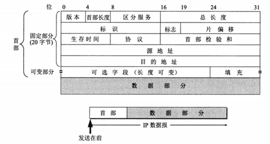
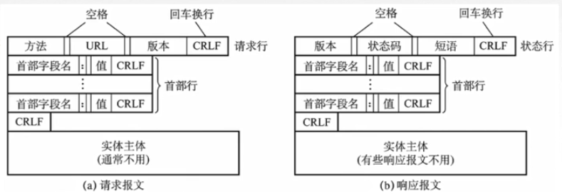

### 计算机网络主要内容

1. 网络体系结构，包括7层（OSI），4层（TCP/IP），5层（通用）。
2. 了解各层结构之间的协议。
3. 将协议应用到典型网络中（以太网）。
4. 各个层次的网络设备。

## 一、计算机网络概述

### 1.计算机网络的概念

​	计网是一个分散的、具有独立功能的计算机系统，通过通信设备与线路连接起来，由功能完善的软件实现资源共享和信息传递的系统。

​	 **计算机网络是互连的、自治的计算机集合。**

### 2.计算机网络的功能

1. 数据通信（连通性）。

2. 资源共享 如硬件、软件、数据等资源的共享。

3. 分布式处理。多台计算机各自承担同一工作任务的不同部分。如Hadoop平台。

4. 提高可靠性。替代机，当一台主机宕机了，通过另一条链路找到替代机。

5. 负载均衡。分布式处理达到的一种效果，多台计算机平均分配工作任务。

   主要是1,2两点，其他功能如生活乐趣，经济发展等等…

### 3.计算机网络的组成

1. 组成部分。包括硬件、软件和协议。
2. 工作方式。包括边缘部分和核心部分。边缘部分指用户主机，核心部分包括路由器和网络，为边缘部分提供服务。
3. 功能组成。包括资源子网（应用层、表示层和会话层）和通信子网（网络层、数据链路层和物理层）。资源子网实现资源共享/数据处理，通信子网实现数据通信。

### 4.性能指标

1. 速率。又称数据率/数据传输率/比特率。连接在计算机网络上的主机在数字信道上传输数据位数的速率。单位b/s。数据最小传输单元：比特（bit）。
2. 带宽。网络设备所支持的最高传输速率。单位b/s
3. 吞吐量。单位时间内通过某个网络（或信道、接口）的数据量。单位b/s
4. 时延。数据（报文/分组/比特流）从网络的一端传送到另一端所需的时间，也叫延迟，单位是s。包括发送时延、传播时延、排队时延和处理时延。
5. 时延带宽积=传播时延*带宽。单位为bit，又称为以比特为单位的链路长度，数据容量。
6. 往返时延RTT。从发送方发送数据开始，到发送方收到接收方的确认，总共经历的时延。
7. 利用率。包括信道利用率和网络利用率。利用率增大，时延增大的速率会越大。
   	- 信道利用率=有数据通过时间/（有+无）数据通过时间。
      	- 网络利用率=信道利用率加权平均值。

### 5.分层结构参考模型

1. OSI分层。7层：“物联网淑慧试用”。物理层、数据链路层、网络层、传输层、会话层、表示层、应用层。
2. TCP/IP分层。网络接口层、网际层、传输层、应用层。
3. 五层通用参考模型。将TCP/IP中的网络接口层划分为物理层和数据链路层。

## 二、物理层

### 1.通信方式

根据信息在传输线上的传送方向，分为以下三种通信方式：

- 单工通信：单向传输
- 半双工通信：双向交替传输
- 全双工通信：双向同时传输

### 2.物理层设备

常用设备：集线器，Hub。集线器的主要功能是对接收到的信号进行再生整形放大，以扩大网络的传输距离，同时把所有节点集中在以它为中心的节点上。

## 三、数据链路层

### 1.基本概念

1. 节点。主机、路由器
2. 链路。网络中两个节点之间的物理通道。分有线链路和无线链路，传输介质有双绞线、光纤和微波。
3. 数据链路。两个节点之间的逻辑通道。将实现控制数据传输协议的硬件和软件加到链路上就构成了数据链路。
4. 帧。链路层的协议数据单元，将网络层数据报封装得到帧。
5. 信道分类。
   - 点对点链路。一对一，两个相邻节点通过一个链路相连，没有第三者。应用：PPP协议，常用于广域网。
   - 广播式链路。一对多，所有主机共享通信介质。早期总线以太网、无线局域网、常用于局域网。典型拓扑结构：总线型、星型。

### 2.主要功能

1. 封装成帧。在网络层IP数据报的前后部分添加首部和尾部，从而构成帧。首尾部包含许多控制信息，主要作用是帧的定界。

   ​    帧的数据部分<=**最大传输单元MTU**。

2. 透明传输。不管所传的数据是怎样的比特组合，都应当能在链路上传送（不会因数据报中包含控制字符而传输失败）。透明是指用户察觉不到转义字符的存在。常用方法有：

   	- 字符填充法。
      	- 零比特填充法。
         	- 违规编码法。

3. 差错控制。差错包括：

   	- 帧错：丢失、重复、失序。
      	- 位错：比特位0，1出错。数据链路层的差错控制主要针对位错。

   检错方法：

   - 奇偶校验码。只能检查出奇数个比特错误，检错能力为50%。
   - **CRC循环冗余码**。能够实现无比特差错的传输。

   纠错方法：

   - 海明码。发现双比特错，纠正单比特错。

4. 流量控制。

   - 停止-等待协议。每发送一个帧就等待对方的确认（接收方发送一个ACK确认字符（Acknowledgement）给发送方），确认后就发送下一个帧，如果超时还未接收到确认，就重传。可以理解成特殊的滑动窗口，发送=接送窗口大小=1.
   - 滑动窗口协议。包括后退N帧协议（GBN）和选择重传协议（SR）。

### 3.介质访问控制MAC

介质访问控制（Multiple Access Control）是指采取一定的措施，使得两对节点之间的通信不会发生互相干扰的情况。广播信道才会出现这个冲突。有动态和静态两种方式

 1. 静态划分信道。即信道划分MAC协议，主要采用多路复用技术。指把多个信号组合在一条物理信道上进行传输，使得多个计算机或终端设备共享信道资源，提高信道利用率。

    - 频分复用：频分复用的所有主机在相同的时间占用不同的频率带宽资源。类似于并行。
    - 时分复用：时分复用的所有主机在不同的时间占用相同的频率带宽资源。类似于并发。
    - 统计时分复用：是对时分复用的一种改进，不固定每个用户在时分复用帧中的位置，只要有数据就集中起来组成统计时分复用帧然后发送。
    - 波分服用：即光的频分复用。由于光的频率很高，因此习惯上用波长而不是频率来表示所使用的光载波。
    - 码分复用：码分多址（CDMA）是码分多路复用的一种方式。1一个bit分为多个码片（chip），每一个站点被指定一个唯一的m为的芯片序列。

 2. 动态划分信道。信道并非在用户通信时固定分配。

    - 轮询访问MAC协议。既要不产生冲突，又要发送时占全部带宽。主节点会轮流“邀请”从属节点发送数据。包括令牌传递协议。

    - 随机访问MAC协议。所有用户可随机发送信息，发送信息时占据全部带宽。特点：会发生冲突，需要通过协议来进行协调。其中最常用**CSMA/CD**协议。

      - CSMA/CD协议。载波监听多路访问/碰撞检测协议。应用于总线式以太网（有线网）。监听后再发送，边发边监听。

        ​	CS：载波监听。每一个站在发送数据之前以及发送数据时都要检测总线上是否有其他计算机在发送数据。由于有传播时延，因此载波监听可能会失误。

        ​	MA：多点接入。总线型网络。

        ​	CD：碰撞检测。边发送边监听，在发送中，如果监听到信道已有其它主机正在发送数据，就表示发生了碰撞。虽然每个主机在发送数据之前都已经监听到信道为空闲，但是由于电磁波的传播时延的存在，还是有可能会发生碰撞。

        ​	记端到端的传播时延为 τ，最先发送的站点最多经过 2τ 就可以知道是否发生了碰撞，称 2τ 为 **争用期** 。只有经过争用期之后还没有检测到碰撞，才能肯定这次发送不会发生碰撞。当发生碰撞时，站点要停止发送，等待一段时间再发送。这个时间采用 **截断二进制指数退避算法** 来确定。从离散的整数集合 {0, 1, .., (2k-1)} 中随机取出一个数，记作 r，然后取 r 倍的争用期作为重传等待时间。

### 4.局域网

局域网是一种典型的广播信道，主要特点是网络为一个单位所拥有，且地理范围和站点数目均有限。

1. 拓扑结构。可以按照网络拓扑结构对局域网进行分类：包括星型，环型，总线型和树形等。以太网就是总线型。
2. 传输介质。有线：双绞线、同轴电缆、光纤。无线：电磁波。
3. 分类。以太网（应用最广泛，物理拓扑是星型，逻辑拓扑是总线型）、令牌环网、FDDI网、ATM网、无线局域网（WLAN，符合IEEE 802.11标准，wifi是WLAN的一种应用）。

### 5.以太网

Ethernet，是基带总线**局域网**规范。使用CSMA/CD协议。符合IEEE 802.3标准。特点：造价低廉，应用最广泛，满足网络速率要求10Mb/s-10Gb/s。以太网提供无连接、不可靠（差错帧直接丢弃，差错纠正由高层负责）的服务。

适配器：计算机通过通信适配器与外界局域网进行连接。

**MAC地址**：在局域网中，硬件地址又称为物理地址，或MAC地址。MAC 地址是链路层地址，长度为**6 字节**（48 位），用于唯一标识网络适配器（网卡），前24位代表厂家，后24位由厂家自己制定。常用6个十六进制数表示，如：4C-E0-F2-92-C7-26。一台主机拥有多少个网络适配器就有多少个 MAC 地址。例如笔记本电脑普遍存在无线网络适配器和有线网络适配器，因此就有两个MAC 地址。

以太网使用交换机替代以前使用的集线器，能根据 MAC 地址进行存储转发，不会发生碰撞（集线器可能会发生碰撞）。

以太网帧的格式如图中MAC层部分：

- 头部：目的地址、源地址、类型（指定网络层使用的协议）
- 数据部分：长度在46-1500（MTU）之间。
- 尾部：FCS是指帧检验序列，使用的是 CRC 检验方法

  
 
### 6.无线局域网

Wireless Local Area Networks，WLAN。符合IEEE 802.11标准。

无线局域网MAC帧头格式:接收端和发送端是目的地之和源地址对应的基站（如无线路由器）的地址。

分类：

- 有固定的基础设施的WLAN：基本服务集BSS，每个服务集都有一个标识符（wifi名称）。
- 无固定基础设施WLAN的自组织网络。

### 7.广域网与PPP协议

广域网（WAN，Wide Area Network）。通常跨接很大物理范围的远程网络。因特网是世界范围内最大的广域网。

主要使用**分组交换**技术，利用共用分组交换网、卫星通信网和无线分组交换网，将分布在不同地区的局域网或计算机系统互联起来，达到资源共享的目的。区别于局域网（覆盖物理层到数据链路层）强调数据传输，广域网还覆盖网络层，强调资源共享。

**点对点协议PPP**（point-to-point protocal）。互联网用户通常需要连接到某个 ISP（互联网服务提供商） 之后才能接入到互联网，PPP 协议是用户计算机和 ISP 进行通信时所使用的数据链路层协议。用户使用拨号接入因特网一般都是PPP协议,只支持全双工链路。PPP协议不需要进行纠错（只需检错）、流量控制、序号以及不需要支持多点线路。只需要实现封装成帧，透明传输，差错检错即可。

PPP协议帧的格式：

- F为帧的定界符
- A与C暂无意义
- 信息部分不超过1500
- FCS为帧检验序列

  
 
### 8.链路层设备——网桥、交换机

物理层扩展以太网：光纤+集线器。

链路层扩展以太网：网桥&交换机。目前交换机比较常用。

- 网桥。根据MAC帧的目的地址对帧进行转发和过滤。
- 交换机（又称为多接口网桥）。通常会有十几个接口，可以连在主机或集线器上，每一个的冲突域都可以独占传输媒体带宽。

*冲突域&广播域*：冲突域是指同一时间内只有一台设备发送信息的范围，一般交换机连接的一个集线器或一个主机都是冲突域；广播域是指如果站点发出一个信号，所有能接收到这个信号的设备范围为一个广播域。

## 四、网络层

### 1.网络层概述

网络层主要任务是将分组从源端传到目的端，为分组交换网上的不同主机提供通信服务。网络层传输单位是**数据报**。数据报是一个较长的数据，分组是将数据报切割形成的片段。

因为网络层是整个互联网的核心，因此应当让网络层尽可能简单。网络层向上只提供简单灵活的、无连接的、尽最大努力交付（不可靠传输）的数据报服务。

主要功能：路由选择与分组转发、异构网络（4G,wifi,以太网等）互联、拥塞控制。

### 2.数据交换方式

1. 电路交换。例子：电话网络。步骤：建立连接（呼叫/电路建立）；通信（数据交换过程）；释放连接（断开电路）。特点是独占资源。
2. 报文交换。源应用（源主机上的应用）发送的信息整体。如：一个PDF文件。优点：可靠性、利用率较高，无需建立连接。缺点：存储转发有时延，需要网络节点有较大的缓存空间。
3. 分组交换。与报文交换思想一致，都是存储转发，区别在于将大的数据块分割成小的数据块。具有报文交换的优点，同时还有存储管理更容易的特点（对交换设备的缓存要求不高）。缺点：有时延；需要传输额外的信息量；乱序到目的主机时，要对分组排序重组（总时延还是比报文交换要小）。

#### 知识点小结：各层传输单元名词辨析

​	**报文**（文件，应用层）-->分割成**报文段**（传输层）-->封装成**IP数据报**，如果数据报过大，分割成**分组**（网络层）-->加头加尾封装成**帧**（数据链路层）-->将**比特流**转换成信号的形式进行传播（物理层）

### 3.IP数据报的格式

  
 
首部固定部分详解：

- 版本。占4bit，有4和6两个取值，对应两种版本IPv4/IPv6。

- 首部长度，单位是4B。占4bit，可以表示的数字为0-15，为保证固定部分为20B，因此长度至少为5.(5*4B=20)。

- 区分服务。指示期望获得哪种类型的服务。一般不使用。

- 总长度。首部+数据的长度，单位是1B。占16bit。IP数据报的总长度上限值是65535B。

  

- 生存时间TTL。它的存在是为了防止无法交付的数据报在互联网中不断兜圈子。以路由器跳数为单位，当 TTL 为 0 时就丢弃数据报。

- 协议。指出携带的数据应该上交给哪个协议进行处理，即数据部分所使用的协议。例如 ICMP、TCP（值为6）、UDP（值为17） 等。

- 首部检验和。因为数据报每经过一个路由器，都要重新计算检验和，因此检验和不包含数据部分可以减少计算的工作量。

  

- 源IP地址和目的IP地址。长度都为32位。

  

  以下三个用于区分分组在数据报中的位置：

- 标识。在数据报长度过长（超过链路层MTU）从而发生分片的情况下，相同数据报的不同分片具有相同的标识符。

- 标志。占3位。x_ _，只有后两位有意义。中间为DF=1，禁止分片；DF=0，允许分片。最低位MF=1，后面还有分片；MF=0，代表最后一片/没有分片，MF有意义的前提是DF=0。

- 片偏移。占13位。该片在原分组中的相对位置。片偏移的单位为 8 B，因此除了最后一个分片，每个分片的长度一定是8B。

### 4.IPv4地址

IP地址：给每一台主机/设备分配一个地址，全世界唯一的**32位/4字节**标识符，标识路由器/主机的接口。写法一般采用点分十进制。

IP地址的编址方式经历了三个阶段：

- 分类。由两部分组成。网络号和主机号，其中不同分类具有不同的网络号长度，并且是固定的。主机号不能全0也不能全1（全0指本网络，全1指广播分组）。IP 地址 :: = {< 网络号 >, < 主机号 >}

  
  
 

- 子网划分。分类的IP地址的弱点在于地址空间的利用率有时会很低；且两级（ISP和企业）的IP地址不够灵活。于是出现了子网划分。

  ​	通过在主机号字段中拿一部分作为子网号，把两级 IP 地址划分为三级 IP 地址。

  IP 地址 ::= {< 网络号 >, < 子网号 >, < 主机号 >}。

- 无分类CIDR。无分类编址 CIDR 消除了传统 A 类、B 类和 C 类地址以及划分子网的概念，使用网络前缀和主机号来对 IP 地址进行编码，网络前缀的长度可以根据需要变化。

  IP 地址 ::= {< 网络前缀号 >, < 主机号 >}。

  ​	CIDR 的记法上采用在 IP 地址后面加上网络前缀长度的方法，例如 128.14.35.7/20 表示前 20 位为网络前缀。

  ​	CIDR 的地址掩码可以继续称为子网掩码，子网掩码首部1的长度为网络前缀的长度。

  ​	网络前缀都相同的连续IP地址组成一个CIDR地址块。地址范围可以计算，但最小地址和最大地址和前两种一样，也不能指派给主机。

将多个子网聚合成一个较大的子网叫做**构成超网**/路由聚合。与划分子网是一个相逆的过程。一个 CIDR 地址块中有很多地址，一个 CIDR 表示的网络就可以表示原来的很多个网络，并且在路由表中只需要一个路由就可以代替原来的多个路由，减少了路由表项的数量。 使用**最长前缀匹配**的方式选择路由（因为前缀越长，地址块越小，路由越具体）。

### 5.网络地址转换NAT

由于路由器对目的地址是私有地址的数据报一律不进行转发，所以需要NAT将本地IP地址转换为全球IP。NetWork Address Translation，网络地址转换。是指专用网内部的主机使用本地 IP 地址又想和互联网上的主机通信时，可以使用 NAT 来将本地 IP 转换为全球 IP。

NAT转换表包括WAN端和LAN端，表示两端IP地址和端口号（在传输层增加）的转换对应关系。使用端口号的 NAT 也叫做网络地址与端口转换 NAPT。

### 6.重要协议

#### 1.地址解析协议ARP

在通信过程中，IP 数据报的源地址和目的地址始终不变，而 MAC 地址随着链路的改变而改变。

每个主机都有一个 ARP 高速缓存，里面包括本局域网上的各主机和路由器的 IP 地址到 MAC 地址的映射表。通过ARP（Address Resolution Protocol）协议由IP地址可以得到MAC地址。

ARP协议的使用过程：检查**ARP高速缓存**，有对应表项则写入MAC帧，没有则用目的地址为全F（即全1）的帧封装并**广播ARP请求分组**，在同一局域网中的所有主机都可以收到该请求。目的主机收到请求后就会向源主机**单播一个ARP响应分组**，源主机收到后将次映射**写入ARP缓存**，10-20min更新一次。

ARP协议的使用场景：主机/路由器发送给**本网络**上的另一台主机/路由器，用ARP找到另一台的MAC地址；发给**另一网络**上的设备，则需要用ARP找到本网络上的一个路由器（网关）的MAC地址。

MAC地址解析成IP地址：使用**RARP协议**。

ARP攻击：网络拥堵和ARP欺骗。ARP协议是以广播方式发送ARP请求的，只要是同一个网段内主机都可以收到，这就为攻击者以可乘之机，攻击者可以发送大量的ARP请求包，阻塞正常网络宽带，使局域网中有限的网络资源被无用的广播信息所占用，造成**网络拥堵**；其次ARP协议没有安全认证机制，因为局域网内主机是建立在信任的基础上的，所以只要主机接收到ARP应答包，都会缓存在ARP表中，这就为**ARP欺骗**提供了可能。攻击者可以发送错误的IP地址MAC地址的映射关系。

#### 2.动态主机配置协议DHCP

主机获得IP地址的方式有两种：

- 静态配置。IP地址、子网掩码、默认网关。
- 动态配置。DHCP服务器为移动的主机分配IP地址。

DHCP是**应用层**协议，使用**C/S**式，客户端与服务器通过**广播方式**进行交互，基于**UDP**的一种协议。

DHCP提供**即插即用**联网的机制，主机可以从服务器动态获取IP地址、子网掩码、默认网关、DNS服务器名称与IP地址，允许**地址重用**，支持**移动用户加入网络**，支持**在用地址续租**。

使用过程：

1. 主机广播DHCP发现报文。主机试图找到网络中的服务器，服务器获得一个IP地址。
2. DHCP服务器广播HDCP提供报文。服务器分配给主机一个IP地址和相关配置。
3. 主机广播DHCP请求报文。主机向服务器请求提供IP地址。
4. DHCP服务器广播DHCP确认报文。正式将IP地址分配给主机。

移动IP：是指移动节点（计算机/服务器等）以**固定的网络IP地址**，实现跨越网段的漫游功能。

#### 3.网际控制报文协议ICMP

ICMP协议支持主机或路由器进行**差错报告**或**网络探询**。是为了转发IP数据报更加有效，提高交付成功的机会。**主要作用是用于在IP主机、路由器之间传递控制消息**。控制消息是指网络通不通、主机是否可达、路由是否可用等网络本身的消息。这些控制消息虽然并不传输用户数据，但是对于用户数据的传递起着重要的作用。

ICMP报文包括差错报告报文和询问报文，格式如下：

  
 
1. 差错报告报文：发生差错时发送。

   - 终点不可达。类型值3。当路由器或主机不能交付数据报时就向源点发送。
   - 时间超过。类型值11。当路由器收到生存时间TTL=0的数据报时，要丢弃该数据且发送报文。
   - 参数问题。类型值12。首部字段出问题。
   - 改变路由（重定向）。类型值5。路由器发送给主机，让主机将数据报发给另外的路由。

   不发送ICMP差错报文的情况：对ICMP差错报文的差错不发送、第一个分片的后续数据报片不发送、组播地址、特殊地址。

2. 询问报文：确认两台主机之间的连通性。

   - 回送（Echo）请求和回答报文。类型值8/0。向目的主机发送，为了测试目的站是否可达以及了解其相关状态。
   - 时间戳（Timestamp）请求和回答报文。类型值13/14。请某个主机/路由器回答当前的日期和时间。

ICMP的应用：

- Ping。Ping用来测试两个主机之间的连通性。原理是通过向目的主机发送 ICMP 回送请求报文，目的主机收到之后会发送回送回答报文，Ping根据时间和成功响应次数估算出数据包往返时间和丢包率。
- Traceroute。用来跟踪一个分组从源点到终点的路径，使用了时间超过差错报告报文。

#### 4.IGMP协议和组播路由选择协议

IP数据报的三种传输方式：单播、广播和组播（多播）。组播与广播的区别在于组播是为某些有特定需求的用户发送数据。

组播地址的范围为D类地址的范围。一个D类地址表示一个组播组，只能用作目的地址，源地址总是单播地址。

IGMP协议：在一个路由器内部使用的协议。使一个局域网中的组播路由器知道局域网中一个主机是否参加或退出了某个组播组。

组播路由选择协议：为了找出以源主机为根节点的组播转发树。

### 7.IPv6

32位IPv4地址空间已分配殆尽，CIDR和NAT只能一定程度上改善，而IPv6可以从根本上解决地址耗尽的问题。使用改进首部格式的方式，达到快速处理/转发数据报和支持QoS（Quality of Service，是指为特定网络通信提供更好的服务的技术）的能力。

IPv6数据报格式：将IPv4的可变部分放到有效载荷中，有效载荷包括扩展首部和数据部分。

  
 
IPv4和IPv6的主要区别：

- IPv6将地址从32位扩大到**128位（16B）**，有更大的地址空间。
- IPv6将IPv4的**校验和字段彻底移除**，减少每跳的时间。
- IPv6将IPv4的可选字段移出首部，变成**扩展首部**，路由器通常不对扩展首部进行检查，提高了路由器处理效率。
- IPv6支持**即插即用**（自动配置），不需要DHCP协议。
- 首部长度IPv6为**8B的整数倍**，IPv4首部是4B的整数倍。
- IPv6**只能在主机处分片**，IPv4可以在路由器和主机处分片。

IPv6地址的表示形式：

- 一般形式：冒号16进制记法：BF20:BF20:BF20:BF20:BF20:BF20:BF20:BF20
- 压缩形式：将连续的零压缩，如000A写成A，0000写成0。另一种方式：零压缩，将连续的0压缩为双冒号::，双冒号只可出现一次。

IPv6基本地址类型包括单播、多播和任播。

IPv6向IPv4的过度策略：双栈协议、隧道技术。

### 8.路由算法和路由选择协议

路由器分组转发流程：

- 从数据报的首部提取目的主机的IP地址，得到目的网络地址N；

  （1）如果N是与此路由器相连的某个网络地址，直接进行交付；

  （2）如果路由表中有目的地址为D的特定主机路由，则将数据报传送给表中所指明的下一跳路由器；

  （3）如果路由表中有到达网络N的路由，则将数据报传送下一跳路由器；

  （4）如果路由表中有一个默认路由，则将数据报传送给默认路由器；

- 如果以上都没有，则报告分组转发出错。

路由算法的分类：

- 静态路由算法。非自适应路由算法，管理员手工配置路由信息。这种方式简便可靠，适用于拓扑变化不大的网络。但由于路由更新慢，不适用于大型网络。
- 动态路由算法。自适应路由算法。路由器之间交换信息，按照路由算法优化出路由表项。路由更新快，适用于大型网络，但算法复杂，会增加网络负担。
  - 全局性。链路状态路由算法 OSPF。所有路由器掌握完整的网络拓扑和链路费用信息。
  - 分散性。距离向量路由算法 RIP。路由器只掌握物理相连的邻居和链路费用。

自治系统AS：在单一的技术管理下的一组路由器。即将整个互联网划分为一系列小的团体。

路由选择协议：

- 内部网关协议IGP：自治系统内部使用的协议，常用RIP和OSPF。

  - RIP协议。实现简单，开销小。但限制了网络的规模，且网络出现故障时，需要经过较长的时间才能将次消息传送到所有路由器。

    RIP 是一种基于**距离向量**的路由选择协议。距离是指跳数，直接相连的路由器跳数为 1。RIP允许一条路由最多只能包含15个路由器，超过 15 表示不可达。因此RIP协议只适用于小互联网。

    RIP是**应用层协议**，使用**UDP报文**传送数据。

    RIP协议特点：

    - RIP协议仅和**相邻路由器**交换信息（和谁交换）
    - 路由器交换的信息是**自己的路由表**（交换什么）
    - **每30s**交换一次路由信息（多久交换）

    经过若干次更新后，所有路由器最终会知道到达本自治系统中任何一个网络的**最短距离**和**下一跳路由器地址**。这两个信息根据**距离向量算法**得到。

  - OSPF协议。适用于网络规模较大的网络，收敛速度很快。

    OSPF协议是指开放最短路径优先，是为了克服RIP的缺点而开发出来的。开放表示不受某一厂家控制，是公开发表的；最短路径优先是因为使用了Dijkstra提出的最短路径算法SPF。

    一般认为OSPF是网络层协议，使用**IP数据报**传送数据

    OSPF协议特点：

    - 使用洪泛法（广播）向自治系统内**所有路由器**发送信息。
    - 交换的信息是与本路由器**相邻的所有路由器的链路状态**，包括本路由器与哪些路由器相邻，以及该链路的度量信息（包括费用、距离、时延和带宽等）
    - 只有**当链路状态发生变化**时，路由器才会发送信息。

    到最后所有路由器都能建立一个全网的拓扑结构图，并且是一致的。使用**链路状态路由算法**得到信息。

- 外部网关协议EGP：自治系统之间使用的协议，常用BGP。

  - BGP协议。边界网关协议，BGP只能寻找一条比较好的路由，而不是最佳路由。每个AS都必须配置BGP发言人，通过两个相邻BGP发言人之间建立**TCP连接**来交换路由信息。

### 9.网络层设备——路由器

路由器是一种具有多个输入端口和多个输出端口的专用计算机，其功能是路由选择（构造路由表）和分组转发（根据转发表（由路由表得到）进行转发）。

三层设备的区别：

- 路由器。可以互联两个不同网络层协议的网段。可以隔离冲突域和广播域。
- 网桥。可以互联两个物理层和链路层不同协议的网段。可以隔离冲突域，广播域不能。
- 集线器。不能互联两个物理层不同的网段。不能隔离冲突域和广播域。

### 10.虚拟专用网VPN

由于 IP 地址的紧缺，一个机构能申请到的 IP 地址数往往远小于本机构所拥有的主机数。并且一个机构并不需要把所有的主机接入到外部的互联网中，机构内的计算机可以使用仅在本机构有效的 IP 地址（专用地址）。

有三个专用地址块：

- 10.0.0.0 ~ 10.255.255.255
- 172.16.0.0 ~ 172.31.255.255
- 192.168.0.0 ~ 192.168.255.255

## 五、传输层

### 1.传输层概述

传输层是只有主机才有的层次。主要功能有：

- 提供进程与进程之间的逻辑通信
- 复用和分用。复用是指应用层所有的应用进程都可以通过传输层在传输到网络层，分用是指传输层从网络层收到数据后交付指明的应用进程。
- 对收到的报文进行差错检测。传输层检验数据部分，而网络层负责检验头部，从而实现可靠传输。

主要协议：

- UDP用户数据报协议。User Datagram Protocol。**不可靠、无连接、时延小、适用于小文件**。如：微信发送文件发送失败，需要重新发送。
- TCP传输控制协议。Transmission Control Protocol。**可靠、面向连接、时延大、适用于大文件**。

端口port：又称逻辑端口/软件端口，是传输层的SAP（服务访问点），用于标识主机中的应用进程。

- 端口号只要在本机内唯一标识即可。
- 端口号长度为16位，能表示65536个端口号。
  - 服务端使用的端口号
    - 熟知端口号（0~1023）给最重要的一些应用程序，让所有用户都知道。常用的熟知端口号有：FTP2,1，TELNET23，SMTP25，DNS53，TFTP69，HTTP80，SNMP161。
    - 登记端口号（1024~49151）为没有熟知端口号的应用程序使用。
  - 客户端使用的口号（49151~65535）仅在客户进程运行时才动态选择。

**套接字Socket**：在网络中采用发送方和接收方的套接字组合来识别端点，套接字唯一标识了网络中一个主机和它上面的一个进程。socket=（主机IP地址，端口号）。

### 2.UDP协议

UDP的特点：

- **无连接**。减少开销和发送数据之前的时延。
- 使用最大努力交付，**不保证可靠交付**。
- **面向报文**，适合一次性传输少量数据的网络应用。应用层给UDP多长的报文，UDP都照样发送。
- 无拥塞控制，适合实时应用，允许数据有丢失，但不允许有太大的延时。
- 首部开销小，8字节（TCP是20字节）。12字节的伪首部是为了计算检验和时临时添加。

  
 
### 3.TCP协议

TCP的特点：

- **面向连接**的传输层协议（虚连接，看起来像是两个进程之间的连接）。
- 每一条TCP连接只能有两个端点，每一条TCP连接只能是**点对点**的。
- TCP提供**可靠交付**的服务，可靠有序，不丢失不重复。
- 提供**全双工通信**。
- TCP面向**字节流**。TCP将应用程序交下来的数据看成一连串无结构的字节流（序列）。

TCP首部格式

  
 
- **序号**：在一个TCP连接中传送的字节流中的每一个字节都按顺序编号，表示本报文段所发送数据的第一个字节的序号。如序号为222，数据长度为100字节，则下一个报文段的序号为322.
- **确认号**：期望收到的下一个报文段的序号。ack
- **数据偏移**：数据部分距离报文段起始处的偏移量，实际上指的是首部的长度。以4B为单位。如值为15，则首部长度有60B
- 六个控制位：
  - URG紧急位：为1代表此报文段是紧急数据，有高优先级，不用再缓存中排队。
  - **ACK确认位**：ACK=1时确认号有效，在连接建立后必须把ACK置为1。
  - PSH推送位：为1代表接收方需尽快交付。
  - RST复位：为1表示出现严重差错，需释放连接，重新建立连接。
  - **SYN同步位**：SYN=1表示一个连接请求/连接接受报文。当 SYN=1，ACK=0 时表示这是一个连接请求报文段。若对方同意建立连接，则响应报文中 SYN=1，ACK=1。
  - **终止位FIN**：FIN=1表示此报文段已发送完毕，要求释放连接。
- **窗口**：接收方让发送方设置其发送窗口的限制，即允许对方发送的数据量。占2个字节。

### 4.TCP连接管理

TCP连接传输三个阶段：连接建立，数据传送，连接释放

**TCP的三次握手**，即连接的建立。

- 首先服务器端处于监听（LISTEN）状态，等待连接请求
- 客户端发送**连接请求报文**，无应用层数据。
  - SYN=1，seq=x（随机）。（ACK=0）
- 服务器端为该TCP连接**分配缓存和变量**，并向客户端返回**确认报文段**，允许连接，无应用数据。
  - SYN=1，ACK=1，seq=y（随机），ack=x+1。
- 客户端为该TCP连接分配缓存和变量，并向服务器返回确认，可以携带数据。
  - SYN=0，ACK=1，seq=x+1，ack=y+1。
- 服务端收到客户端的确认后，连接建立。

使用三次握手的原因：第三次握手是为了防止失效的连接请求到达服务器，让服务器错误打开连接。

SYN洪泛（flood）攻击：攻击者发送SYN给服务器，当服务器返回ACK后，攻击者不对其进行确认，这时TCP连接处于挂起状态，服务器收不到再确认，会重复发ACK给攻击者，从而浪费了服务器资源；攻击者通过发送大量的TCP连接请求，消耗服务器CPU和内存，导致服务器无法为用户正常提供服务。 解决方法：SYN cookie，在收到ACK确认报文段时，验证合法性再分配数据区来处理TCP连接。

**TCP的四次挥手**，即连接的释放。

- 客户端发送**连接释放报文段**，停止发送数据，主动关闭TCP连接。
  - FIN=1，seq=u
- 服务器端会送一个**确认报文段**，客户到服务器这个方向的连接就释放了（半关闭状态）
  - ACK=1，seq=u，ack=u+1
- 服务器端发完数据，就发出**连接释放报文段**，主动关闭TCP连接
  - FIN=1，ACK=1，seq=w，ack=u+1
- 客户端回送一个确认报文段，再等到时间等待计时器设置的2MSL（最长报文段寿命）后，连接彻底关闭
  - ACK=1，seq=u+1，ack=w+1

使用四次挥手的原因：客户端发送了 FIN 连接释放报文之后，服务器收到了这个报文，就进入了 CLOSE-WAIT 状态。这个状态是为了让服务器端发送还未传送完毕的数据，传送完毕之后，服务器会发送 FIN 连接释放报文。

等待2MSL时间的原因：（1）确保最后一个确认报文能够到达。如果 B 没收到 A 发送来的确认报文，那么就会重新发送连接释放请求报文，A 等待一段时间就是为了处理这种情况的发生。（2）等待一段时间是为了让本连接持续时间内所产生的所有报文都从网络中消失，使得下一个新的连接不会出现旧的连接请求报文。

### 5.TCP可靠传输

TCP通过确认和重传来实现可靠传输。如果一个已经发送的报文段在重传时间内没有收到确认，那么就重传这个报文段。如果已确认，则发送方从TCP缓存中删除该报文段。

重传的方式有两种：

- 超时重传。超时计时器到期，但没收到确认，进行重传。TCP采用自适应算法，动态改变重传时间RTTs（加权平均往返时间）。
- 冗余确认。当收到失序报文时，向发送端发送冗余ACK，当发送方收到三个冗余ACK时，就认为报文段丢失，进行重传。

### 6.TCP流量控制

流量控制是为了控制发送方的发送速率，保证接收方来得及接收。

TCP利用**滑动窗口**机制实现流量控制。接收方根据自己接收缓存的大小，动态地调整发送方的发送窗口的大小，**发送方的发送窗口取接收窗口rwnd和拥塞窗口cwnd的最小值**。接收方发送的**确认报文**中的**窗口**字段可以用来控制发送方窗口大小，从而影响发送方的发送速率。

注：TCP滑动窗口：窗口是缓存的一部分，用来暂时存放字节流。发送方和接收方各有一个窗口，接收方通过 TCP 报文段中的窗口字段告诉发送方自己的窗口大小，发送方根据这个值和其它信息设置自己的窗口大小。发送窗口内的字节都允许被发送，接收窗口内的字节都允许被接收。如果发送窗口左部的字节已经发送并且收到了确认，那么就将发送窗口向右滑动一定距离，直到左部第一个字节不是已发送并且已确认的状态；接收窗口的滑动类似，接收窗口左部字节已经发送确认并交付主机，就向右滑动接收窗口。接收窗口只会对窗口内最后一个按序到达的字节进行确认，例如接收窗口已经收到的字节为 {31, 34, 35}，其中 {31} 按序到达，而 {34, 35} 就不是，因此只对字节 31 进行确认。发送方得到一个字节的确认之后，就知道这个字节之前的所有字节都已经被接收。

### 7.TCP拥塞控制

出现拥塞的条件：对资源需求的总和>可用资源。如果网络出现拥塞，分组将会丢失，同时发送方会自动继续重传，从而导致网络拥塞程度更高。

拥塞控制的目的：防止过多的数据注入到网络中。即全局的协调各个主机占用的资源。

拥塞控制的四种算法：慢开始、拥塞避免、快重传、快恢复。

假设：

- 数据单方向传送，另一个方向只传送确认。
- 接收方总有足够大的缓存空间，因而发送窗口大小取决于拥塞程度。

发送方的发送窗口取接收窗口rwnd和拥塞窗口cwnd的最小值。

- 拥塞窗口：发送方需要根据自己估算的网络拥塞程度而设置拥塞窗口的值，反映网络当前容量。
- 接收窗口：接收方根据接收缓存设置的值，并告知给发送方，反映接收方的容量。

1. 慢开始与拥塞避免。

   发送最初执行慢开始，cwnd=1，发送方只发送一个报文段，当收到确认后（一个传输轮次），cwnd加倍，之后发送方能够发送的报文段数量为2,4,8...

   设置一个慢开始门限ssthresh，当cwnd>=ssthresh时，进入拥塞避免，每个轮次只将cwnd加1。

   如果出现超时，则令ssthresh=cwnd/2，并令cwnd=1，重新执行慢开始。

2. 快重传与快恢复。

   要求每次接收到报文段都应该对最后一个已收到的有序报文段进行确认。

   这时，如果发送方收到三个重复确认（冗余ACK），那么可以知道下一个报文段丢失，此时执行快重传，立即重传下一个报文段。

   在发生快重传的情况下，只是丢失了个别报文段，而没有发生网络拥塞，因此执行快恢复，令ssthresh=cwnd/2，cwnd = ssthresh，此时直接进入拥塞避免。

## 六、应用层

### 1.应用层概述

应用层对应用程序的通信提供服务。

应用层的功能：文件传输、访问和管理；电子邮件；虚拟终端；查询服务和远程作业登录。

网络应用模型：

- 客户/服务器模型，即C/S模型。服务器是负责提供计算服务的设备，可以永久提供服务，具有永久性的访问地址/域名。客户机是请求计算服务的主机，与服务器通信，间歇性的接入网络，可能使用动态IP地址，不与其他客户机直接通信。 应用包括：web、FTP、远程登录、电子邮件。
- P2P模型。不存在永远在线的服务器，每台主机既可以提供服务，也可以请求服务，任意节点之间可以直接通讯，节点间歇性接入网络，节点可能改变IP地址，可扩展性好，网络健壮性强。

### 2.域名系统DNS

DNS（Domain name system）。由于IP地址难于记忆，因此使用域名来替代IP地址，用户通过域名来访问网站。依靠DNS服务器可以将域名解析成IP地址，从而找到网站的服务器。

域名具有层次结构，从上到下依次为：根域名、顶级域名、二级域名、三级域名...

顶级域名：

- 国家顶级域名 cn,us,uk
- 通用顶级域名 com(一般公司),net,org,gov,int(国际组织),aero,museum,travel
- 基础结构域名/反向域名 arpa

二级域名：

- 类别域名：ac,com,edu,gov,mil,net,org（一般与国家顶级域名一起使用）
- 行政区域名：用于各省、自治区、直辖市
- 自注册的二级域名，要求是全球唯一的，如google，baidu

域名服务器：包括根域名服务器、顶级域名服务器、权限域名服务器和本地域名服务器。

域名解析过程：当一个主机发出DNS查询请求时，这个查询请求报文就发给本地域名服务器，如果本地缓存中没有解析信息，本地域名服务器就会求助于根域名服务器，然后依次查询顶级域名服务器和权限域名服务器的信息，找到IP地址后返回给主机。本地域名服务器查询域名信息有递归查询和迭代查询两种方式。本地域名服务器使用高速缓存保存近期域名和IP地址的映射关系以及从哪里获取信息的记录。

### 3.文件传输协议FTP

FTP（File Transfer Protocol）。提供不同种类的主机系统之间的文件传输能力。

FTP工作原理：

- 登录。ftp地址， 用户名&密码/匿名登录（只需输入地址即可访问FTP服务器）。
- FTP使用TCP实现可靠传输。FTP服务器可以同时为多个客户端提供服务，服务器包括1个主进程和n个从属进程。控制进程和数据传送进程都是从属进程。
- 传送一个文件需要两个连接来进行。
  - 控制连接。控制连接始终保持。服务器端口号为21。
  - 数据连接。用来传送一个文件数据。数据连接保持一会。
    - 使用主动方式，服务器主动建立数据连接。服务器端口号为20，客户端端口号随机（但要大于1024，因为0-1023是熟知端口号）
    - 使用被动方式，客户端主动建立数据连接。则客户端端口号由客户端自己指定，服务器端口号随机。

FTP传输模式：文本模式（ASCII）和二进制模式（Binary）。

区别：如果文件使用二进制编码的字符，如Unicode，ASCII表示文本，那么就是文本文件。如果二进制代表的是机器语言，或图片，或音乐编码，该文件就是二进制文件。

其他文件传输协议：简单文件传送协议TFTP是一个面向小文件、易于实现的文件传输协议。

### 4.电子邮件系统

电子邮件的信息格式：信封和内容。信封主要包括邮箱地址，内容包括首部和主体。

电子邮件系统由三个部分组成：

- 用户代理。电子邮件客户端软件。功能包括撰写、显示、处理和通信。
- 邮件服务器。功能：发送和接收邮件、向发件人报告邮件传送结果。
- 邮件协议。在两个邮件服务器通信过程中使用的协议。发送协议：SMTP。读取协议：POP3和IMAP。

主要协议：

- SMTP简单邮件传送协议。规定两个相互通信的SMTP进程之间如何交换信息。
  - TCP连接、端口号25、C/S模式。
  - 传送过程：连接建立、邮件发送、连接释放。
  - 使用MIME（通用因特网邮件扩充）来支持多种数据类型的传输，扩充了SMTP仅可传送的ASCII码。
- POP3邮局协议。
  - TCP连接、端口号110、C/S模式。
  - 工作方式：下载并保留（在服务器）/下载并删除
- IMAP网际报文存取协议。比POP3更为复杂。IMAP 协议中客户端和服务器上的邮件保持同步，如果不手动删除邮件，那么服务器上的邮件也不会被删除。IMAP 这种做法可以让用户随时随地去访问服务器上的邮件。

基于万维网的电子邮件，也是目前最常用的模式，使用十分方便。使用HTTP协议处理邮件服务器和用户代理之间的过程，发送邮件还是使用SMTP协议。

### 5.万维网和HTTP协议

万维网（WWW，World Wide Web）是一个大规模的、联机式的信息储藏所/资料空间，是无数个网络站点和网页的集合。使用**统一资源定位符URL**来唯一标识资源。

URL的一般形式：<协议>://<主机>:<端口>/<路径>	协议如http，ftp；主机如域名/IP地址。**URL不区分大小写**。

用户通过点击超链接获取资源，这些资源通过超文本传输协议（HTTP）传送给使用者。

HTTP协议。规定了浏览器（万维网客户进程）怎样向万维网服务器请求万维网文档，以及服务器怎样将文档传送给浏览器。

HTTP协议的特点：

- 无状态（无记忆的），但实际工作中，使用cookie来保存用户信息，从而为用户提供个性化服务。

- 采用TCP作为传输层的协议，但本身是无连接的，因为通信双方交换HTTP报文不需要先建立连接。

  连接方式有非持久连接和持久连接（一段时间内保持连接）两种方式。

HTTP报文结构。因为HTTP是面向文本的，因此在报文中的每一个字段都是一些ASCII码串。

  
 
### 6.常用端口

| 应用             | 应用层协议 | 端口号  | 传输层协议 | 备注                   |
| :--------------- | :--------- | :------ | ---------- | ---------------------- |
| 域名解析         | DNS        | 53      | UDP/TCP    | 长度超过512B时使用TCP  |
| 动态主机配置协议 | DHCP       | 67/68   | UDP        |                        |
| 简单网络管理协议 | SNMP       | 161/162 | UDP        |                        |
| 文件传输协议     | FTP        | 20/21   | TCP        | 控制连接21，数据连接20 |
| 远程登录协议     | TELNET     | 23      | TCP        |                        |
| 超文本传送协议   | HTTP       | 80      | TCP        |                        |
| 简单邮件传送协议 | SMTP       | 25      | TCP        |                        |
| 邮件读取协议     | POP3       | 110     | TCP        |                        |
| 网际报文存取协议 | IMAP       | 143     | TCP        |                        |

注：DHCP见网络层；TELNET 用于登录到远程主机上，并且远程主机上的输出也会返回，是远程登录协议。

### 7.Web页面一次请求的完整过程

1. DHCP配置主机信息。如果主机没有IP地址，主机通过发送DHCP请求报文给DHCP服务器，DHCP服务器返回DHCP报文给主机，主机获取服务器分配的IP地址及其相关配置。

   详细过程：

   - 如果主机最开始没有 IP 地址以及其它信息，那么就需要先使用 DHCP 来获取。
   - 传输层。主机生成一个 DHCP 请求报文，并将这个报文放入具有目的端口 67 和源端口 68 的 UDP 报文段中。
   - 网络层。该报文段则被放入在一个具有广播 IP 目的地址(255.255.255.255) 和源 IP 地址（0.0.0.0）的 IP 数据报中。
   - 链路层。该数据报则被放置在 MAC 帧中，该帧具有目的地址 FF:FF:FF:FF:FF:FF，将广播到与交换机连接的所有设备。
   - 连接在交换机的 DHCP 服务器收到广播帧之后，不断地向上分解得到 IP 数据报、UDP 报文段、DHCP 请求报文，之后生成 DHCP ACK 报文，该报文包含以下信息：IP 地址、DNS 服务器的 IP 地址、默认网关路由器的 IP 地址和子网掩码。该报文被放入 UDP 报文段中，UDP 报文段又被放入 IP 数据报中，最后放入 MAC 帧中。
   - 该帧的目的地址是请求主机的 MAC 地址，因为交换机具有自学习能力，之前主机发送了广播帧之后就记录了 MAC 地址到其转发接口的交换表项，因此现在交换机就可以直接知道应该向哪个接口发送该帧。
   - 主机收到该帧后，不断分解得到 DHCP 报文。之后就配置它的 IP 地址、子网掩码和 DNS 服务器的 IP 地址，并在其 IP 转发表中安装默认网关。

2. ARP解析MAC地址。主机为了生成套接字，需要知道网站的域名对应的IP地址，因此需要进行DNS域名解析。在域名解析之前，需要通过网关路由器的 IP 地址获取其MAC地址，因此需要向网关路由器发送ARP请求报文，由其返回ARP回答报文将其MAC地址返回给主机。

   详细过程：

   - 主机通过浏览器生成一个 TCP 套接字，套接字向 HTTP 服务器发送 HTTP 请求。为了生成该套接字，主机需要知道网站的域名对应的 IP 地址。
   - 主机生成一个 DNS 查询报文，该报文具有 53 号端口，因为 DNS 服务器的端口号是 53。
   - 该 DNS 查询报文被放入目的地址为 DNS 服务器 IP 地址的 IP 数据报中。
   - 该 IP 数据报被放入一个以太网帧中，该帧将发送到网关路由器。
   - DHCP 过程只知道网关路由器的 IP 地址，为了获取网关路由器的 MAC 地址，需要使用 ARP 协议。
   - 主机生成一个包含目的地址为网关路由器 IP 地址的 ARP 查询报文，将该 ARP 查询报文放入一个具有广播目的地址（FF:FF:FF:FF:FF:FF）的以太网帧中，并向交换机发送该以太网帧，交换机将该帧转发给所有的连接设备，包括网关路由器。
   - 网关路由器接收到该帧后，不断向上分解得到 ARP 报文，发现其中的 IP 地址与其接口的 IP 地址匹配，因此就发送一个 ARP 回答报文，包含了它的 MAC 地址，发回给主机。

3. DNS解析域名。主机发送DNS查询报文给DNS服务器，返回DNS回答报文给主机。

   详细过程：

   - 知道了网关路由器的 MAC 地址之后，就可以继续 DNS 的解析过程了。
   - 网关路由器接收到包含 DNS 查询报文的以太网帧后，抽取出 IP 数据报，并根据转发表决定该 IP 数据报应该转发的路由器。
   - 因为路由器具有内部网关协议（RIP、OSPF）和外部网关协议（BGP）这两种路由选择协议，因此路由表中已经配置了网关路由器到达 DNS 服务器的路由表项。
   - 到达 DNS 服务器之后，DNS 服务器抽取出 DNS 查询报文，并在 DNS 数据库中查找待解析的域名。
   - 找到 DNS 记录之后，发送 DNS 回答报文，将该回答报文放入 UDP 报文段中，然后放入 IP 数据报中，通过路由器反向转发回网关路由器，并经过以太网交换机到达主机。

4. HTTP请求页面。主机根据HTTP服务器的IP地址生成TCP套接字，向web服务器发送HTTP请求报文，返回HTTP响应报文，浏览器收到响应报文后，抽取出web页面内容，进行渲染，显示web页面。

   详细过程：

   - 有了 HTTP 服务器的 IP 地址之后，主机就能够生成 TCP 套接字，该套接字将用于向 Web 服务器发送 HTTP GET 报文。
   - 在生成 TCP 套接字之前，必须先与 HTTP 服务器进行三次握手来建立连接。生成一个具有目的端口 80 的 TCP SYN 报文段，并向 HTTP 服务器发送该报文段。
   - HTTP 服务器收到该报文段之后，生成 TCP SYN ACK 报文段，发回给主机。
   - 连接建立之后，浏览器生成 HTTP GET 报文，并交付给 HTTP 服务器。
   - HTTP 服务器从 TCP 套接字读取 HTTP GET 报文，生成一个 HTTP 响应报文，将 Web 页面内容放入报文主体中，发回给主机。
   - 浏览器收到 HTTP 响应报文后，抽取出 Web 页面内容，之后进行渲染，显示 Web 页面。

参考资料：

- JamesF.Kurose, KeithW.Ross, 库罗斯, 等. 计算机网络: 自顶向下方法 [M]. 机械工业出版社, 2014.
- W.RichardStevens. TCP/IP 详解. 卷 1, 协议 [M]. 机械工业出版社, 2006.
- [CyC2018计算机网络博客](https://github.com/CyC2018/CS-Notes/blob/master/notes/计算机网络%20-%20目录.md)
